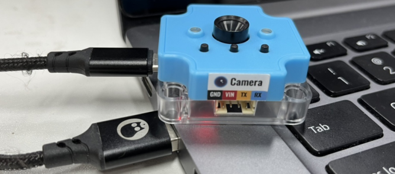
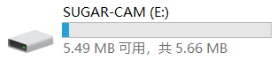
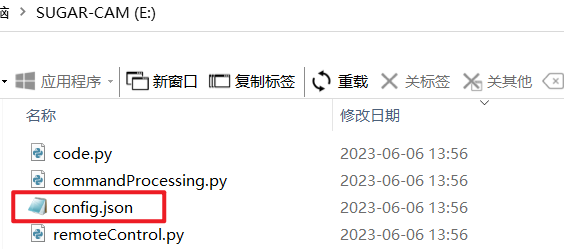
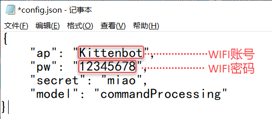
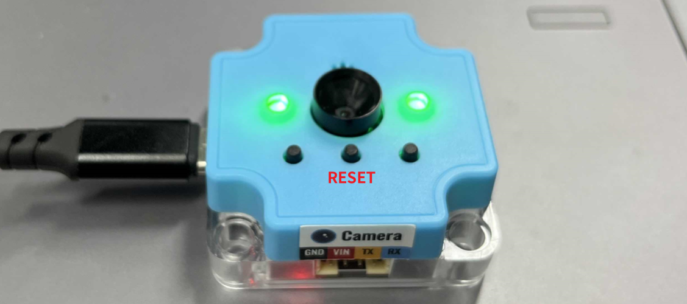
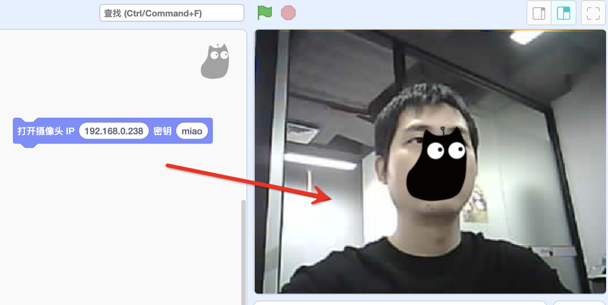

### 首次使用
首次使用方糖摄像头，需要先给模块设置WIFI的账号与密码，方便后续无线连接

1. 使用USB数据线连接摄像头模块与电脑

2. 电脑出现SUGAR-CAM的U盘。进入盘符双击打开盘符中的`config.json`

3. 修改为自己的WIFI账号与密码（记得保存修改）
:::warning
模块只支持2.4G频段的路由器，若无法连接，可尝试手机发射WIFI热点
:::

- ap：你的WIFI账号
- pw：你的WIFI密码
- secret：一定要填，软件连接无线摄像头需要用到的密钥
- model：模型（模式），在接下来的环节的会详细展开，此处默认不要修改即可
- 

4. 完成config.json的配置修改后（记得保存），重新拔插USB数据线或者按一下模块中间的RESET按键，进行复位重启
:::info
若WIFI连接成功，亮绿灯；若失败，亮红灯。如果失败就仔细检查一下以下几点：

- WIFI信号是否为2.4G频段，不支持5G
- 账号密码是否填写错误
:::

### 连接方糖摄像头

1. 打开[Kittenblock1.89.17](http://www.kittenbot.cn/kittenblock)及以上版本，在扩展中加载`方糖摄像头模块`，它作为一个WIFI摄像头的功能

2. 查找方糖摄像头IP地址

需要在电脑上安装软件，进行方糖摄像头的IP查找:

- windows电脑安装这个[ip扫描器](https://www.advanced-ip-scanner.com/cn/)
- mac电脑安装LanScan（在APP Store搜素LanScan）

软件中，显示制造商为`Espressif Inc`的对应IP ，就是你的方糖摄像头IP（如图所示192.168.0.135），请记住你自己的IP 

3. 填入你的方糖摄像头的IP地址，再点击积木，舞台即可出现摄像头画面。到此，你已经将方糖摄像头成功用起来了。 

## 
