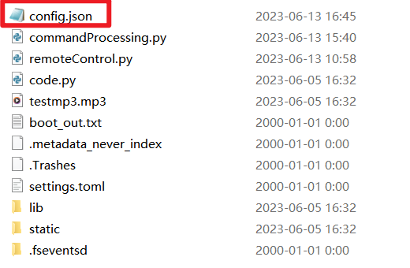
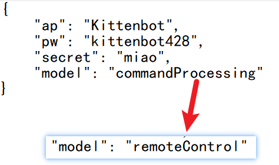
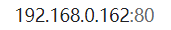
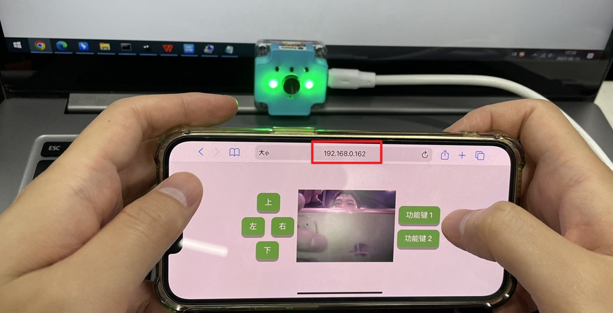
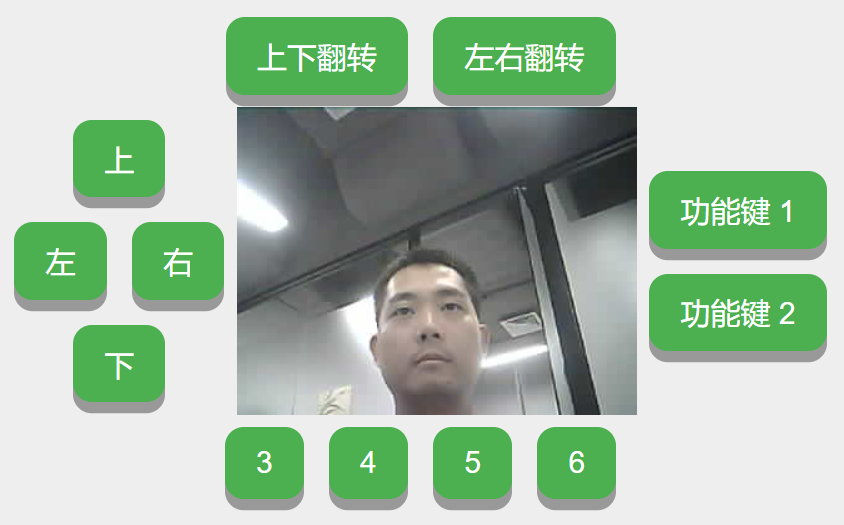
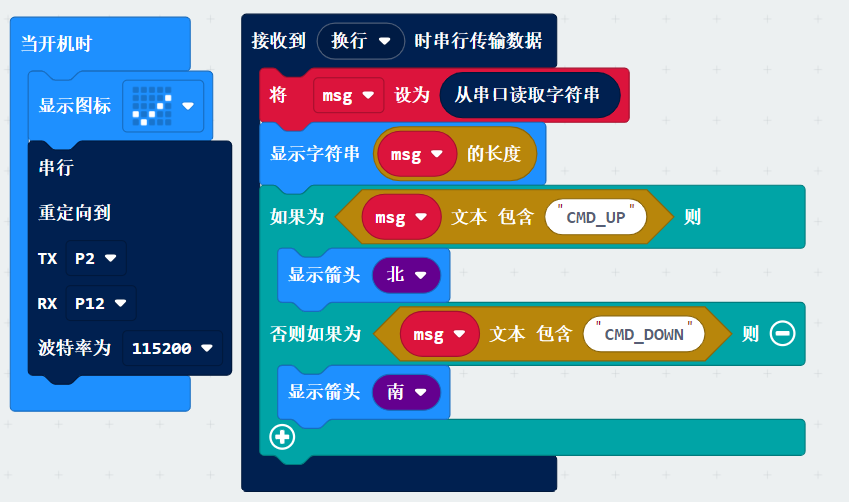
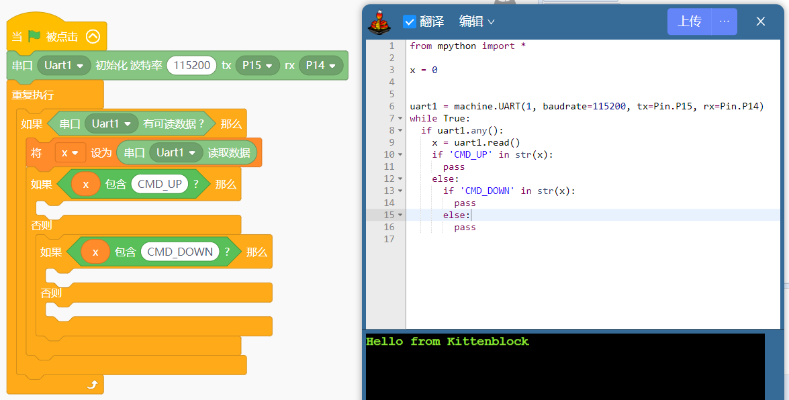

## Introduction
In addition to the quick video transfer function via the Kittenblock stage. Video transmission and remote control is also possible via the webpage

## Demo results

When the web button is pressed, the Camera receives the command and its serial port sends a serial command to the other motherboard.

control flow：

Mobile Web Interface

## Configuration settings
In addition to following the basic tutorial, fill in the wifi account password into the network, but also need to modify the configuration file.

1、USB cable to connect Sugar Camera 

2、When the USB stick of SUGAR-CAM appears on the computer, open "config.json".

3、Change commandProcessing to remoteControl.

4. Save and exit the file

If you don't want to use the webcam control later and want to use the normal mode, please change back to commandProcessing.

## Web Browsing
Open it in your computer browser or mobile phone browser. The IP of the Camera needs to be added ": 80"

For example, my address

 

The IPs of the Cameras vary and you need to check them yourself with the help of a tool.

My mobile phone's browser opens the corresponding IP address (IP addresses only support one device for connection, if more than one device is opened, the screen of the other device will be unresponsive)

## Keypad Serial Control

There are currently 10 buttons

1、When using on the web page, you can click the mouse button to trigger, of course, you can also use the keyboard arrow keys up and down, left and right, and the number 1~6 to trigger.

2, in the mobile phone web use, you can directly through the touch of the button to trigger the

| Button Name | Serial Command |
| --- | --- |
| 上（UP） | CMD_UP |
| 下（Down） | CMD_DOWN |
| 左（Left） | CMD_LEFT |
| 右（Right） | CMD_RIGHT |
| 功能键1（Function Key 1） | CMD_FUNC1 |
| 功能键2（Function Key 2） | CMD_FUNC2 |
| 功能键3（Function Key 3） | CMD_FUNC3 |
| 功能键4（Function Key 4） | CMD_FUNC4 |
| 功能键5（Function Key 5） | CMD_FUNC5 |
| 功能键6（Function Key 6） | CMD_FUNC6 |

According to the above table, for different motherboards to write the serial port receiving procedures

When the serial port receives the message, the specific instruction judgement

The serial port baud rate is 115200

## Take Microbit for example
Note the use of "text containment" for judgements

Example：[https://makecode.microbit.org/_4cWAUUEot4jH](https://makecode.microbit.org/_4cWAUUEot4jH)
Example of car：[https://makecode.microbit.org/_DgvfhzXqjCUt](https://makecode.microbit.org/_DgvfhzXqjCUt)

## Take mPython Board for example

The programming environment is Kittenblock, of course, with other programming platforms, it is possible to write the corresponding serial port receiving program.
When receiving the command from the corresponding serial port, the corresponding motor movement will be controlled.

