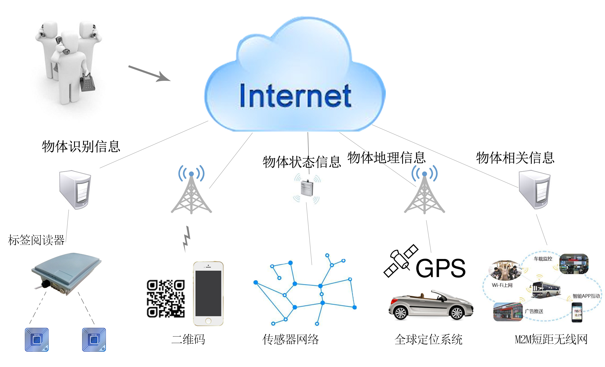
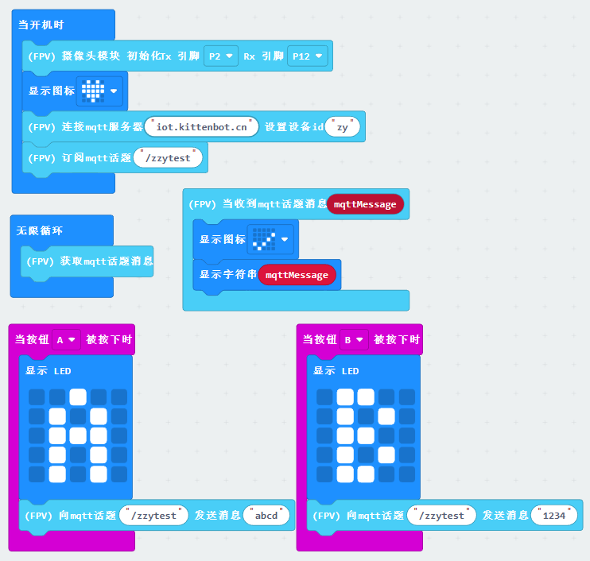
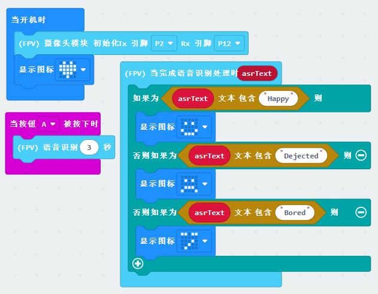
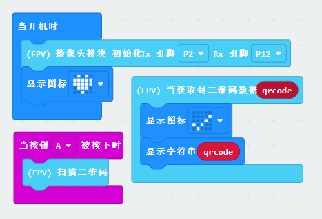
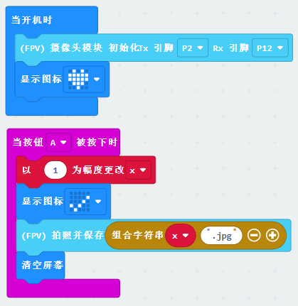

## 初始化配置
wifi配置与模式选择，请参考文档🚀[快速上手](https://www.yuque.com/kittenbot/hardwares/pb5m4xg9u8ve16lg)部分，这里不再赘述~

1. 进入makecode主页，点击新建项目[https://makecode.microbit.org/](https://makecode.microbit.org/)
2. 添加方糖摄像头扩展点击添加扩展==》搜索sugar==》点击添加

## 案例程序

### iot数据互通

#### 简介
方糖摄像头本身带有wifi功能，通过连接方糖摄像头模块，你可以让你的micro:bit能够通过网络与其他设备进行通信，例如智能手机、电脑或其他互联网设备。这为你的micro:bit带来了更多的功能和可能性，尤其是在物联网方面。

关于iot平台：后续的示例中，需要你创建一个自己的iot话题才能继续，如果你已有准备，则可以继续往下，如果你还没有iot自己的iot话题，这里建议搭建使用🪐[小喵的iot服务器](https://www.yuque.com/kittenbot/software/bnnfgm)创建自己的iot话题，小喵的iot服务器上手容易操作简单，且免费注册使用。

#### 线路连接

**接线图中的robotbit需要先连接microbit**
:::

#### 

#### 程序编写

#### 程序讲解
下载程序后，稍等片刻microbit会亮起爱心表示模块初始化完成，之后会不断地从mqtt服务器获取话题的最新消息，你可以按下a或b键向话题发送测试消息，过一会之后microbit会显示“√”然后输出话题收到的最新消息。

当然，如果你用的是小喵的iot服务器，也可以直接在iot话题管理界面发送消息选择对应话题==》连接话题==》输入想要发送的消息==》点击发送

### 语音识别

#### 简介
通过方糖摄像头中的麦克风和wifi模块，我们可以音频数据上传到云端，进行语音识别处理，然后根据处理结果让microbit显示不同的表情

#### 线路连接

#### 程序编写

### 二维码扫描

#### 线路连接

#### 程序编写

#### 程序讲解
1.程序上传，且成功初始初始化之后，microbit会亮起爱心，按下a键会识别摄像头前的二维码，在数据处理完成之后就就会进入二维码数据处理积木，如果扫描失败则会返回None2.由于没有屏幕辅助扫码，所以很容易导致摄像头画面内根本没有完整的二维码。这里建议大家搭建一个建议的扫码结构固定二维码和摄像头模块的位置，这样就几乎不会扫码失败了。镜头距离二维码高度大概10cm，二维码大小为6.5x6.5cm[https://cli.im/text](https://cli.im/text)推荐使用草料二维码网站生成，内容为英文或者字符串！

3.另外在这个示例中扫描的二维码需要为全英文，否则microbit不支持中文编码

### 拍照
**需要断电进行操作！**
**在使用文件存储相关功能需要先插入sd卡，然后复位摄像头模块**

:::

#### 线路连接

#### 程序编写

#### 程序讲解
程序下载且初始化成功之后，按下a键即可拍照保存到sd卡中，后续你可以通过读卡器将卡内的照片取出。
