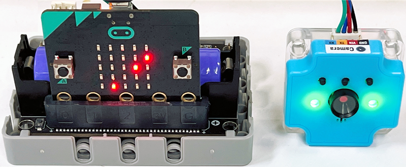
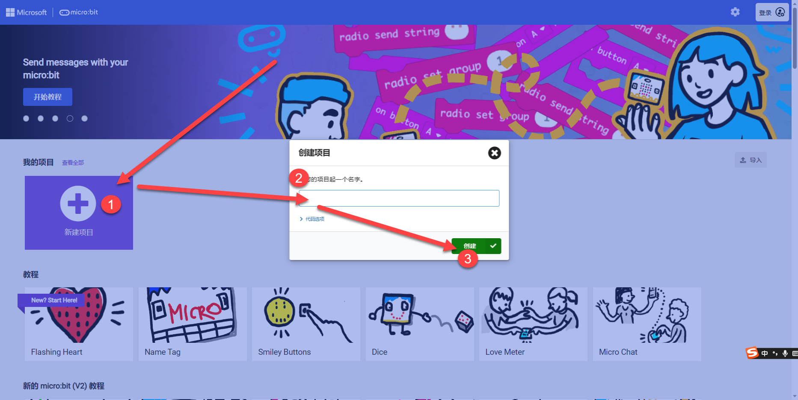
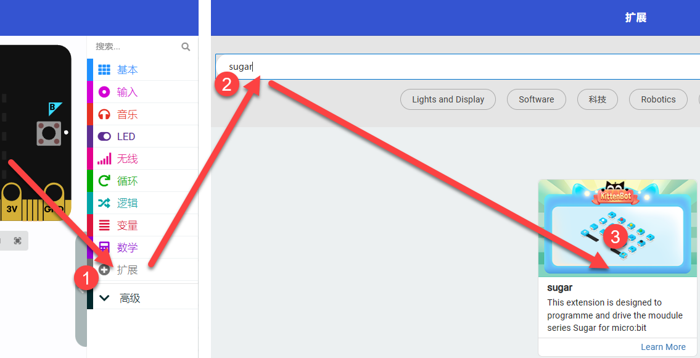
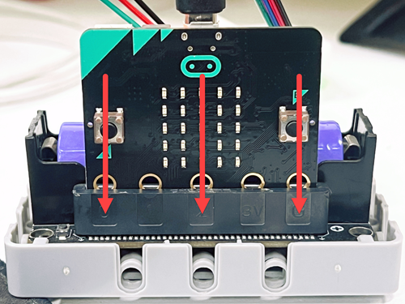
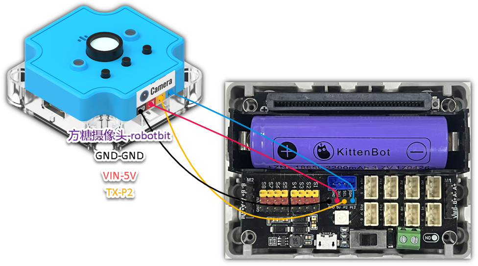
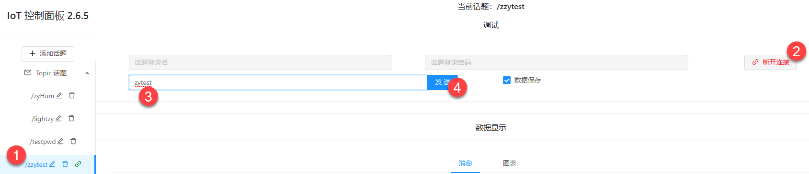
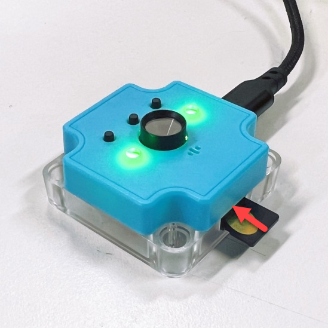
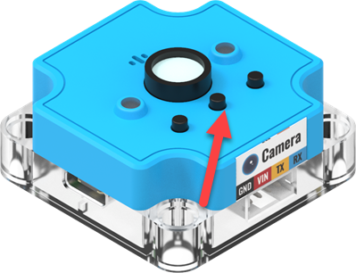

## 初始化配置
1. Go to the makecode homepage and click on New Project [https://makecode.microbit.org/](https://makecode.microbit.org/)

   

2. Extensions -> Search for 'sugar' -> add

   

## 案例程序

### IoT MQTT

Sugar camera can be used as a wifi module.

#### connect

:::

#### 

#### Coding

https://makecode.microbit.org/_cU6MpmPyLKPY

#### Code Explanation
After downloading the programme, wait for a moment, the microbit will light up to indicate that the initialisation of the module is complete.

After that, it will continuously get the latest news of the topic from the mqtt server, you can press buttonA or ButtonB to send a test message to the topic, after a while the microbit will display "√" and then output the latest news received by the topic.

You can use KittenBot's IOT platform or other MQTT IOT platforms.

https://iot.kittenbot.cn/

Or send a message on a topic via the web

### speech recognition

#### intro
With the microphone in the camera and the wifi function, we can upload the audio data to the cloud（BaiduAI in China）, process it for speech recognition, and then have the microbit display different expressions based on the results.

#### Connect

#### Coding

https://makecode.microbit.org/_c8HRtPUMpMJX

### QR code

#### Connect

#### Coding

https://makecode.microbit.org/_HARTjeXa084j

#### 程序讲解
1. After the program is uploaded and successfully initialised, the microbit will light up with love.
Pressing button A will identify the QR code. If the code is recognised, it will return None.
Because there is no screen assistance, it is easy to cause the camera screen is not complete QR code.
Here we recommend that you build a mechanical structure, so that almost never scan code failure.
2. The height of the camera from the QR code is about 10cm, and the size of the QR code is 6.5x6.5cm [https://cli.im/text](https://cli.im/text) It is recommended that you use a straw QR code website to generate the content in English or string!

### take a picture
Before unplugging the TF card, you need to switch off the power first.

:::

#### Connect

#### Coding

https://makecode.microbit.org/_P0YTveKx1gYg

#### Code  Explanation
After successful download, press the a button to take a photo and save it to the TF card.
You can take it photo out by card reader.
