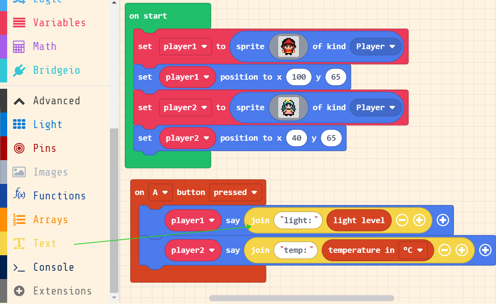

#### Hardware Preparation

Using MicroUSB to connect Bridge to the computer, you can see a new drive letter on the computer: Bridge

(If it doesn't appear, press the Reset button on the Bridge board to see the RGB green light up)

The USB disk is the real storage space, which is used to store the program file and the data file generated by the program running

(Notice: When a uf2 file is dragged into the USB disk, the uf2 file will be automatically detected whether it is a valid executable program file. If it is, it will be automatically burned to the chip for execution. At this time, you cannot see the program file, you can see the result of the circuit board execution)

#### Coding with Arcade

Arcade Website：[https://arcade.makecode.com](https://arcade.makecode.com/#editor)

- STEP1：Create a new project

- STEP2：Write a simple program

When using Bridge alone, we can program the on-board LED (D13 pin) to watch the phenomenon

First, we need to load an extension plugin corresponding to Bridge to get the available pin blocks

(There are many different types of main control hardware integrated on the Arcade platform, and the pin layout and mapping sequence number of each hardware are different, so we have to import the specific extension to support different hardware)

Input the extension url：[https://github.com/KittenBot/pxt-bridgeio](https://github.com/KittenBot/pxt-bridgeio)

STEP3：Write a LED blinking program

Write the program according to the diagram - the program that makes the on-board LED of D13 pin blink once every 1 second

Click the download button in the lower left corner of the interface, and select D5 in the pop-up hardware selection box

When the download is complete, the Bridge will automatically restart and run the program

On the Bridge, we can see the D13 pin LED blinking every 1 second

(Each time you need to download other programs, you need to press the Reset button of Bridge to return to the main interface, at this time the RGB light is green, and the Bridge drive letter appears at the same time)

#### Use Arcade Shield to make a handheld game console

Arcade shield is an extension board of Bridge, which is loaded with Arcade shield. The Bridge with Arcade shield is transformed into a programmable handheld game console. Insert the shield into the Bridge according to the corresponding position

STEP1: Write a simple game

Create a sprite character, let the keyboard (joystick) control the sprite to move, draw a map scene, and let the camera follow the sprite to move

[arcade-game_test.zip](./arcade-game_test.zip)

Once the program is built, you can try it directly in the left simulator, and then download it to Bridge to run

(Notice: You can switch between the program and the main interface by pressing the Reset button)

STEP2: Combine the game with the hardware

There are temperature and brightness sensors on Bridge, which can make full use of the display screen of Arcade shield

First go to the extension interface to load the Controller plugin (which contains some functional building blocks of on-board resources)

Code like this and copy it to the Bridge drive letter (you can also download the ready-made one below)

[arcade-sensor_test.zip](./arcade-sensor_test.zip)

Once the program is download successfully, two sprites can be seen running on Bridge. At this time, press the A button on the Arcade shield to see the phenomenon
