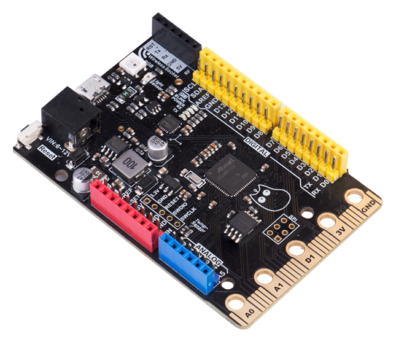
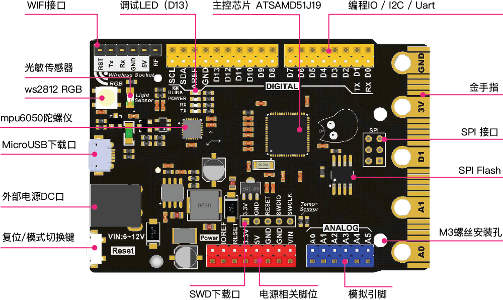

#### Shop Link
[ Kittenbot-Bridge ](https://www.kittenbot.cc/products/bridge-the-ultimate-arduino-makecode-fusion-board)

#### Audience

- Maker
- Arcade game programming enthusiasts
- 3D printing enthusiasts

#### Product Introduction

Bridge is a high-performance main control board. The naming of Bridge implies that it is a medium for grafting various programming languages and technologies. You can use several common ways to program, such as Arduino, Micropython or graphical programming. In addition, in terms of application, with the support of the high-performance Atmel D51 main control chip, you can even DIY a 3D printer.

Of course, it is not just to exert all its efforts on hardware creation. With the support of the Microsoft Arcade platform, Bridge can be transformed into a fun and permanent programming game console after installing a handheld Shield.

#### Product Features

- Compatible with Arduino Extension Boards, 32-bit MCU, 120MHz main frequency, performance far exceeds UNO
- Compatible with Micro:bit gold finger
- All pins support interrupts

#### Technical Parameters
| Main control chip | ATSAMD51J19 ARM Cortex-M4  120MHz main frequency hardware DSP and floating point support 32-bit single chip microcomputer |
| --- | --- |
| Working voltage | 3.3V |
| Power supply voltage | 5V (USB), 6 ~ 12V (external power supply DC head) |
| Weight | 26.5g |
| Onboard resources | Photosensitive sensor, temperature sensor, gyroscope, programmable RGB light (chip foot PB22 / Arduino ~ pin 40), programmable LED (D13 foot), 2MByte SPI FLASH, SDA (A6) / SCL (A7), SD card slot (SPI) |
| Programming platform | Arcade, Arduino IDE, Platform IO |

#### Hardware Details

(Back with SD card slot for expanding SD Bluetooth or SD storage)

**Pin Mapping**

| Component | Pin |
| --- | --- |
| Light sensor | PB00 |
| Temperature sensor | PB05 |
| RGB | PB22 |

- SD Slot

| SD Pin | Pin |
| --- | --- |
| DATA2 | / |
| CD/DATA3 | PA15 |
| CMD | PA12 |
| VSS | GND |
| VDD | +3.3V |
| CLK | PA13 |
| VSS | GND |
| DATA0 | PA14 |
| DATA1 | / |
| CD | / |
| WP | / |

#### Makecode Arcade Extension

IO：[github.com/KittenBot/pxt-bridgeio](https://github.com/KittenBot/pxt-bridgeio)

SD Bluetooth：[github.com/KittenBot/pxt-bridgeio](https://github.com/KittenBot/pxt-bridgeio)

