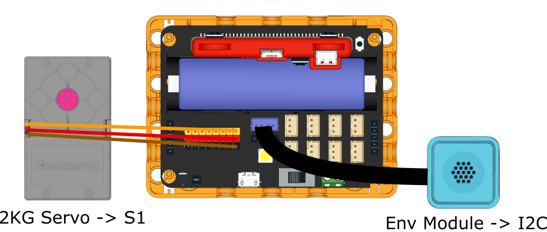
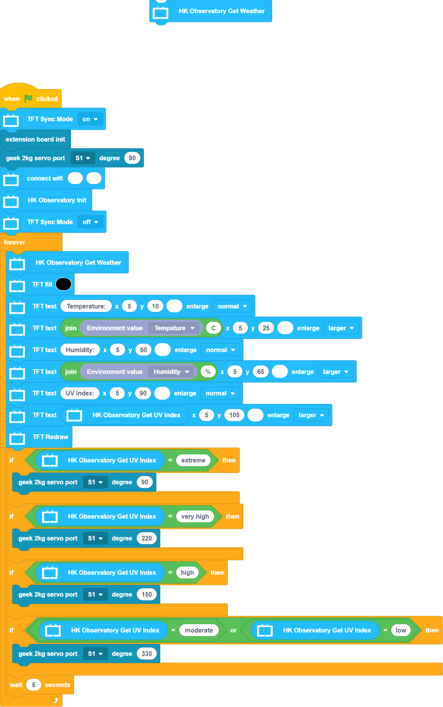

# Weather Station

This weather station can report the local weather from Hong Kong Observatory.

## Building Instructions

[Building Instructions(Right Click->Save As)](https://github.com/kittenbothk/kittenbothk/raw/master/Kits/future_inventor/Programming Case/pdf/weatherstation.pdf)

## Sample Wiring Diagram

## Sample Program

### KittenBlock Sample Program

[Download Sample Program(Right Click->Save As)](https://github.com/kittenbothk/kittenbothk/raw/master/Kits/future_inventor/Programming Case/sb3/weather.sb3)

### Python Sample Program

    #/bin/python
    
    from time import sleep
    from future import *
    from sugar import *
    import robotbit
    import urequests
    import ujson
    api_url='https://data.weather.gov.hk/weatherAPI/opendata/weather.php?dataType=rhrread&lang=en'
    
    x = 0
    
    screen.sync = 1
    
    robot = robotbit.RobotBit()
    
    robot.geekServo2kg(1, 90)
    
    wifi.connect(str("3DJollyFab"), "goodluckjf11b")
    
    #init hko
    
    screen.sync = 0
    
    while True:
      r=urequests.get(api_url)
      weather=ujson.loads(r.content)
      
      screen.fill((0, 0, 0))
      screen.text(str("Temperature:"),5,10,1,(255, 255, 255))
      screen.text(str(str(ENV().update()[0])+str("C")),5,25,2,(255, 255, 255))
      screen.text(str("Humidity:"),5,50,1,(255, 255, 255))
      screen.text(str(str(ENV().update()[1])+str("%")),5,65,2,(255, 255, 255))
      screen.text(str("UV Index:"),5,90,1,(255, 255, 255))
      screen.text(str(weather['uvindex']['data'][0]['desc']),5,105,2,(255, 255, 255))
      screen.refresh()
      if weather['uvindex']['data'][0]['desc'] == "extreme":
        robot.geekServo2kg(1, 90)
      if weather['uvindex']['data'][0]['desc'] == "very high":
        robot.geekServo2kg(1, 220)
      if weather['uvindex']['data'][0]['desc'] == "high":
        robot.geekServo2kg(1, 150)
      if weather['uvindex']['data'][0]['desc'] == "moderate" or weather['uvindex']['data'][0]['desc'] == "low":
        robot.geekServo2kg(1, 330)
      sleep(5)

[Download Sample Program(Right Click->Save As)](https://github.com/kittenbothk/kittenbothk/raw/master/Kits/future_inventor/Programming Case/py/weather.py)

## Program Instructions

Modify the program to connect to your WiFi network, FutureBoard will display the current temperature and humidity, the icon will change according to the UV index.