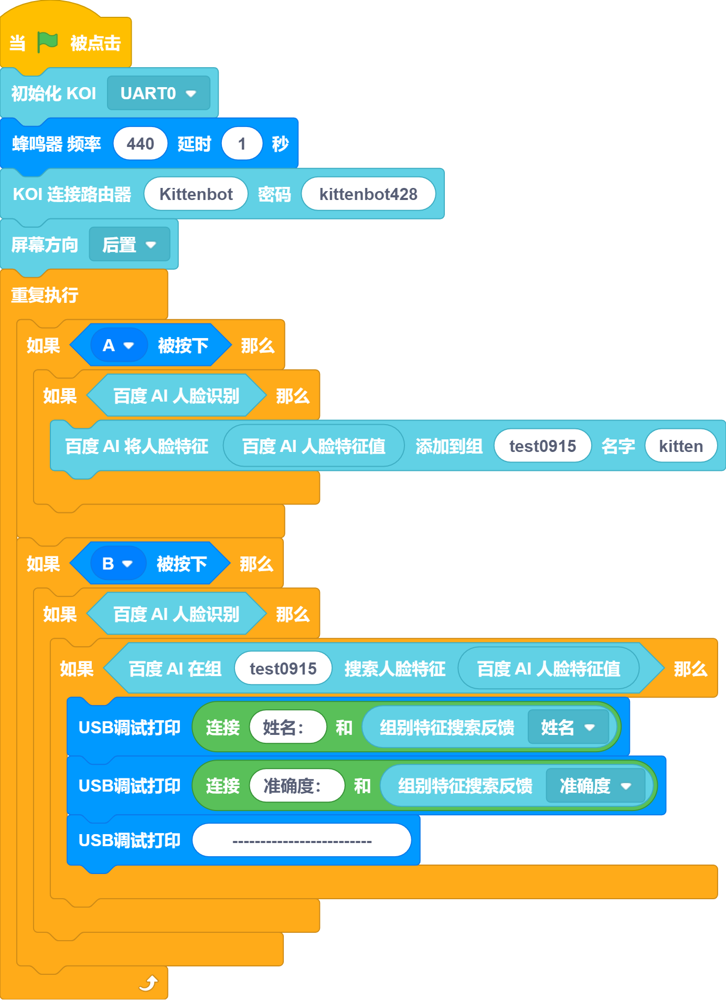

## Wiring Connections
> Notes:  When wiring, pay attention to the hole position marks on the Futureboard lite. It can only be connected to the two UART ports on the left, and the corresponding position needs to be set in the code. The diagram shows the connection of uart0, and the following code examples are based on this position.
In addition, some computers have a small USB current that may not be able to power the koi, resulting in a failure to start. At this time, an external USB power supply can be connected to the koi.

## Camera Direction Control

## Photo and Display

## Show face coordinates

## Show the number of faces

## Feature classification
Program description: When the prompt appears on the screen, point the camera at the object to be trained, and then press the B key several times to train. At this time, press the A key to switch to the next target. After switching, press the B key several times to train. Repeat the above several times, and you can press the M key to recognize. 

## Line Tracking
Program description: after the prompt appears, press the A key to start calibration, please place the color to be calibrated completely in the square on the screen.
 

## Color Tracking
Procedure: After the prompt appears, press the A key to start calibration. Please place the color that needs to be calibrated completely within the square on the screen. 

## Round-Robin Scheduling

## Rectangle Tracking

## QR Code Detection
Related website: [https://cli.im/text](https://cli.im/text) 

## Barcode Detection
Related website: [http://www.jsons.cn/barcode/](http://www.jsons.cn/barcode/) 

## AprilTag Code Detection
Related website: [https://www.2weima.com/aruco.html](https://www.2weima.com/aruco.html)  

## Baidu Face Recognition
Program instruction: Press key A to register a face, press key B to recognize a face. A group can have multiple faces, but this program only performs basic demonstration.  

## Baidu TTS

## Record and Play
When using this feature, the koi screen may display an error message, then please check whether the SD card is inserted. 

