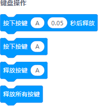
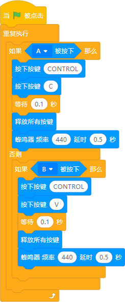
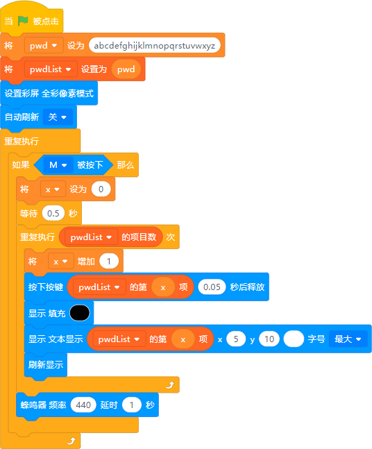

## Introduction

## Overview
Send keyboard events to the computer via USB HID protocol, making Futureboard Lite a keyboard

## Cases
---

##  Brick-moving keyboard
 

## Account Keys
You can set a super complicated related password, and then store the password in the future board lite. Let him help you enter the password The complexity of this password can only be remembered by Tu Yaya (manual dog head~) 

## One-button combo!
Street Fighter 6 has recently become very popular. I was eager to try it out, but I found that it was difficult to perform cool combos without extensive practice. In this case, we can use Futureboard Lite to find a clever way to do it. :-)
This experiment requires everyone to debug slowly according to the actual situation, so the program is no longer displayed. 

