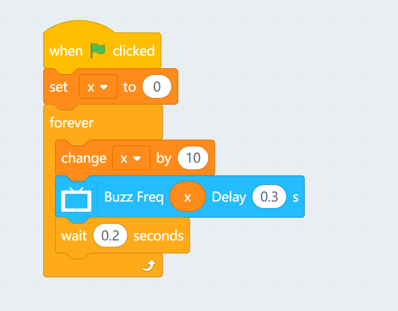
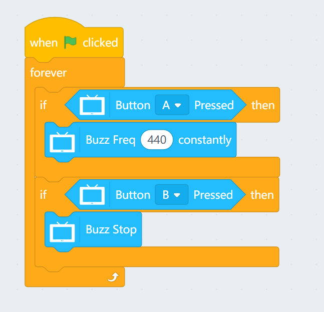
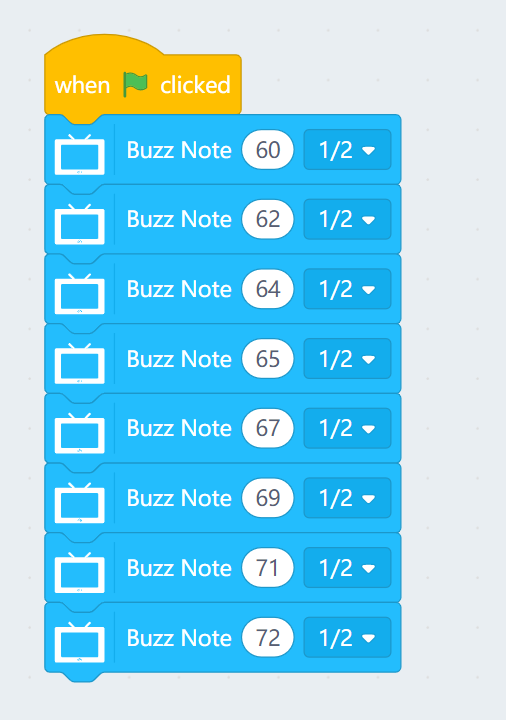
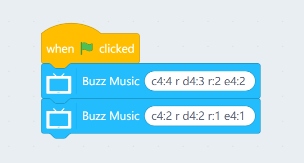
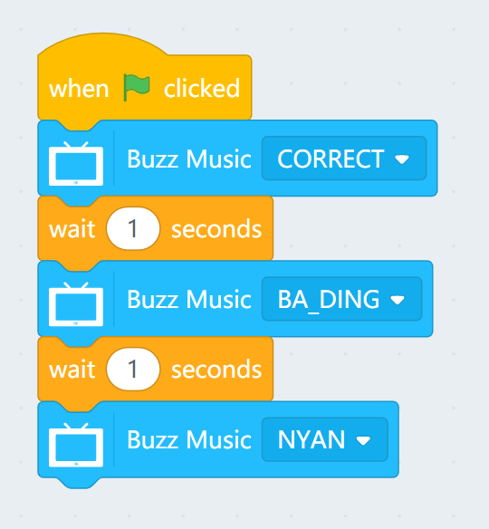
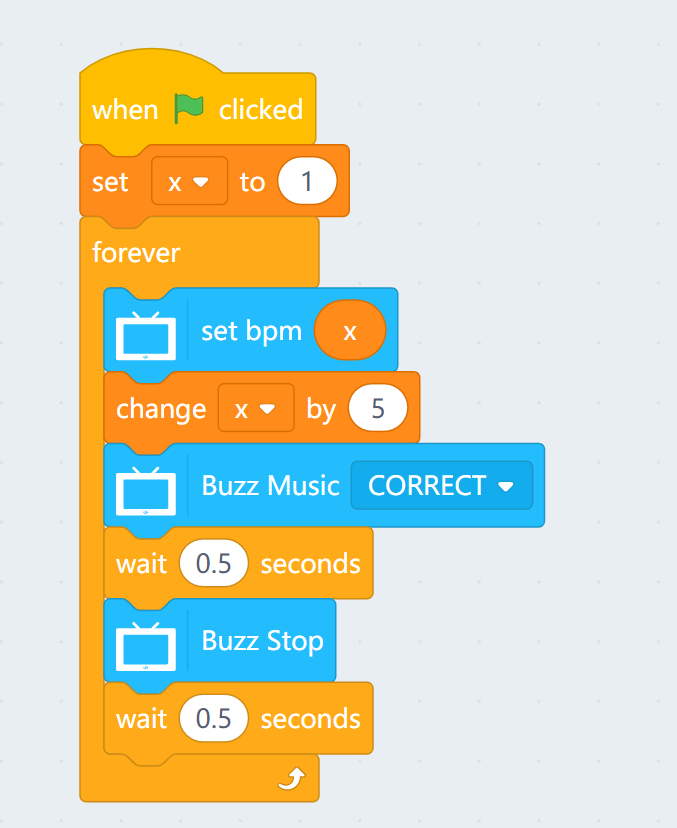

# Buzzer

Buzzers can make your creations more interesting by adding sounds and musics.

## Buzzer Blocks

### Sample Program: Buzzer and Frequencies

The buzzer can be controlled using frequencies.

Refer to this page for more information about frequencies and notes: <https://pages.mtu.edu/~suits/notefreqs.html>

### Sample Program: Stopping the Buzzer

Press A and the buzzer will sound continuously, press B to stop the sound.

### Sample Program: Playing Notes

Plays the 8 stand notes.

### Sample Program: Making your own Melodies

- Using c4:2 as an example
    - C is the note played
    - 4 is the octave
    - :2 is the duration in beats
    

### Sample Program: Playing Preset Melodies

Plays a few preset melodies.

### Sample Program: Affecting the BPM

The BPM slowly increases.

