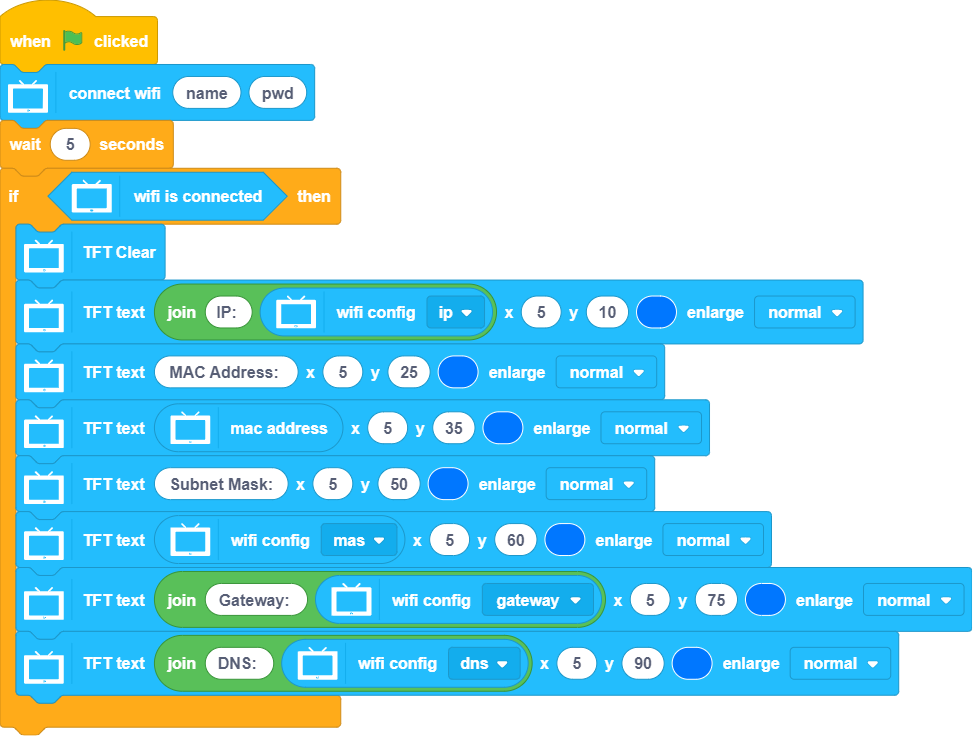
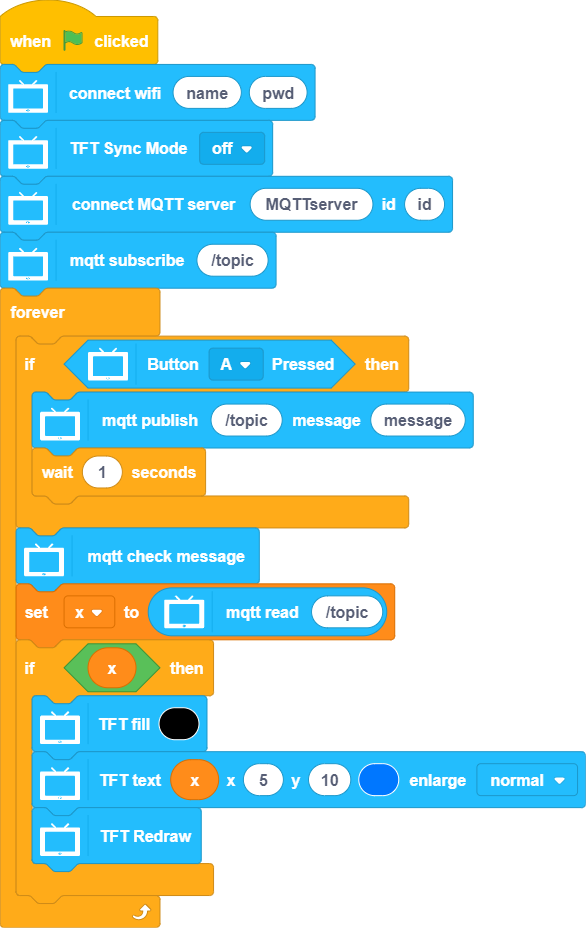
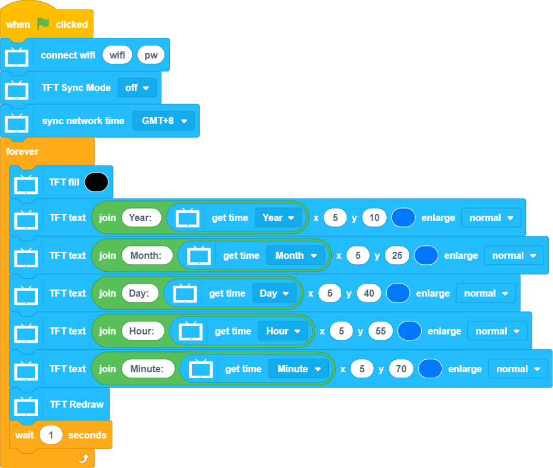

# WiFi & IoT

FutureBoard's WiFi capability enables it to fulfill IoT tasks.

## IoT Blocks

### Sample Program: WiFi Configurations

### Sample Program: MQTT Operations

### Sample Program: Network Time Protocol

