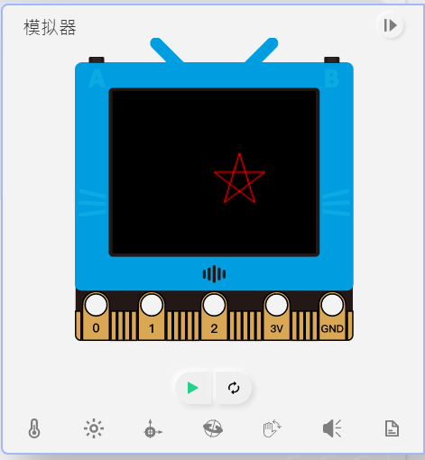

# Turtle

## Import FutureBoard Library

Import the Library to make use of its functions.

    from future import *
    
## 04: Turtle

### 1. Setting the Pen Color

    turtle.fillcolor(color)

Turtle accepts RGB value for color, value range is 0~255. Example: (255,100,0)

### 2. Moving the Pen Forward

    turtle.forward(steps)
    
Moves the pen forward by the number of steps.
    
### 3. Turning the Pen

    turtle.left(angle)
    turtle.right(angle)
    
Turns the pen to the left or right by the degree of angle.

### 4. Setting the Heading

    turtle.setheading(angle)
    
Sets the heading to be the angle.

### 5. Moves the Pen to a Point

    turtle.goto(x,y)
    
Moves the pen to a point (x,y).

### 6. Moves the Pen along an axis

    turtle.setx(x)
    turtle.sety(y)
    
Moves the pen to a point on the x or y axis.

### 7. Draws a Dot
    
    turtle.dot(d)
    
Draws a dot with the diameter of d.

### 8. Draws a Circle

    turtle.circle(r,angle)

Draws an arc with the given radius and angle, a 360 degree arc results in a full circle.

### 9. Sets a Fill Area

    turtle.begin_fill()
    turtle.end_fill()

Begins and ends the fill area.

    Note: The screen of the FutureBoard is below the requirements for the Turtle MicroPython Library, there may be unintended results with the fill function.
    
### 10. Sets the Pen Up or Down

    turtle.pendown()
    turtle.penup()

### 11. Clears the Screen

    turtle.clear()
    
### Sample Program

    # Draws a star

    from future import *

    turtle.clear()
    turtle.penup()
    turtle.setx(80)
    turtle.sety(64)
    turtle.pendown()
    for i in range(5):
        turtle.forward(40)
        turtle.right(144)

