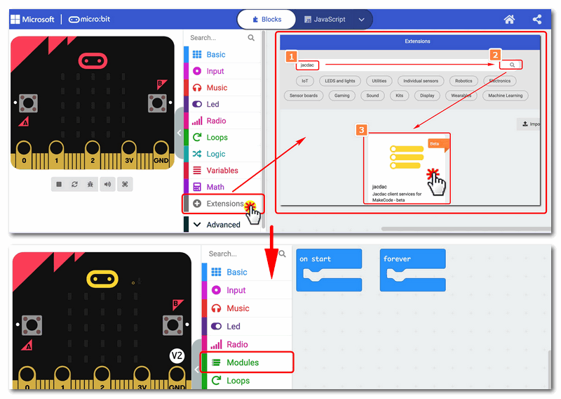

## 
## Introduction

Jacdac KitB is the second set of robot kits for Microsoft Jacdac protocol developed by KittenBot. KitB is an electronic module extension kit for KitA. KitB includes 8 electronic modules: Accelerometer, Env Sensor, RGB Strip, Servo, Power, Haptic Output, Relay, Ultrasonic, and a new Hub. KitB combines the outer packaging with the electronic module to form a mini robot.

You can also use KB RP2040 Brain or Grape:bit as the main control, and program and control it under the DeviceScript platform.

For more Jacdac information, please visit: [https://microsoft.github.io/jacdac-docs/start/](https://microsoft.github.io/jacdac-docs/start/)

## Feature

The paper box packaging not only serves as a storage function, but also combines the modules to form a robot

Users do not need to care about the port connection or port characteristics, just plug it in, reducing the user's use cost

New programming experience, plug and play programming blocks, much better than looking for the required blocks in a pile of blocks in the past

The Jacdac interface is similar to the USB Type-C connection experience, and can be connected in both positive and negative directions.

The newly embodied connection form is no longer the point radiation connection from the main control to the module. The connection link can be branched arbitrarily, and the wiring is more free, and the work is not restricted. It is more prominent in some complex wiring or large works.

## Components used

- 1x MicroUSB Cable
- 1x MicrobitV2
- 1x Jacdaptor
- 1x Cable
- 1x Relay

## Connection

PC-〉MicroUSB -〉MicrobitV2-〉Jacdaptor-〉Cable-〉Relay

## Coding Platform

[https://makecode.microbit.org/beta](https://makecode.microbit.org/beta)

## Create a new project

## Establish a connection

## Add Jacdac Extensions

Extensions——Jacdac

## Add Jacdac Relay

## Coding

## Download

On pressing button A, the relay opens and you can see the LED light up on the relay

On pressing button B, the relay closes and you can see the LED light on the relay go off

