If you are using it for the first time, it is recommended that you familiarize yourself with the 8 modules of KitB before doing the overall programming of the paper box robot. This document assumes that you are already familiar with the use of KitB modules under MakeCode.

## Check before use

1. Please make sure that your jacdac-Power module has been plugged into a 3.7V lithium battery pack or a Type-C data cable (because jacdac-Servo needs 5V power supply from jacdac-Power to work normally)

2. Please make sure that the robot has been assembled according to the instructions

3. Please make sure that the jacdac module has been connected correctly according to the instructions

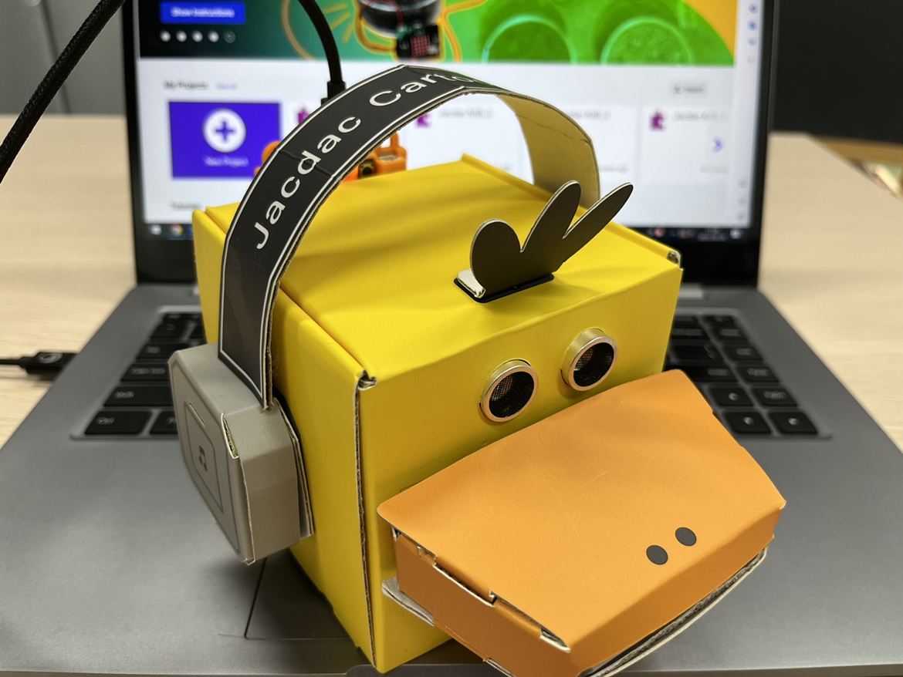

## Components used

- 1x KitB Cartoon Robot
- 1x Micro USB Cable

## Connection

PC-〉MicroUSB -〉KitB Ducky

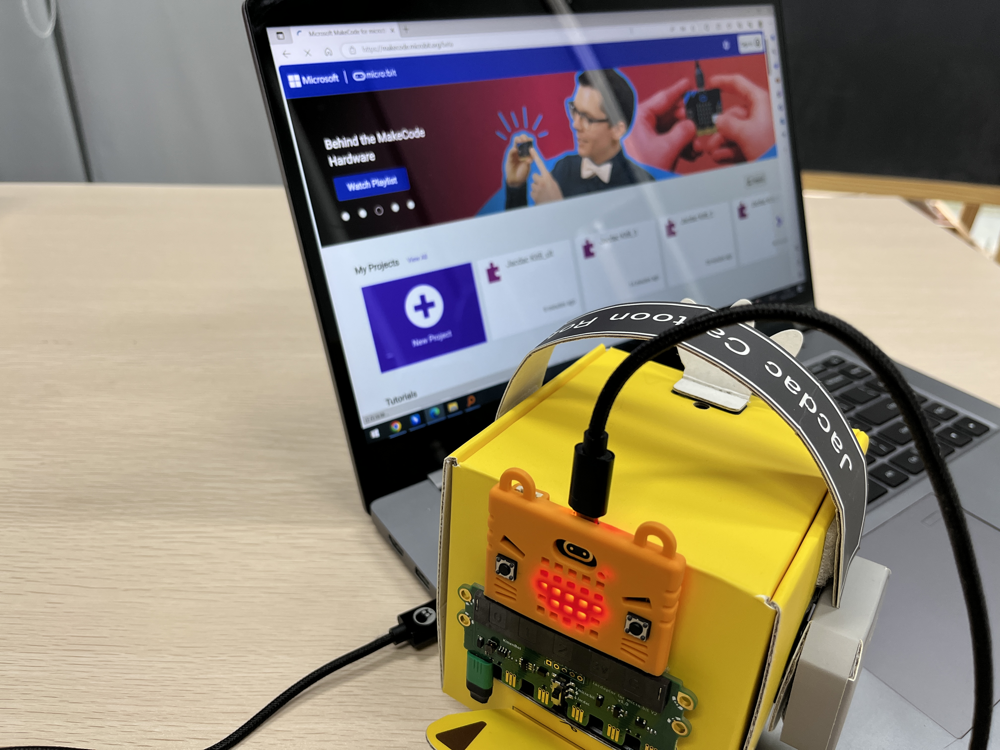

## Coding Platform
[https://makecode.microbit.org/beta](https://makecode.microbit.org/beta)

## Create a new project
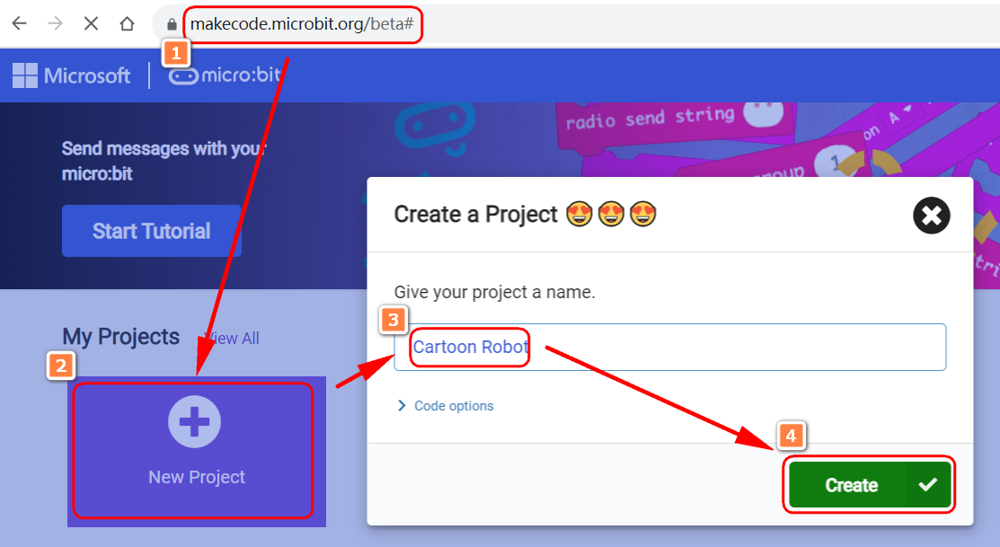

## Establish a connection
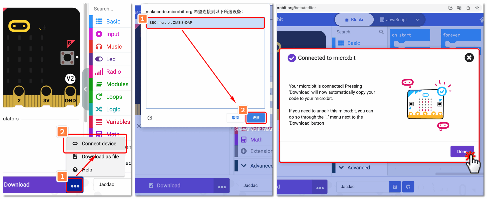

## Add Jacdac Extensions

Extensions——Jacdac

## Download a blank program

Once the Jacdac plug-in is loaded, you need to download a blank program first. The empty program is used to initialize the Jacdac module. After the download is complete, the Jacdac module will be initialized and the Jacdac module will be able to work normally.

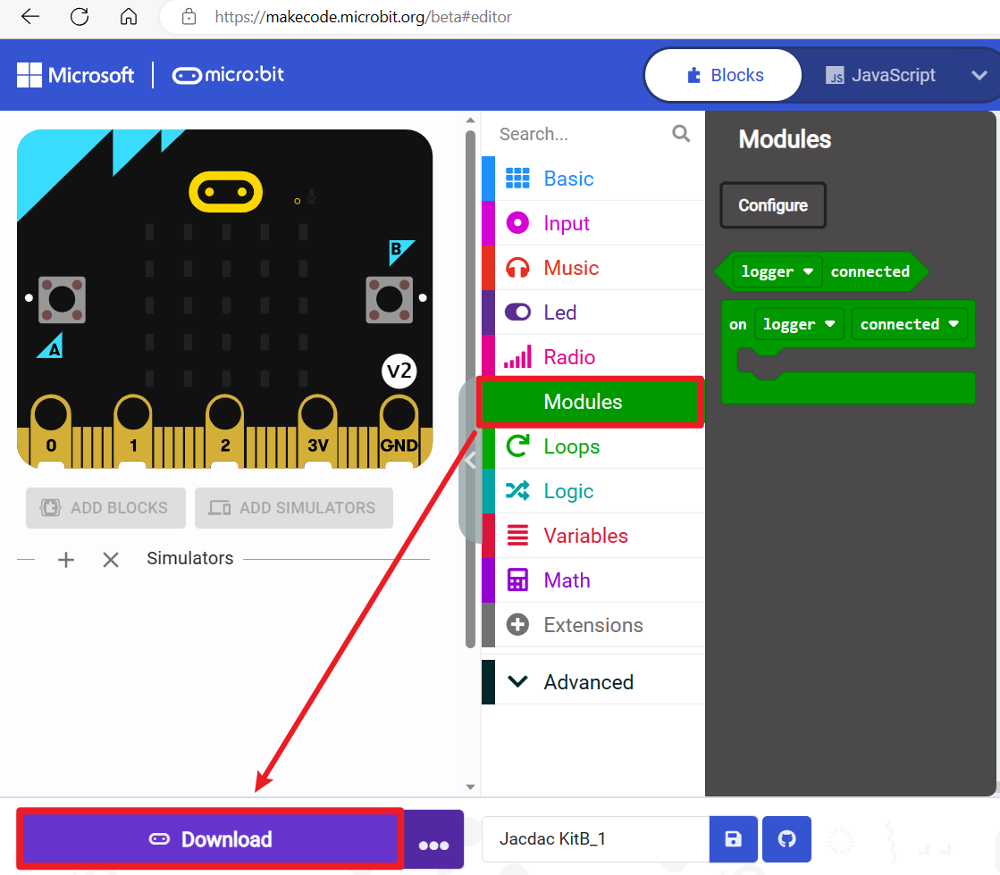

## Simulator

In simulator, you can see all the modules of KitB.

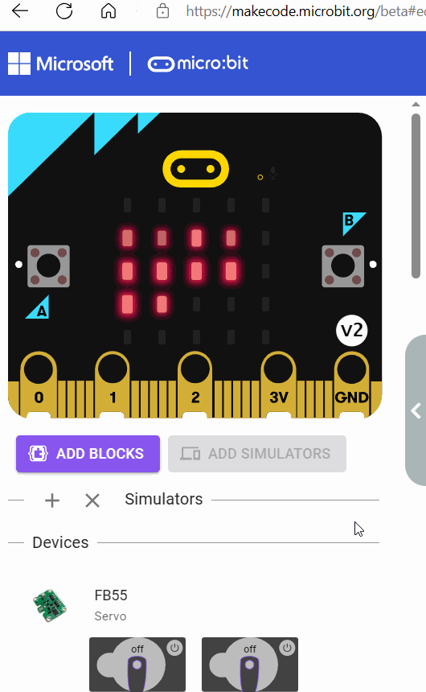

### “ADD BLOCKS”

Add all modules to the Modules column.

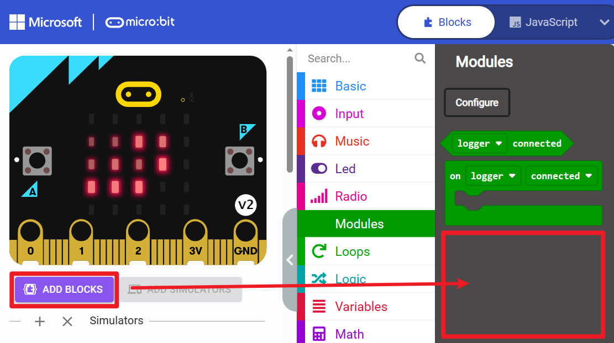
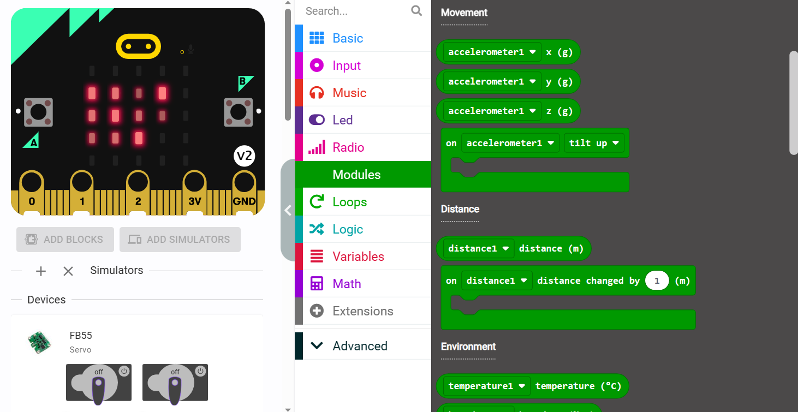

## Coding
### Time to wake up

Coding for RGB Strip and Vibration motor (Haptic Output)

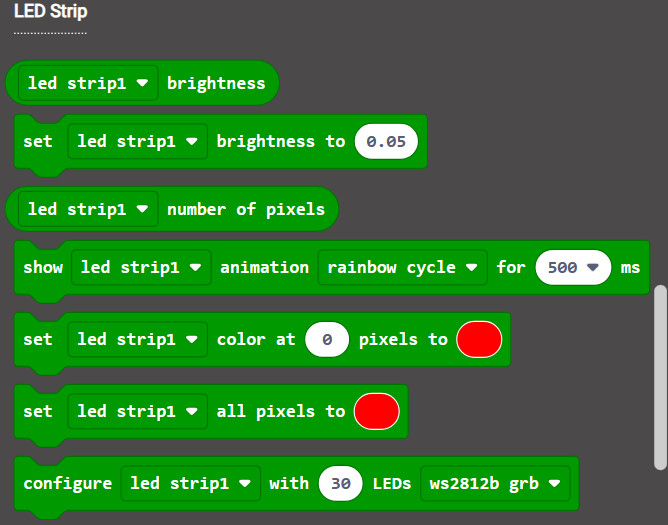
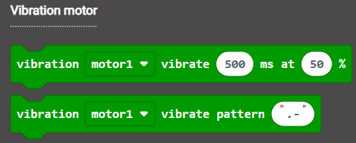

- Coding blocks

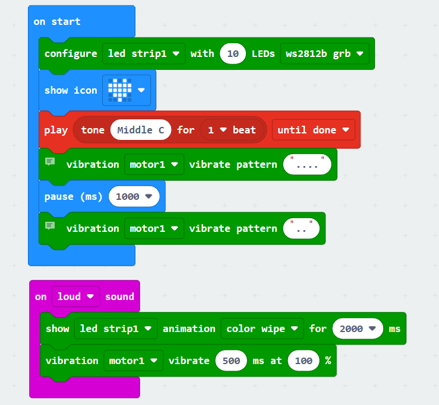
 
- Effects

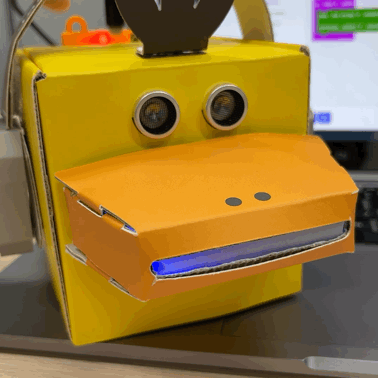

### Let's check the temperature and moisture

Use the temperature and humidity sensor to detect the temperature and humidity of the environment

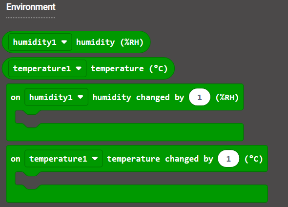

- Coding

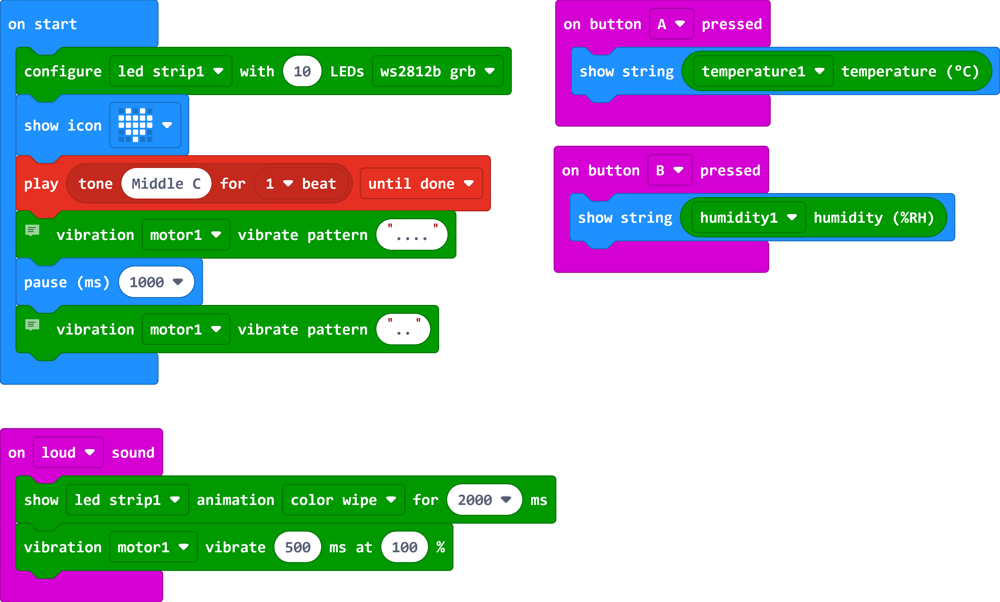

- Effects

### When I fall, I will get up

Use the accelerometer to detect the acceleration of the robot, and when the acceleration is greater than 2g, the robot will stand up

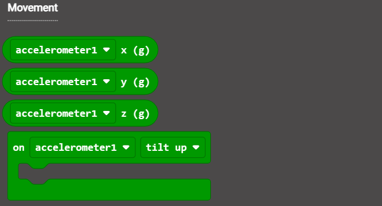

- Coding

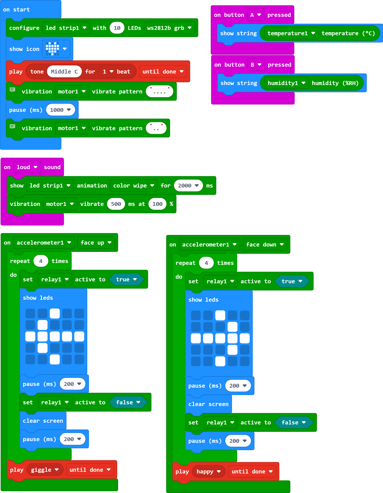

- Effects

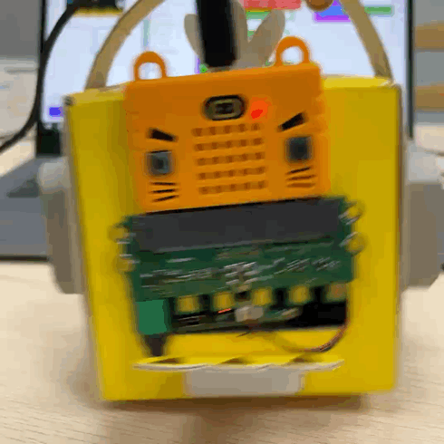

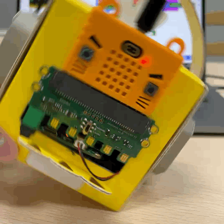

### Please Follow Me

Use the ultrasonic sensor to detect the distance between the robot and the object. When the distance is less than 15CM, the robot will move backwards. When the distance is greater than 15CM and less than 25CM, the robot will move forward. When the distance is greater than 25CM, the robot will stop moving.

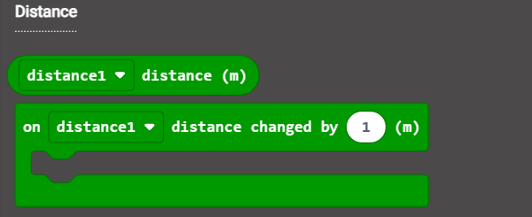

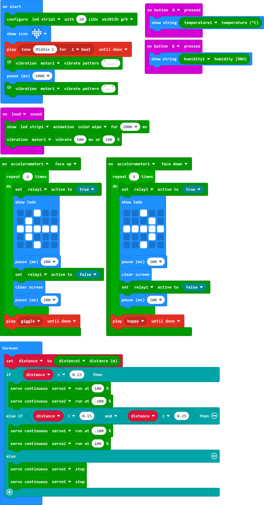

Power on, Jacdac-Power needs to be plugged into the lithium battery

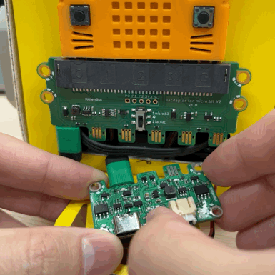

Close to the duck (less than 15cm)

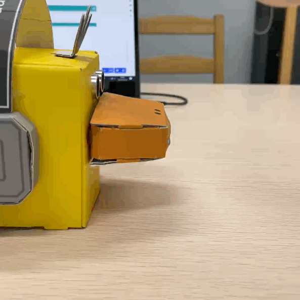

Hold your hand at (15CM-25CM)

