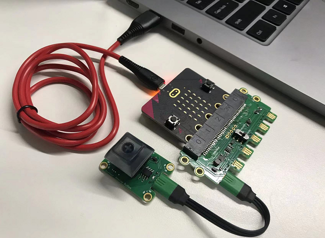
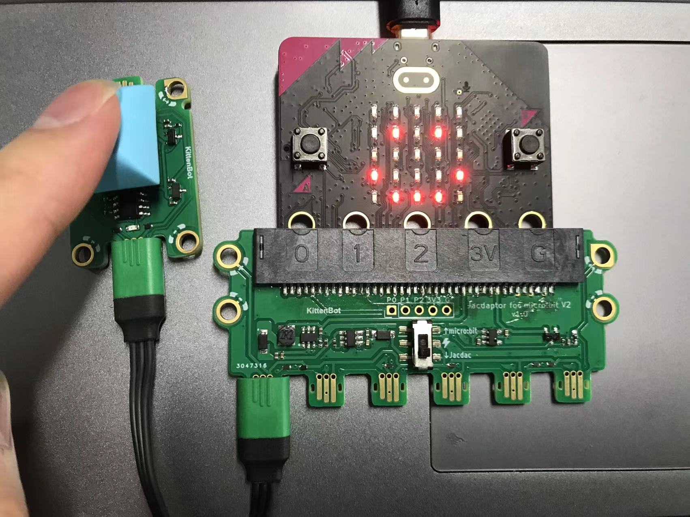

## 
## Introduction

Jacdac KitA is a new kit for Microsoft Jacdac protocol developed by KittenBot. KitA includes 5 types of electronic modules: Slider, Rotary Button, Keycap Button, Magnet Sensor, Light Sensor. The matching soft and novel jacdac connection line will bring you a new connection experience, which is convenient for electronic enthusiasts to learn Jacdac system.

In addition, you can also purchase Jacdaptor, which can be used with MicrobitV2 for programming on the Makecode platform.

for more Jacdac information, please visit:

[https://microsoft.github.io/jacdac-docs/start/](https://microsoft.github.io/jacdac-docs/start/)

## Feature

1. Users do not need to care about the port connection or port characteristics, just plug it in, reducing the user's use cost

2. New programming experience, plug and play programming blocks, much better than looking for the required blocks in a pile of blocks in the past

3. Online interactive empowerment, without a program, you can interact with the sensor (although it is not as good as Scratch, it is a revolutionary change in Makecode)

4. The Jacdac interface is similar to the USB Type-C connection experience, and can be connected in both positive and negative directions.

5. The newly embodied connection form is no longer the point radiation connection from the main control to the module. The connection link can be branched arbitrarily, and the wiring is more free, and the work is not restricted. It is more prominent in some complex wiring or large works.

## Components used

- 1x MicroUSB Cable
- 1x MicrobitV2
- 1x Jacdaptor
- 1x Cable
- 1x Keycap Button

## Connection

PC-〉MicroUSB -〉MicrobitV2-〉Jacdaptor-〉Cable-〉Keycap Button

## Coding Platform

[https://makecode.microbit.org/beta](https://makecode.microbit.org/beta)

## Create a new project

## Establish a connection

## Add Jacdac Extensions

Extensions——Jacdac

## Add Jacdac KeycapButton Block

## Program and download

- Press the A button on the Microbit dot matrix screen as prompted by the Microbit dot matrix screen to start the program

## Effect

- Button not pressed:

- Button pressed:

