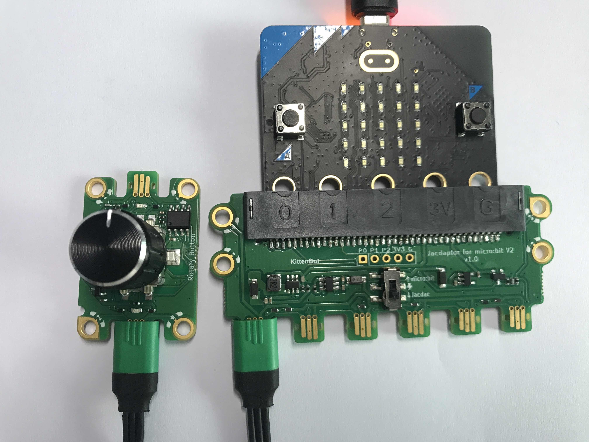

## 

## Module Introduction

1. Jacdac Interface
2. Jacdac Communication Indicator
3. Rotary Encoder with Button
4. Jacdac Standard Through Hole
5. Product QR Code

## Components used

- 1x MicroUSB Cable
- 1x MicrobitV2
- 1x Jacdaptor
- 1x Cable
- 1x RotaryButton

## Connection

PC-〉MicroUSB -〉MicrobitV2-〉Jacdaptor-〉Cable-〉RotaryButton

## Coding Platform

[https://makecode.microbit.org/](https://makecode.microbit.org/beta)

## Create a new project

## Establish a connection

Extensions——Jacdac

## Add Jacdac RotaryButton Block

## Program and download

## After downloading, you need to press the A button to start

## The Result

When the rotary button is not turned:

When the rotary button is turned 5 grids: one circle is 20 grids

