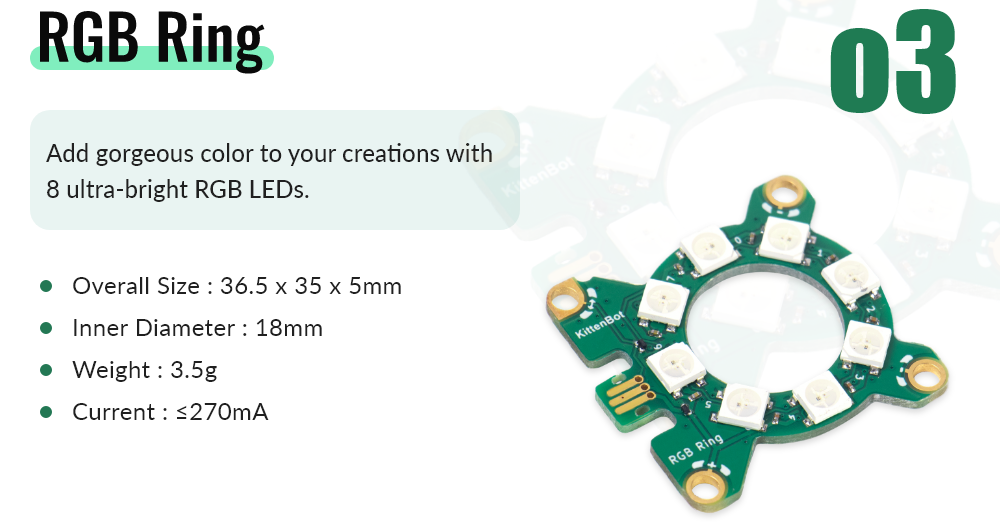
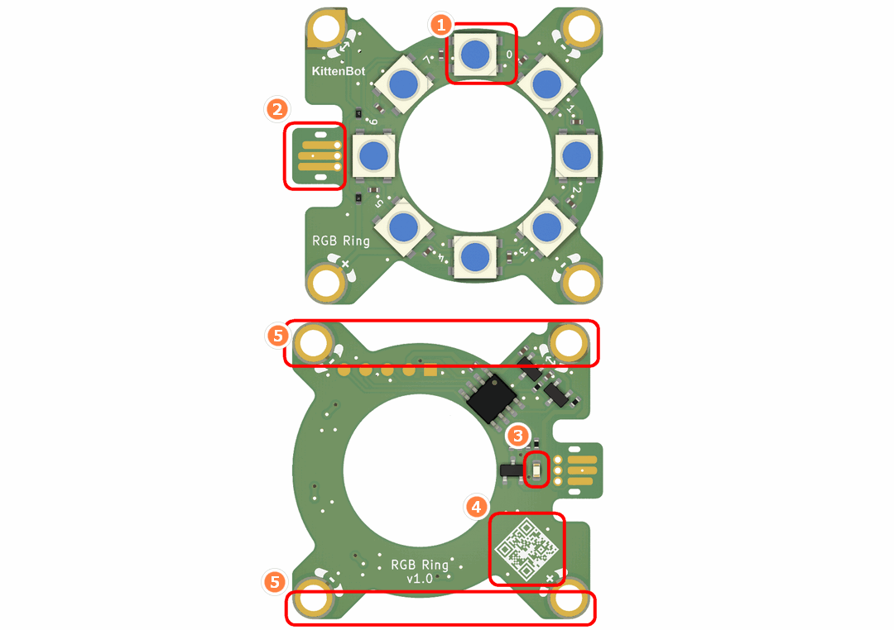
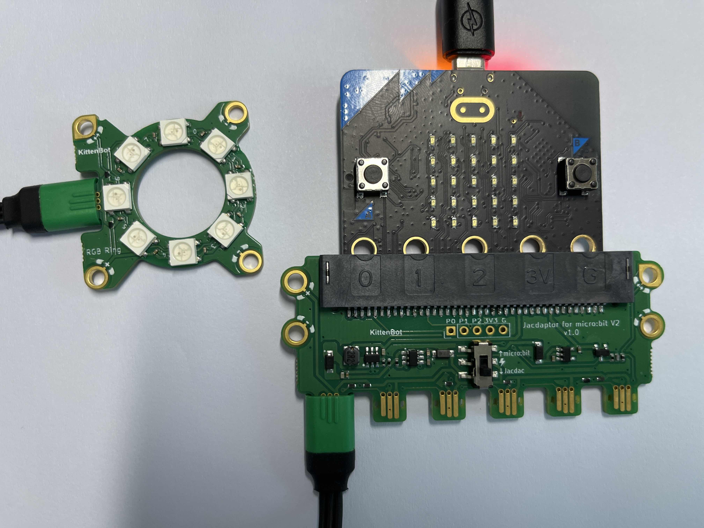
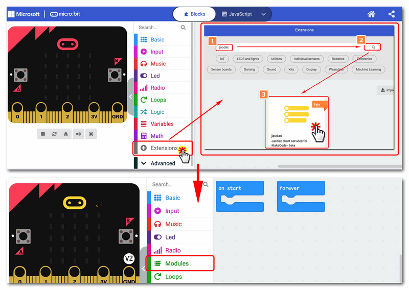
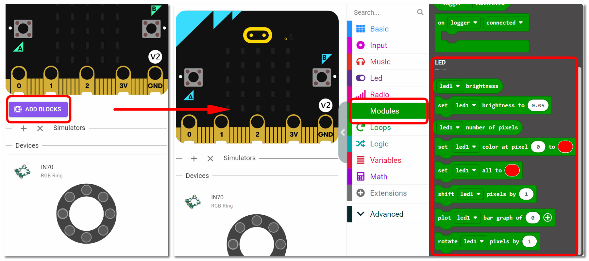
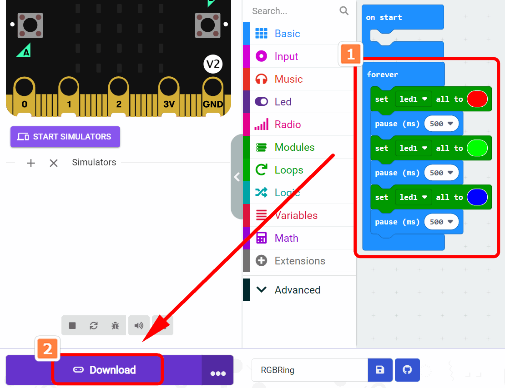
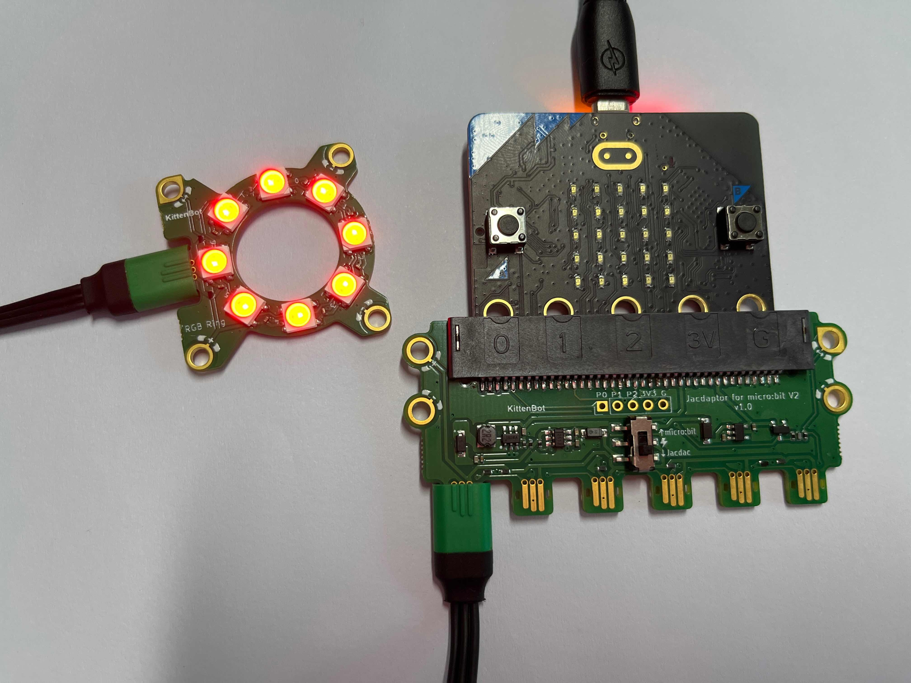
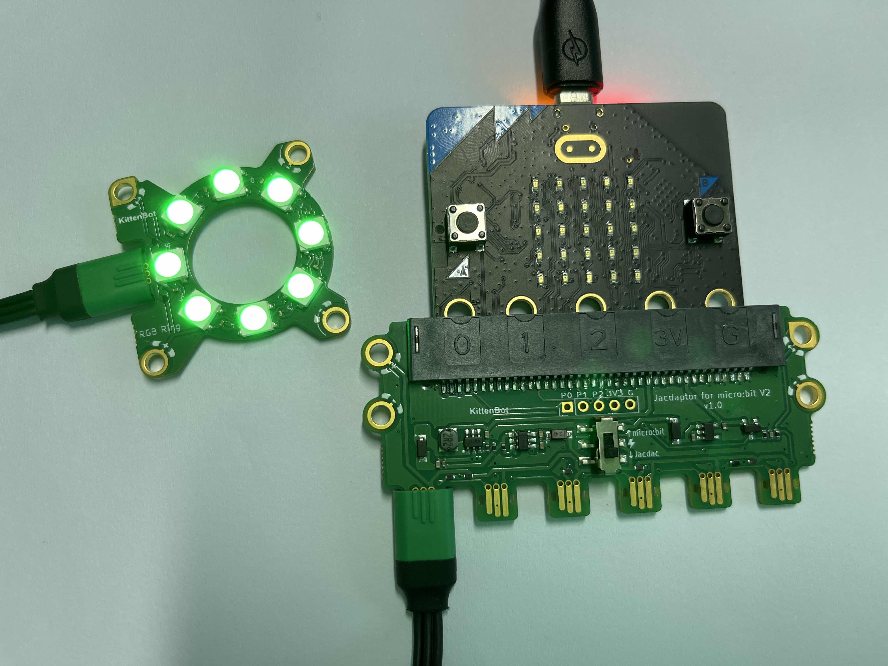
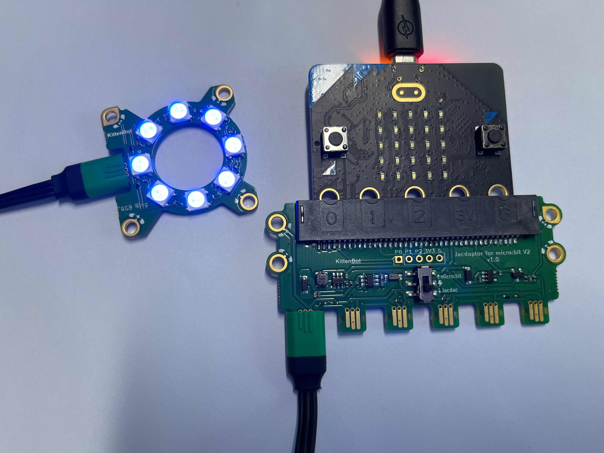

## 

## Module Introduction

1. WS2812RGB LED
2. Jacdac Interface
3. Jacdac Communication Indicator
4. Product QR Code
5. Jacdac Standard Through Hole

## Components used

- 1x MicroUSB Cable
- 1x MicrobitV2
- 1x Jacdaptor
- 1x Cable
- 1x RGBRing

## Connection

PC-〉MicroUSB -〉MicrobitV2-〉Jacdaptor-〉Cable-〉RGBRing

## Coding Platform

[https://makecode.microbit.org/](https://makecode.microbit.org/beta)

## Create a new project

## Establish a connection

Extensions——Jacdac

## Add Jacdac RGBRing Block

## Program and download

## The Result

