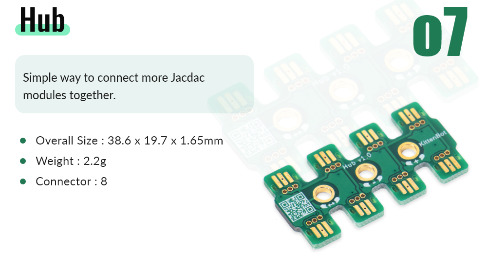
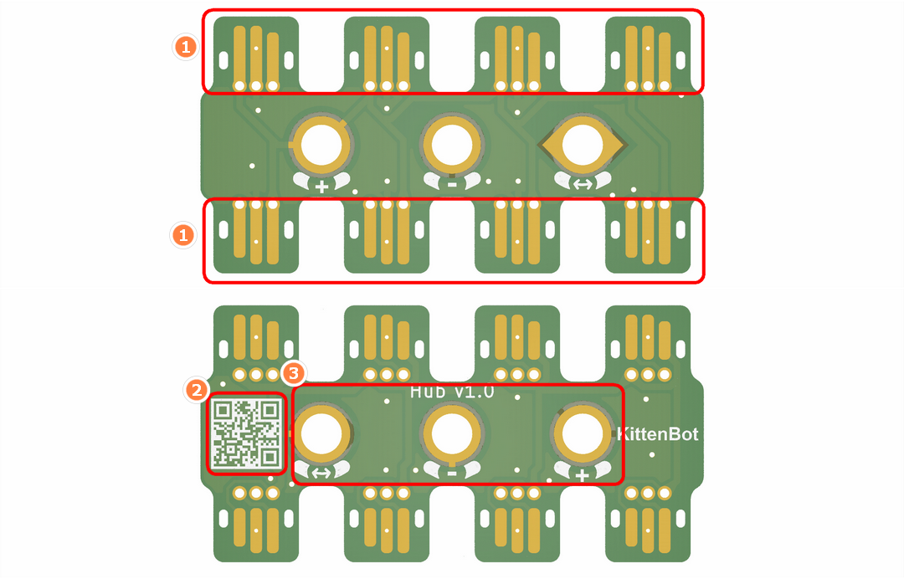
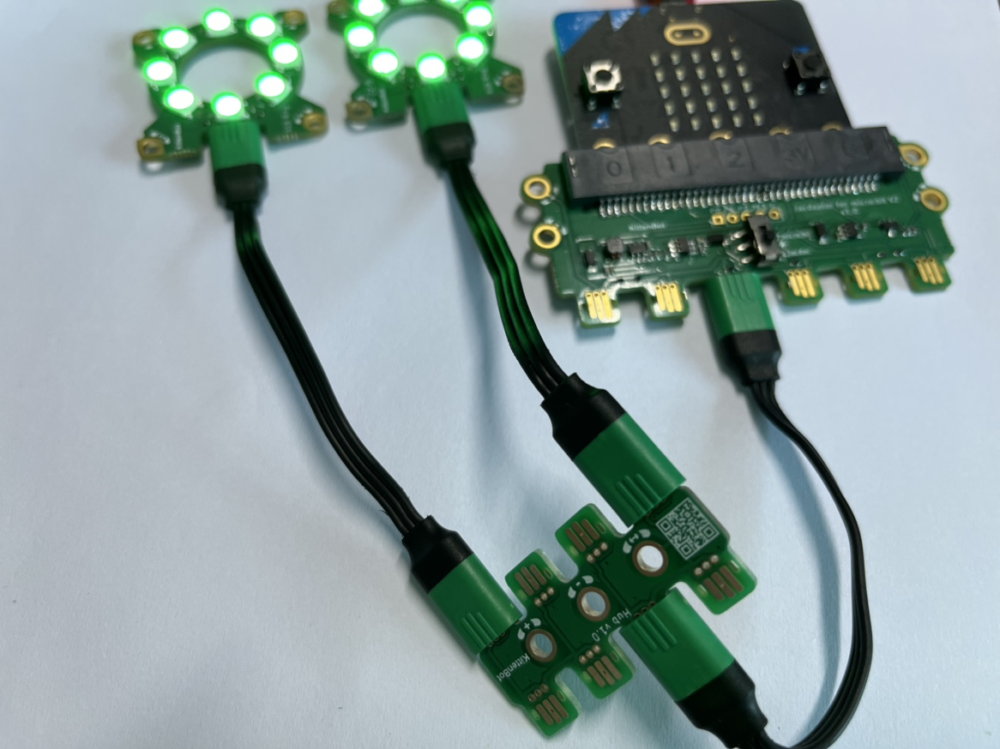
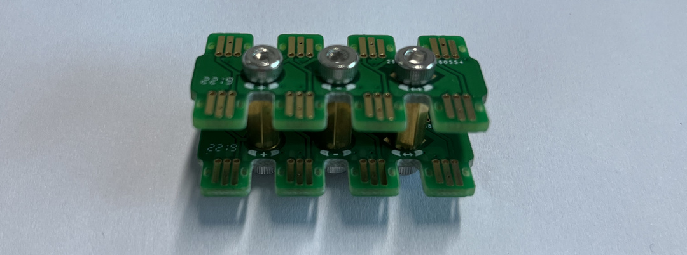
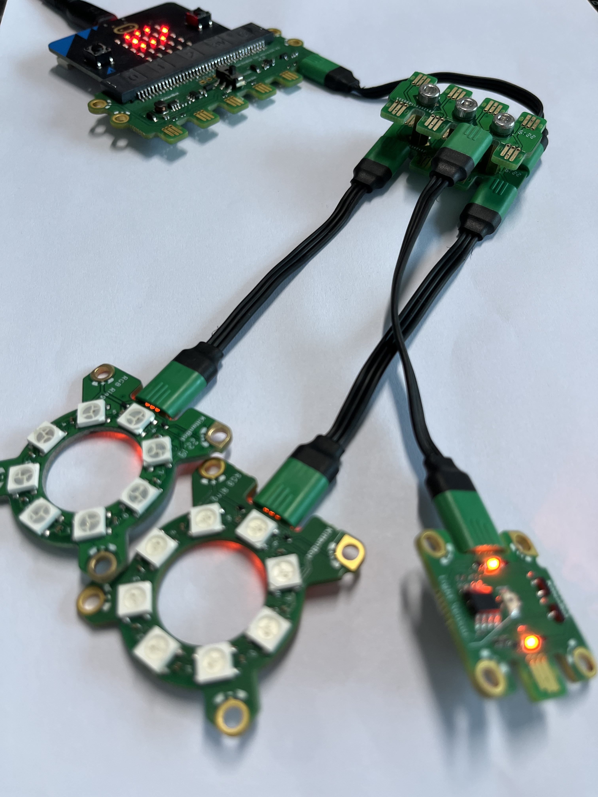

## 

## Module Introduction

1. Jacdac Interface
2. Product QR Code
3. Jacdac Standard Through Hole

## Description

Jacdac-Hub has 8 Jacdac interfaces in total, and the functions of the interfaces are the same. You can plug in at will. Mainly used for one-to-many module usage scenarios

## Usage of Through Hole

When you have two Hubs and want to make the connection more concise, you can use copper pillars and screws to connect

> Please note that the direction of the two Hubs is the same

