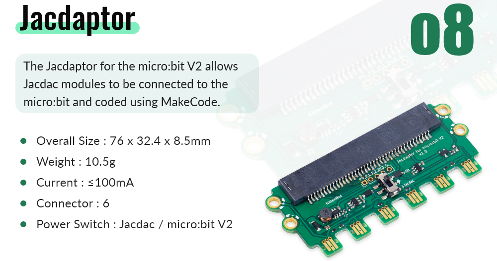
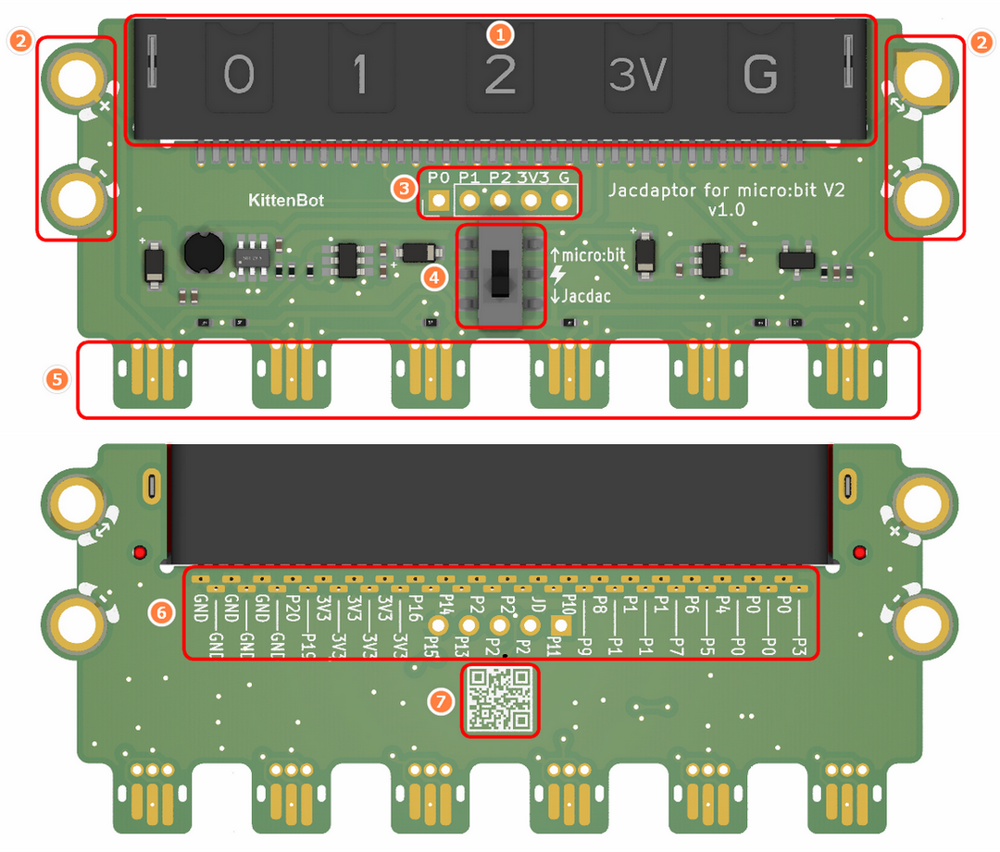
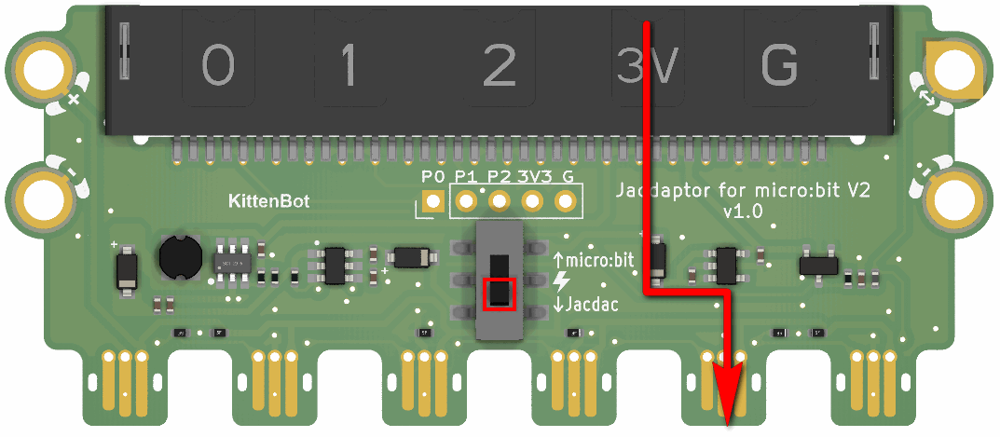
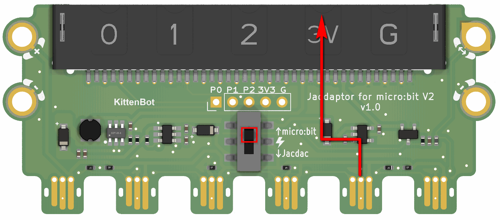

## 

## Module Introduction

1. Microbit Edge Connector
2. Jacdac Standard Through Hole
3. Micro:bit Gold Finger Pad (P0, P1, P2, 3V3, GND)
4. Power Switch
5. Jacdac Interface
6. Micro:bit Full Interface Out (convenient for Maker welding)
7. Product QR Code

## The function of the switch

- When the switch is at the bottom, the power is supplied from Micro:bit to Jacdac interface (commonly used mode, only need to supply power to Microbit with data cable, Jacdac module can work normally)

- When the switch is at the top, the power is supplied from the Jacdac interface to Micro:bit (if you have an external power input, you can use this mode)

## FAQ

### Q1 ：Can Jacdaptor be adapted to MicorbitV1.5?
> A1：Jacdaptor can only be used with MicrobitV2

### Q2：What is the voltage of Jacdaptor?
> A2：5V

### Q3：Which mode should the Jacdaptor power switch choose?
> A3：It is recommended to switch the switch to the bottom and use Micro:bit to supply power to the Jacdac interface

