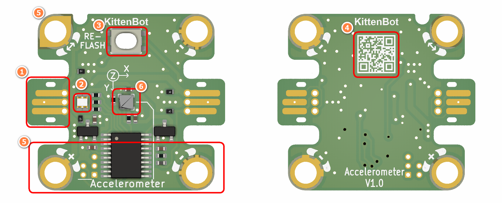
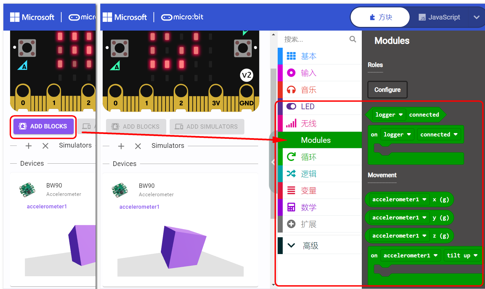
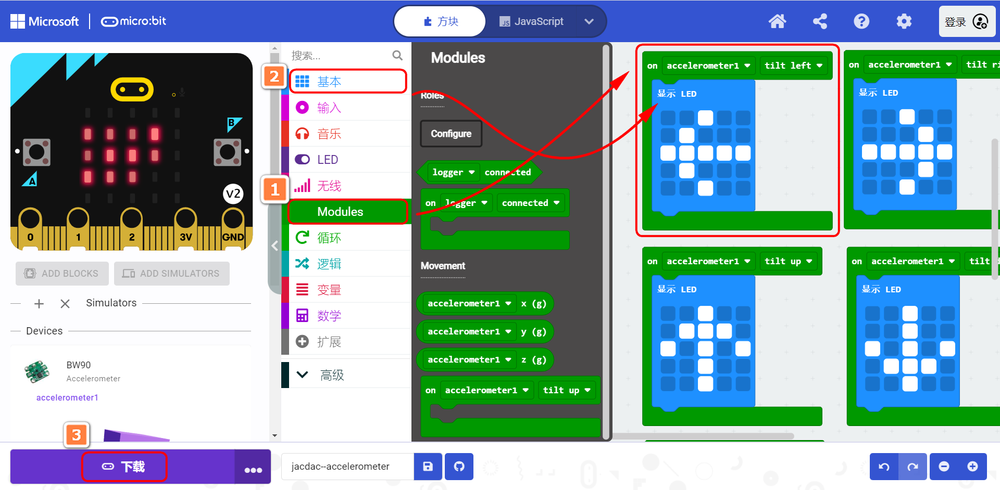
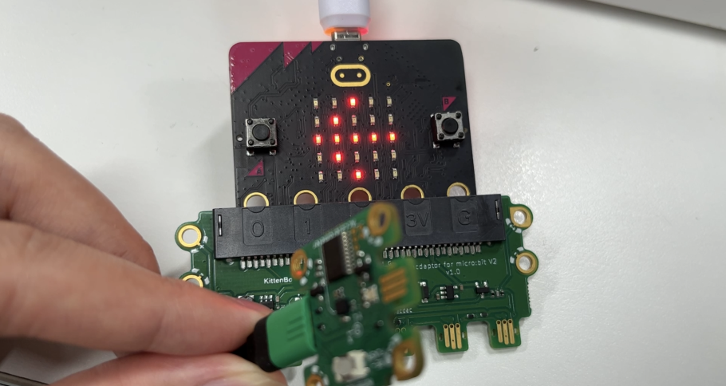
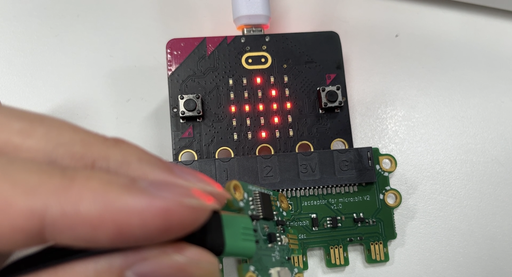

## Module Introduction

1. Jacdac Edge Connector
2. Jacdac Communication Indicator
3. Boot Button
4. Product QR Code
5. Jacdac Standard Through Hole

## Components used

- 1x MicroUSB Cable
- 1x MicrobitV2
- 1x Jacdaptor
- 1x Cable
- 1x Accelerometer

## Connection

PC-〉MicroUSB -〉MicrobitV2-〉Jacdaptor-〉Cable--〉Accelerometer

## Coding Platform

[Microsoft MakeCode for micro:bit (microbit.org)](https://makecode.microbit.org/beta)

## Create a new project

## Establish a connection

Extensions——Jacdac

## Add Jacdac Accelerometer Block

## Program and download

## The Result

When the accelerometer is tilted to the left:

When the accelerometer is tilted to the right:

