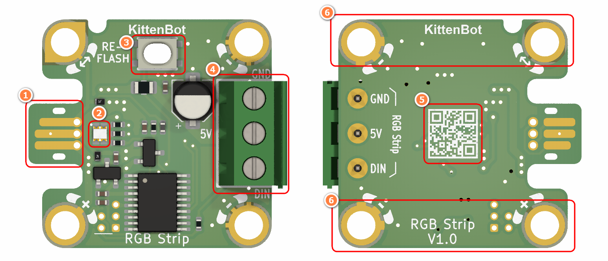
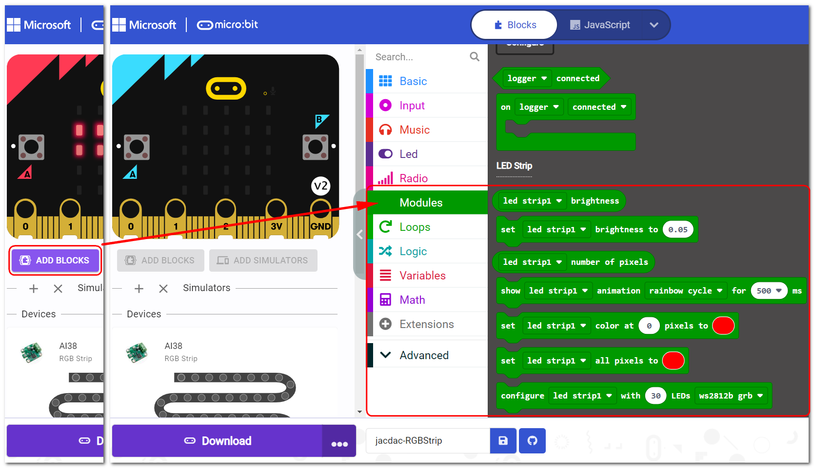
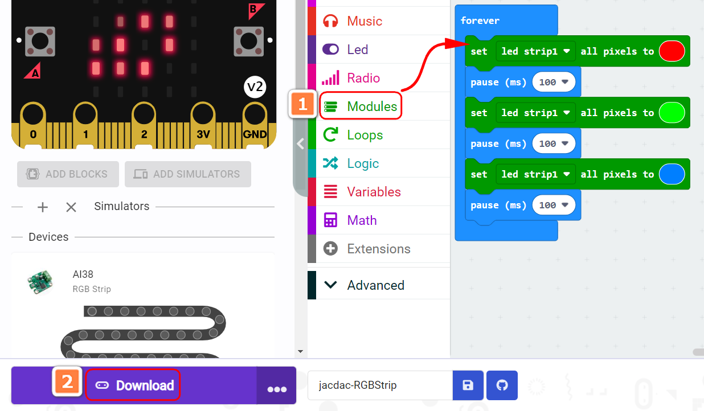
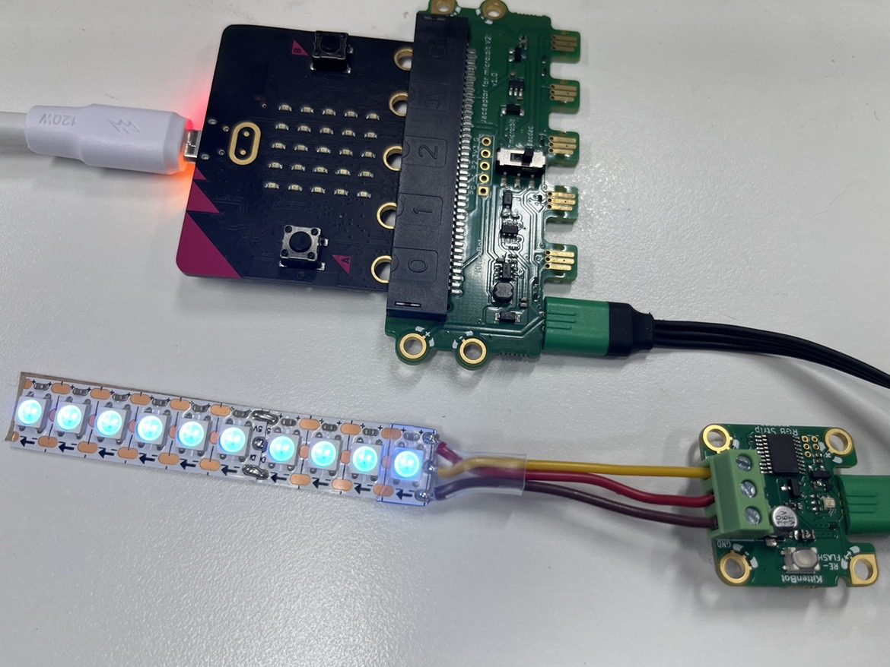

## Module Introduction

1. Jacdac Interface
2. Jacdac Communication Indicator
3. Boot Button
4. RGB Strip Connector
5. QR Code
6. Jacdac Standard Through Hole

## Components used

- 1x MicroUSB Cable
- 1x MicrobitV2
- 1x Jacdaptor
- 1x Cable
- 1x RGB Strip

## Connection

PC-〉MicroUSB -〉MicrobitV2-〉Jacdaptor-〉Cable--〉RGB Strip

## Coding Platform

[https://makecode.microbit.org/](https://makecode.microbit.org/beta)

## Create a new project

## Establish a connection

Extensions——Jacdac

## Add Jacdac RGB Strip Block

## Program and download

## The Result

