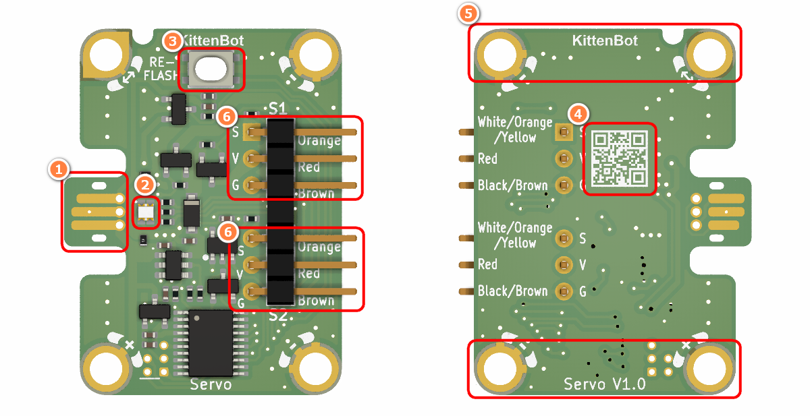
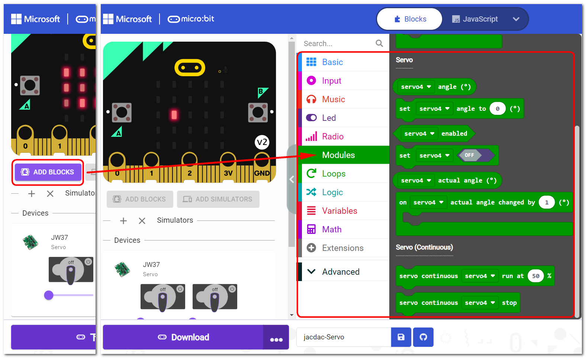
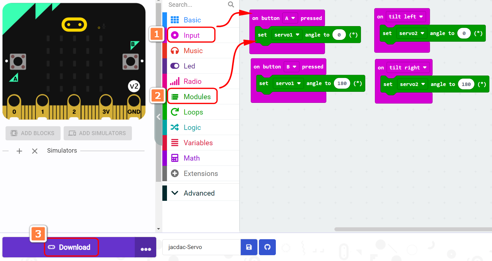
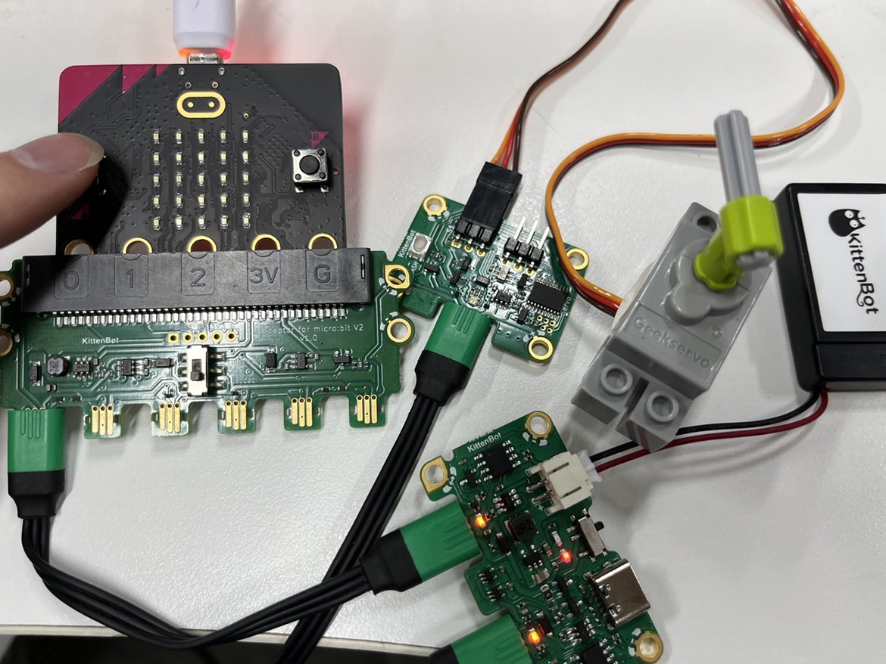
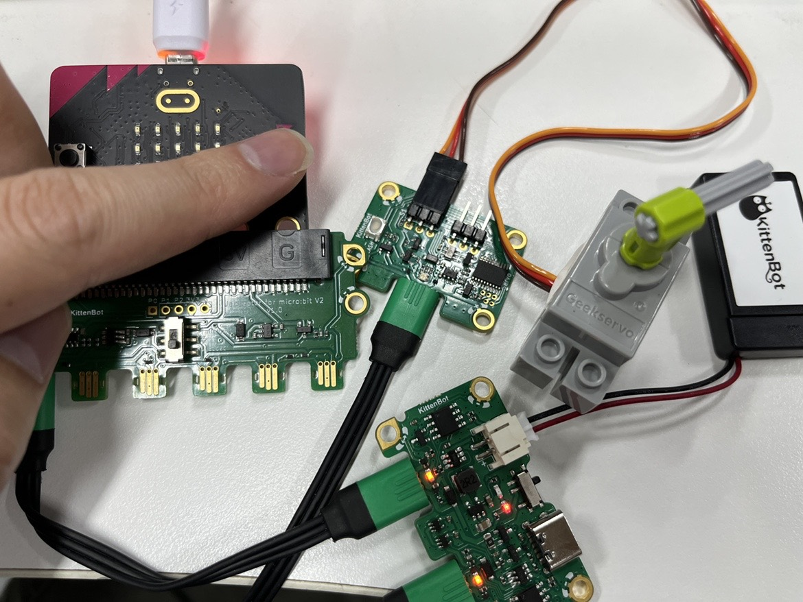

## Module Introduction

1. Jacdac Interface
2. Jacdac Communication Indicator
3. Boot Button
4. Product QR Code
5. Jacdac Standard Through Hole
6. Servo Connector

## Components used

- 1x MicroUSB Cable
- 1x MicrobitV2
- 1x Jacdaptor
- 1x Cable
- 1x Servo

## Connection

PC-〉MicroUSB -〉MicrobitV2-〉Jacdaptor-〉Cable--〉Servo

## Coding Platform

[https://makecode.microbit.org/](https://makecode.microbit.org/beta)

## Create a new project

## Establish a connection

Extensions——Jacdac

## Add Jacdac Servo Block

## Program and download

## The Result

Press AB to control the servo to rotate to different angles

## FAQ

### Why is the servo not moving?
> The servo needs to be used with the jacdac power module
