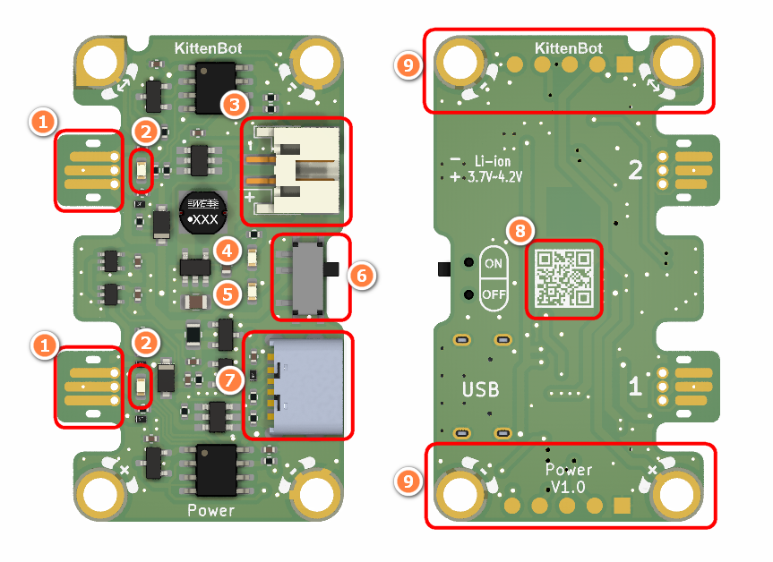
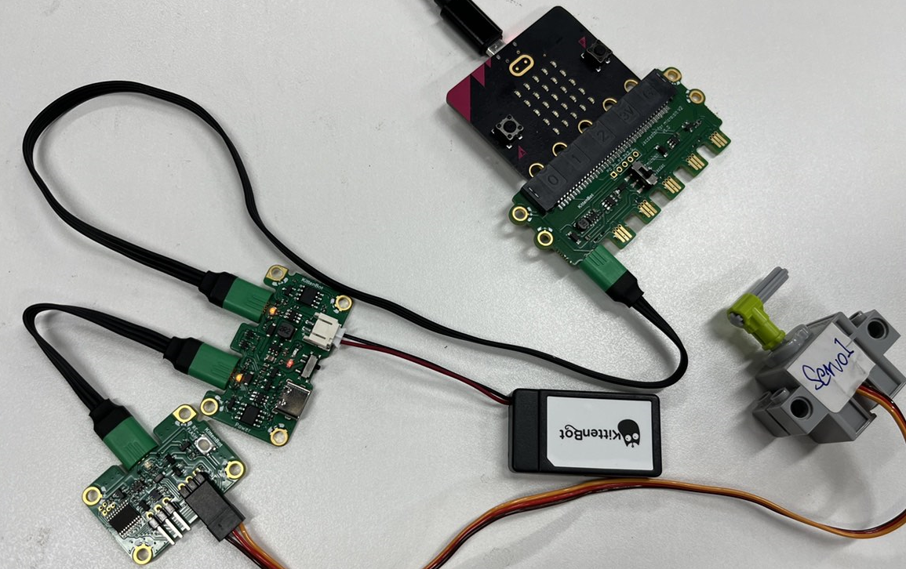
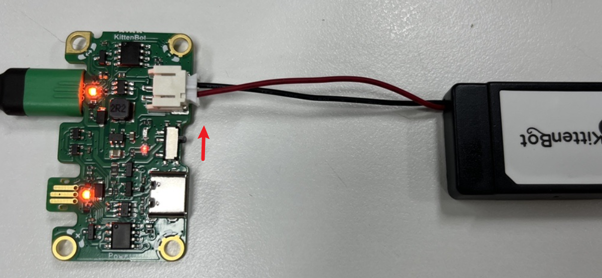
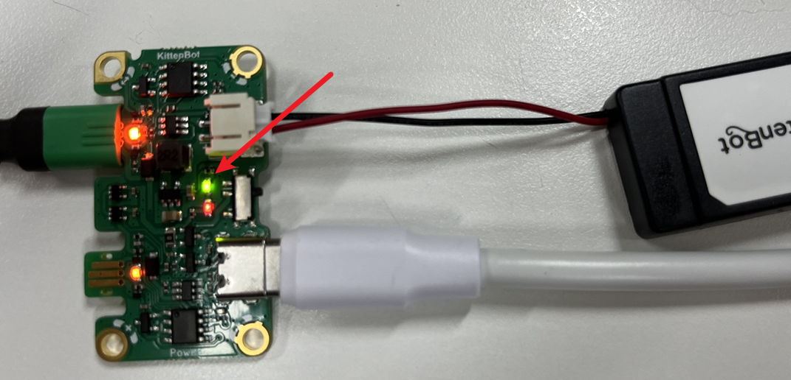

## Module Introduction

1. Jacdac Edge Connector
2. Jacdac Communication Indicator
3. Battery Connector
4. Charging Indicator (Flashing when charging, always on when full)
5. Power Indicator (Always on when power is on)
6. Power Switch
7. 5V External USB Power Interface
8. Product QR Code
9. Jacdac Standard Through Hole

## Components used

- 1x MicroUSB Cable
- 1x MicrobitV2
- 1x Jacdaptor
- 1x Cable
- 1x Servo
- 1x Power

## Connection

PC-〉MicroUSB -〉MicrobitV2-〉Jacdaptor-〉Cable--〉Servo&Power

## Power Module Introduction

1. Power module only serves as a power supply in MakeCode, and has no control function, so there is no programming block.
2. Generally used with servo module (servo module needs external power supply)
3. When the switch is turned on, the Power module will work, and the red power indicator will light up
4. In jacdac bus standard, the maximum current of the power is 1A, and only one module is feeding back to the bus. If two module with power supply role are connected to the bus at the same time, one of them will be automatically turned off.

3. Charging, green light flashing, full, green light always on

