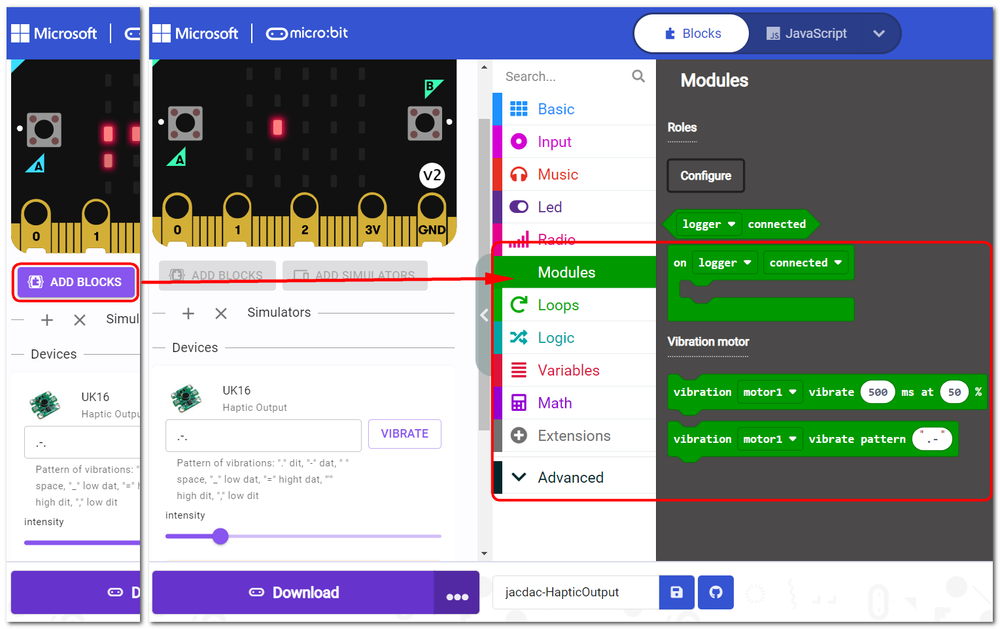

## Module Introduction

1. Jacdac Interface
2. Jacdac Communication Indicator
3. Haptic Motor
4. Product QR Code
5. Jacdac Standard Through Hole

## Components used

- 1x MicroUSB Cable
- 1x MicrobitV2
- 1x Jacdaptor
- 1x Cable
- 1x Haptic Output

## Connection

PC-〉MicroUSB -〉MicrobitV2-〉Jacdaptor-〉Cable--〉Haptic Output

## Coding Platform

[https://makecode.microbit.org/](https://makecode.microbit.org/beta)

## Create a new project

## Establish a connection

Extensions——Jacdac

## Add Jacdac Haptic Output Block

## Program and download

## The Result

Press AB to trigger vibration

## FAQ

### Why does the haptic output module not vibrate?
> Please turn the vibration intensity or vibration duration to a larger value
