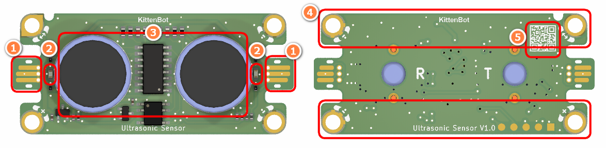
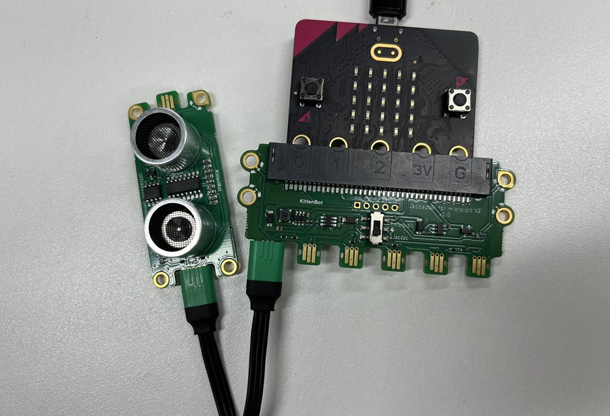
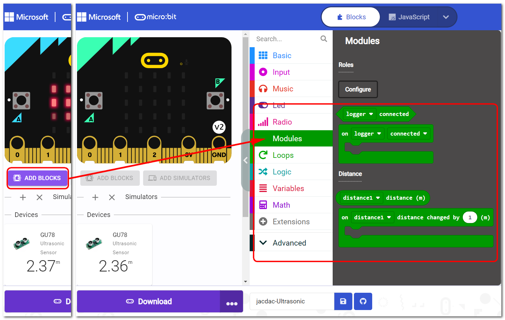
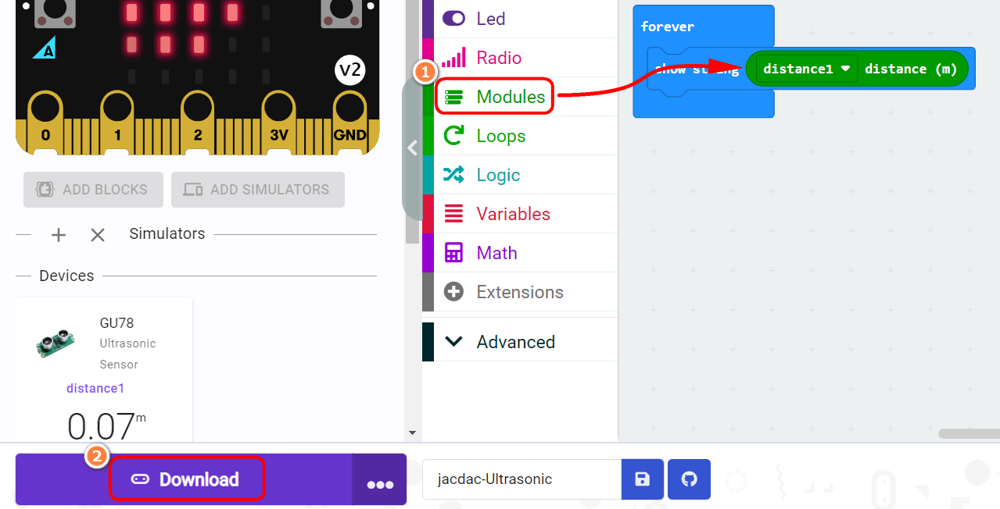
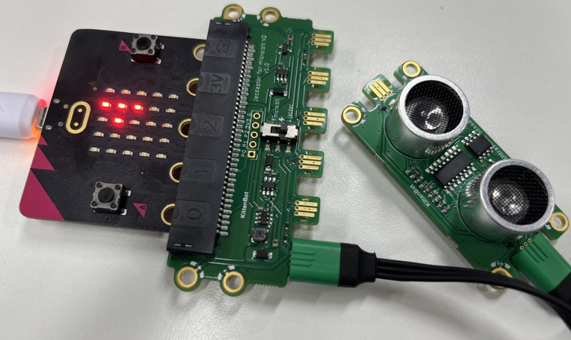

## Module Introduction

1. Jacdac Edge Connector
2. Jacdac Communication Indicator
3. Ultrasonic Sensor
4. Jacdac Standard Through Hole
5. QR Code

> The distance range of the ultrasonic sensor is 3cm-350cm, and the accuracy is ±1cm. The ultrasonic sensor is used to measure the distance of the object. The ultrasonic sensor emits ultrasonic waves and receives the reflected waves from the object. The distance between the sensor and the object can be calculated by measuring the time interval between the emission and reception of the ultrasonic waves.

## Components used

- 1x MicroUSB Cable
- 1x MicrobitV2
- 1x Jacdaptor
- 1x Cable
- 1x Ultrasonic

## Connection

PC-〉MicroUSB -〉MicrobitV2-〉Jacdaptor-〉Cable--〉Ultrasonic

## Coding Platform

https://makecode.microbit.org/beta

## Create a new project

## Establish a connection

Extensions——Jacdac

## Add Jacdac Ultrasonic Block

## Program and download

## The Result

Microbit will feedback the ultrasonic distance value

