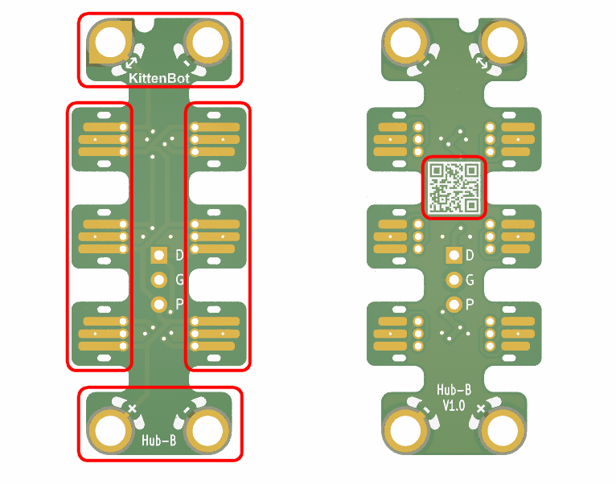
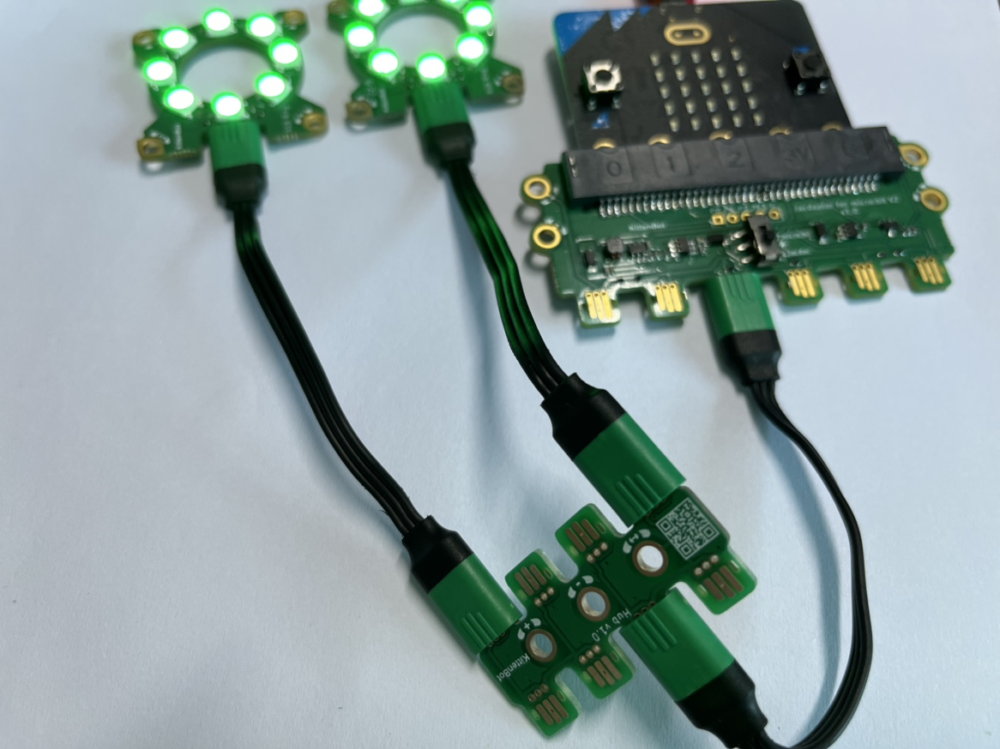
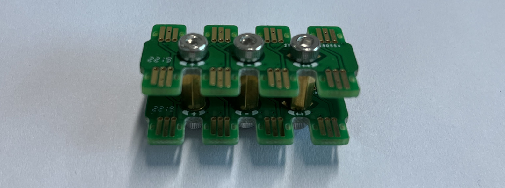
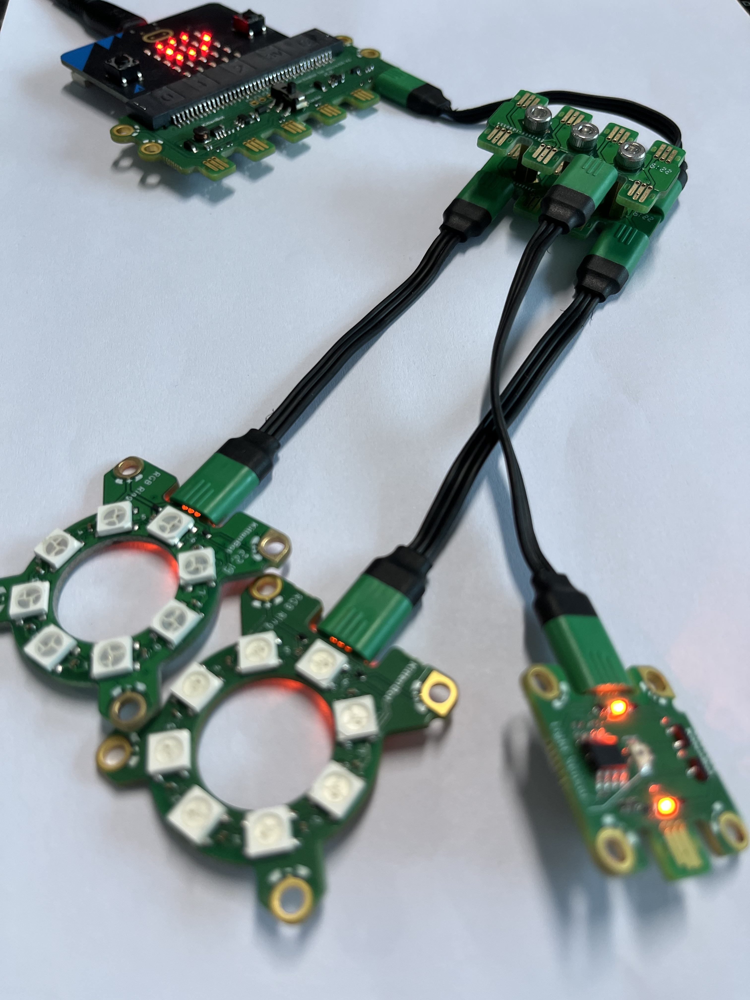

## Module Introduction

1. Jacdac Interface
2. Product QR Code
3. Jacdac Standard Through Hole

## Demostation

There is 6 Jacdac interfaces in Hub-B (8 interfaces in Hub-A), the function of the interfaces are the same, you can plug in freely. Mainly used for one-to-many module usage scenarios

## The usage of through hole

You can use copper pillars and screws to make the connection more concise.

But please align the direction of the through hole, otherwise it will cause the connection to fail.

