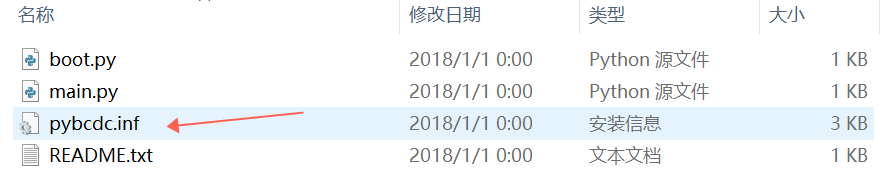
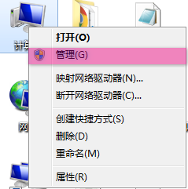
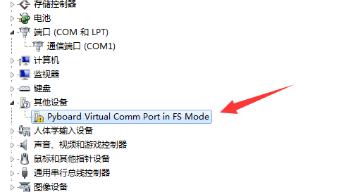
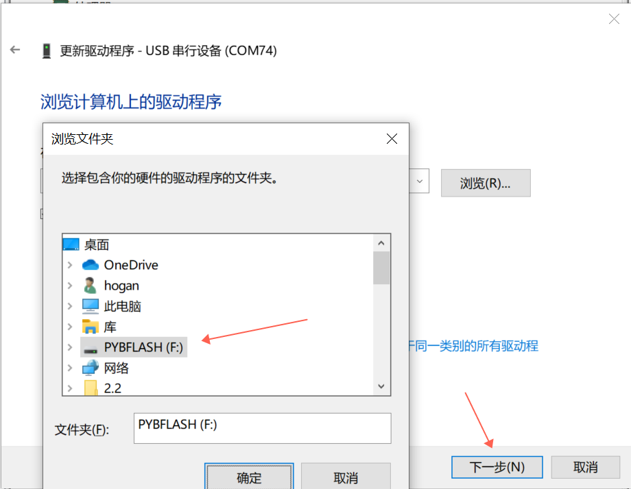
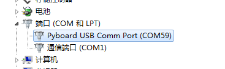
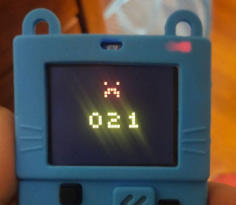

## Frequently Asked Questions (FAQ)

#### Q1: Why can't I find the serial port after switching to microPython mode on Meowbit?
> This issue usually occurs if you're using a stripped-down version of your operating system lacking essential system files. Therefore, some device drivers may not install automatically. Here are two possible solutions:
> 
> **Method 1: Simple Manual Installation**
> 1. Locate the driver installation file in the PYBFLASH drive.
> 

> 2. Go to the Device Manager.
>  

> 3. Right-click on the Pyboard device with the warning sign. Follow the sequence: Update Driver Software -> Browse My Computer for Driver Software -> Browse -> PYBFLASH -> Next.
> 
> 4. If successful, you'll see the new serial device without a warning sign in the Device Manager.
> 
> 
> **Method 2: Missing System Files**
> If you encounter error codes after completing step 3 in Method 1, you may need to install additional files.
> - Code 52: Digital Signature Issue
> - Error Codes 28, 10: Missing Files
> 
> [Download reserve-driver-install.zip](link)
> 
> Unzip the file and run the .exe installer. Allow all permissions if prompted. Once the black window disappears, the patch is successfully installed. Try using your device again.
> 
> ::info::  
> If you encounter complex issues not covered here, please contact Meowbit customer service for further assistance.
> 
---
  
#### Q2: Can I import my own characters or scenes into the Meowbit compiler?
> Convert your images into pixel data and insert them into the JS code. [Learn more here](https://kittenbot.github.io/pxt-neomatrix/index.html).

---

#### Q3: How do I update the Meowbit firmware?
> [Follow the upgrade guide here](https://meowbit-doc.kittenbot.cn/#/more/upgrade).

---

#### Q4: Meowbit shows error code 02X when downloading programs
> This usually happens if you're trying to download a program that's too large for the device's memory. Please download an appropriate program.
> 

---

#### Q5: Meowbit/Microbit Error Code Summary
> Both Meowbit and Microbit share common error codes as they are developed based on Microsoft's MakeCode. Refer to the table below for a list of error codes and their corresponding solutions. Common issues are highlighted in green.
> 
> [Learn more here](https://support.microbit.org/support/solutions/articles/19000016969-micro-bit-error-codes)

---
