## 01 Quick Start

### Hardware Connection

Press the reset button on the right side (as shown below). Your computer should display a new drive named ARCADE-F4.
:::warning
The new drive ARCADE-F4 that appears on your computer is used for flashing the game program or for switching modes.
:::

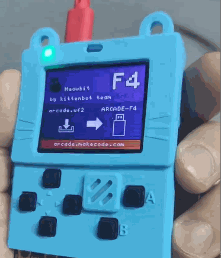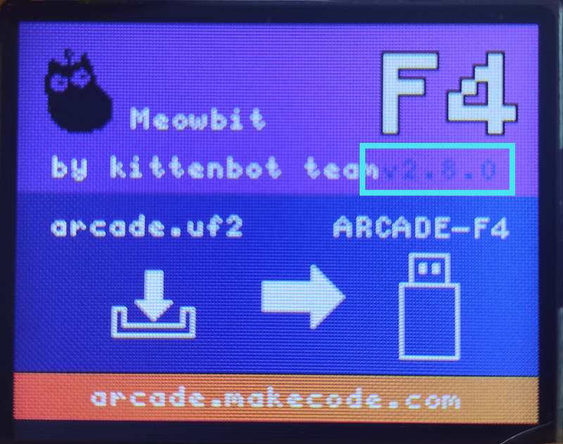 注：如果已经完成了固件切换请跳过此步骤 如果只是按reset按键并不能出现上放右图的画面，请您在尝试以下方法 按紧按键a不松开，按下右侧的reset按键（如下面的动图） 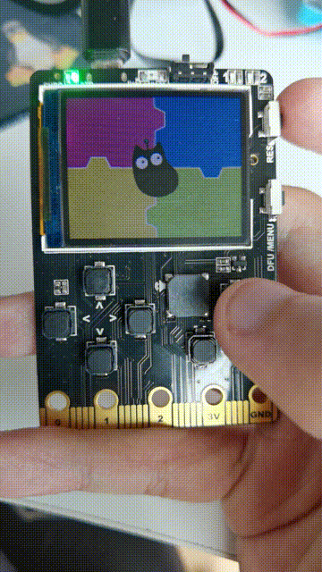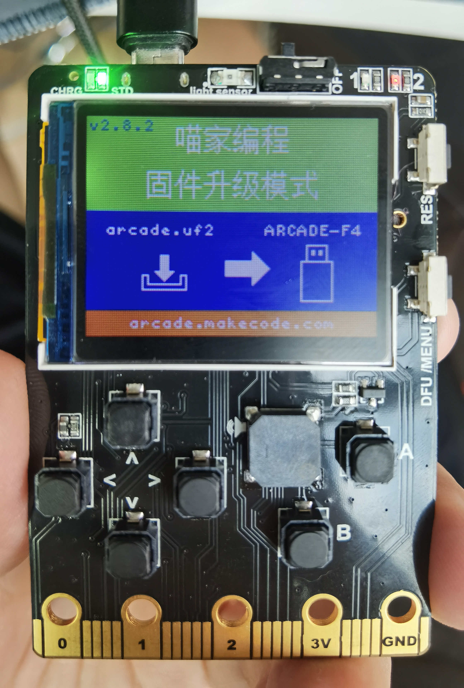

**Note**: If you've already switched firmware, you can skip this step. If pressing the reset button does not yield the expected results, try the following:
- Hold down button A without letting go, then press the reset button on the right side.

### Platform Introduction

:::info
Arcade game programming platform URL: [https://arcade.makecode.com](https://arcade.makecode.com)
:::

**Home Screen**

1. Click the section marked 1 to enter a project name and start programming.
2. The sections below 2 offer some simple tutorials and community-shared games; these can be helpful for beginners.

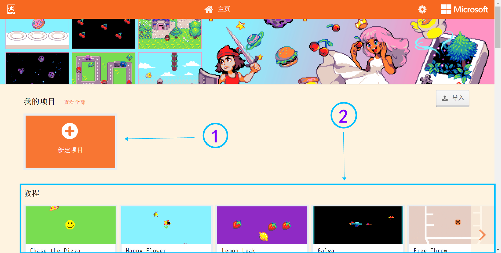

**Programming Interface**

1. Online Simulator: Simulates the effects of the logic in your code in real-time.
2. Programming Block Column: Drag the programming blocks from here.
3. Code Editing Area: Drag blocks from the Programming Block Column and assemble them here to build your game's appearance, interface, and logic.

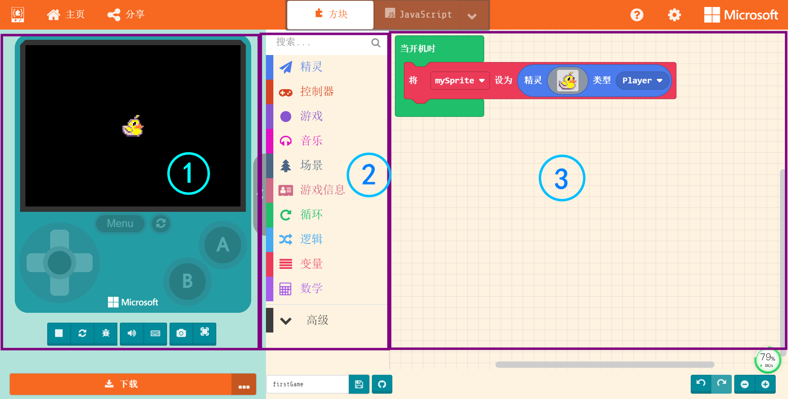

### Game Prototype

1. **Choose or Design a Character**: Use the block to create a character and place it under the "On Start" block. You can choose an existing character from the library.
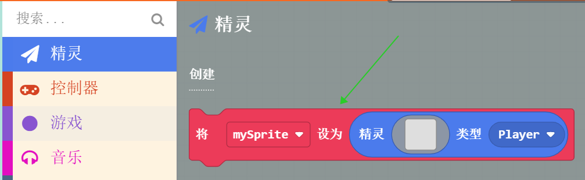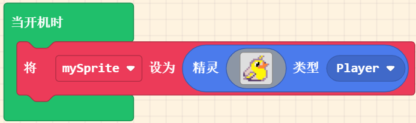

2. **Connect the Character to the Keyboard**: Now you can control the character's movement in the simulator.

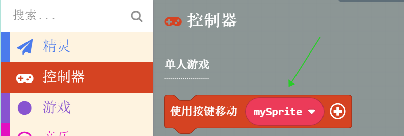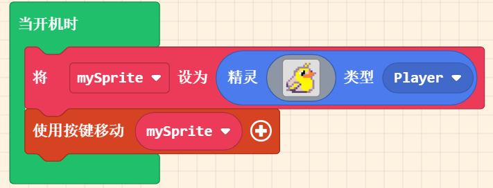

3. **Add a Background**: Change the background color to make the scene brighter.

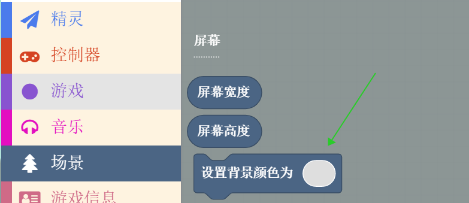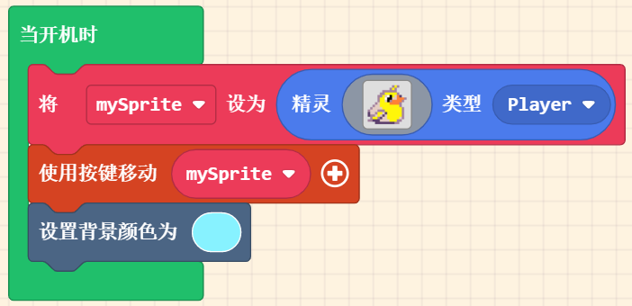

4. **Add a Map**: Change the default 16:16 dimensions to 10:8.
:::info
The 10:8 here represents the number of blocks in the screen's length and width. The block size is set to 16 pixels by default.
:::

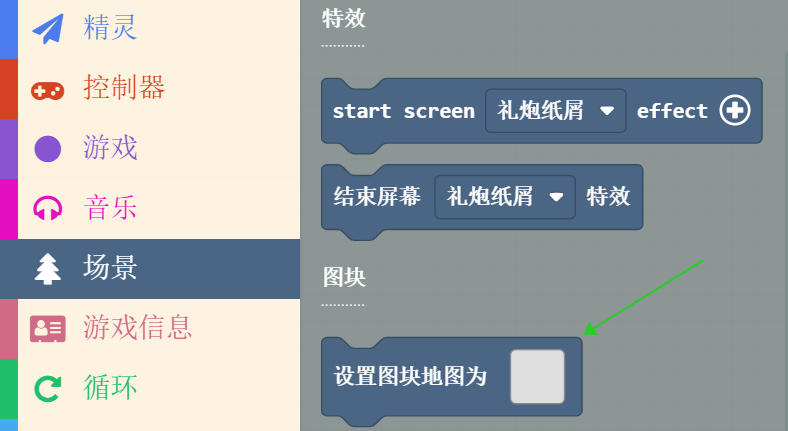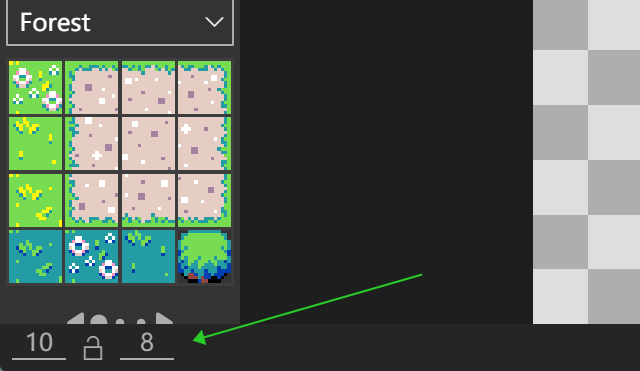

5. **Simple Map Creation**: Now you can control the 'bird' character freely with the keyboard.

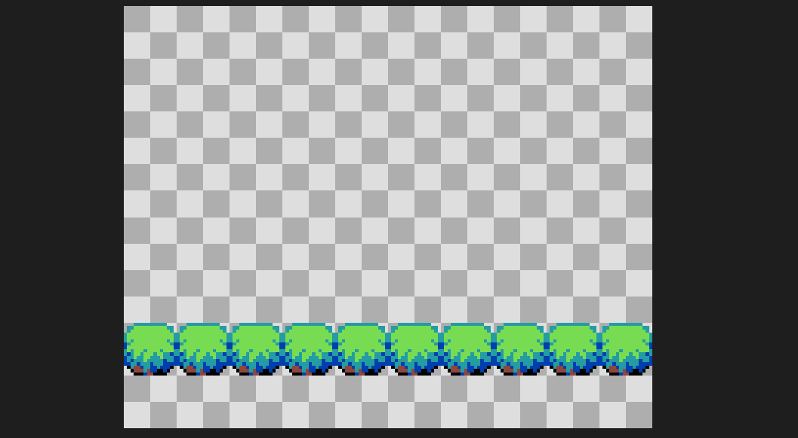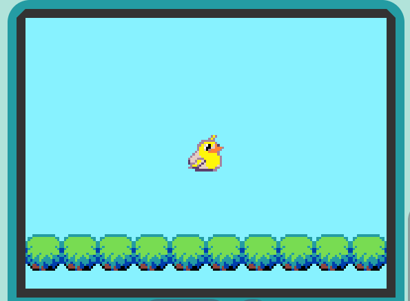

### Game Interactions

1. **Continuous Interactions**: Use the "Game Update" block to represent continuous processes.

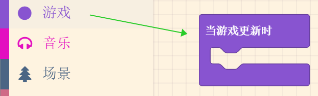

2. **Basic Interaction Logic**: Use the "If...then" block to represent conditions.

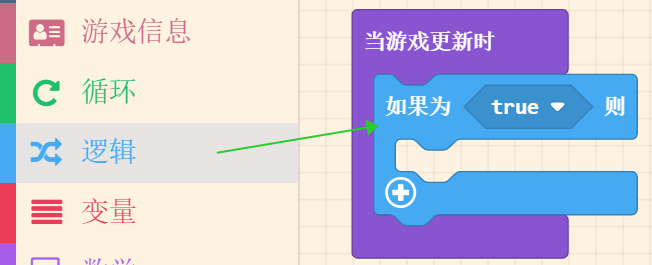

3. **Simple Interaction Example**: When the bird touches the tree, a smiley face appears.

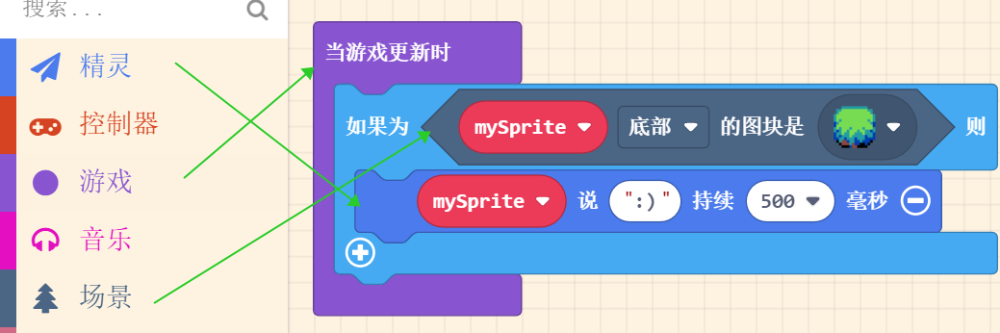

4. **Adding Realism**: Add wall attributes to prevent characters from moving through objects.

  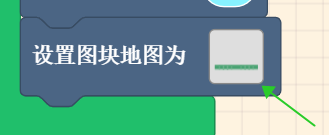  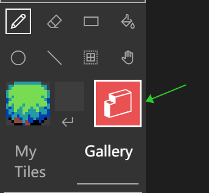

        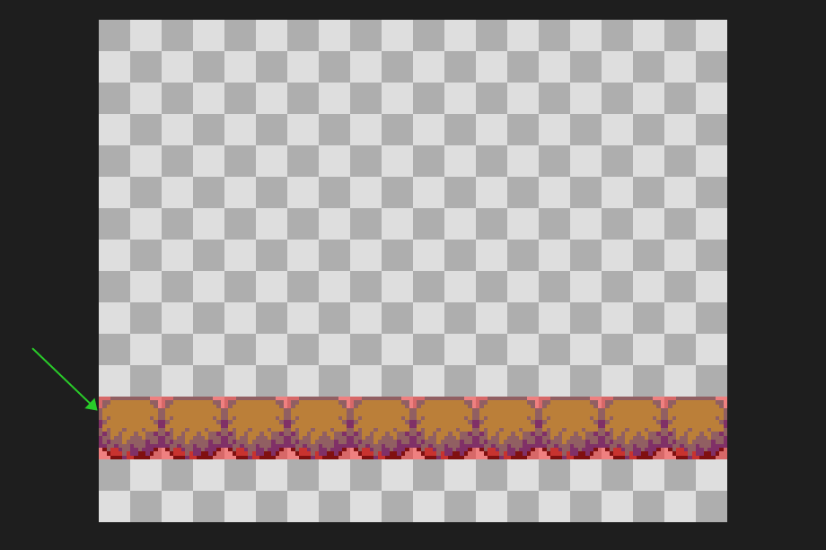

### Downloading the Program

1. Click the download button at the bottom left.

2. Select Meowbit hardware.

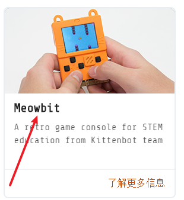

3. You will get a `.uf2` file. Drag it into the ARCADE-F4 drive to flash it.

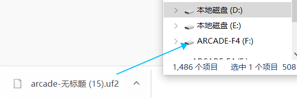

### Completed Program

🏳‍🌈 Go to the project: [https://makecode.com/_LdFRbMU08Jgt](https://makecode.com/_LdFRbMU08Jgt)

### Additional Mini-Courses
17 mini-courses to help you get started: [https://www.bilibili.com/video/BV1uB4y1F7dw](https://www.bilibili.com/video/BV1uB4y1F7dw)

### Companion Book (Purchase Required)
If you prefer a physical book, you can buy it here: [http://product.dangdang.com/29240752.html](http://product.dangdang.com/29240752.html)

---

