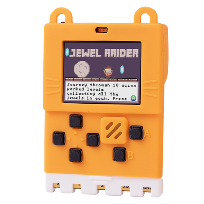
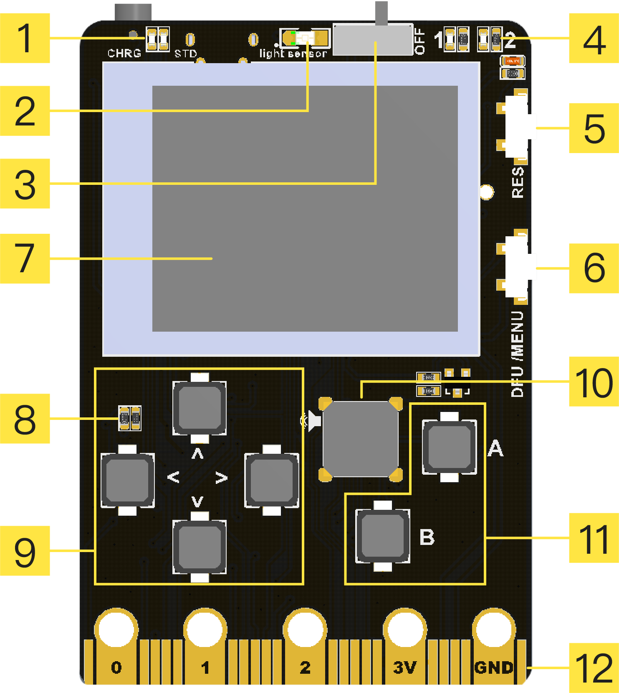
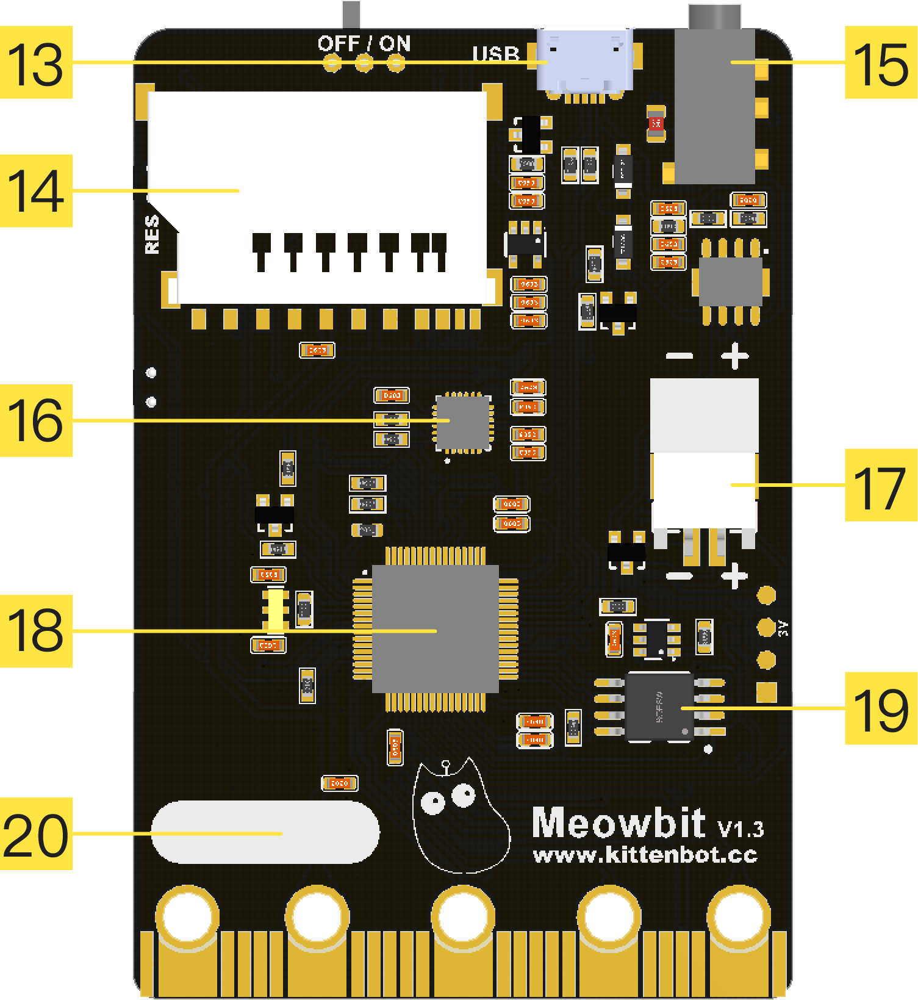
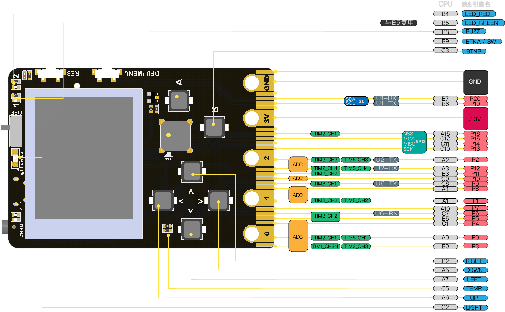

## Shop Link

---

🛒[** Kittenbot-Meowbit **](https://www.kittenbot.cc/products/meowbit-codable-console-for-microsoft-makecode-arcade)

## Key Features

- Unleash your creativity effortlessly with our drag-and-drop game development interface.
- Dive into a wide array of educational topics through our engaging game-based curriculum.
- Code in Python and enjoy an interactive learning experience with our built-in display.

## Ideal Use-Cases for Meowbit

- **Educational Institutions**: Perfect for coding bootcamps and specialized training centers looking to offer a hands-on, interactive learning experience. Meowbit's diverse range of features makes it an ideal educational tool for students who have a basic understanding of programming concepts.
  
- **Game Development Enthusiasts**: Whether you're an amateur game designer or simply passionate about game development, Meowbit offers an intuitive, graphical interface for quick prototyping and testing. Its support for Python also means that more experienced coders can take their projects to the next level.

- **DIY Makers and Hobbyists**: With its array of sensors and programmable buttons, Meowbit is a versatile piece of hardware for all your creative projects. From smart home applications to wearables, the possibilities are endless.

- **Interactive Learning**: Meowbit isn't just for coding. Its built-in display and range of onboard sensors make it a fantastic platform for interactive educational experiences across various subjects, including science, technology, engineering, and math (STEM).

## Technical Specifications

| **Dimension** | 52 x 76 x 12 mm |
| --- | --- |
| **Net Weight** | 42g |
| **Main Controller** | STM32F401RET6, 32-bit ARM Cortex M4 Core |
| **Power Supply** | 5V (USB), 3.7~4.2V (Li-ion Battery) |
| **Onboard Features** | TFT Color Display, Dual LEDs, Light Sensor, Temperature Sensor, 6 Programmable Buttons, Passive Buzzer, SD Card Slot, Gyroscope, Expansion Pins, JacDac Port |
| **Programming Platforms** | Makecode Arcade, (Kittenblock, Python Editor) |

## Hardware Details

### Onboard Features
       

| **1. Charging/Working Indicator** | **2. Light Sensor** | **3. Power Toggle Switch** | **4. Programmable LEDs x 2** |
| --- | --- | --- | --- |
| **5. Reset Button** | **6. DFU Mode Button (Currently Inactive)** | **7. 160 x 128 TFT Color Display** | **8. Temperature Sensor** |
| **9. Directional Programmable Buttons x 4** | **10. Programmable Buzzer** | **11. Programmable A & B Buttons** | **12. Micro:bit-Compatible 40-PIN Expansion Connector** |
| **13. USB Programming/Charging Port** | **14. SD Card Slot (File storage in MicroPython mode, specialized Meow SD Bluetooth module extension in Arcade mode)** | **15. JacDac Interface** | **16. 6-Axis Gyroscope and Accelerometer** |
| **17. 3.7V Li-ion Battery Connector** | **18. Main Controller Chip** | **19. 2MByte SPI Flash** | **20. Signature Area** |

### Pin Overview
The pin mapping is also compatible with Micro:bit extension boards **(B6, B7 mapped for I2C)**.  

1. **Analog Signal Pins**

P0, P1, P2, P3, P4, P8, P10, P12   

2. **Serial Ports (Commonly used with P2 and P12)**

Tx P2 / Rx P12

# Tutorial Navigation

---

**Programming Environments Supported by Meowbit**

- [**Makecode Arcade Game-Based Programming**](./arcade)
<!-- - [**MicroPython API**](./micropy-api) -->

# Troubleshooting

---

[**Frequently Asked Questions (FAQ)**](./FAQ)

