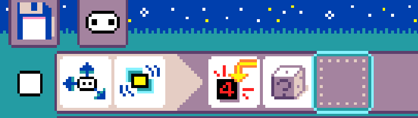
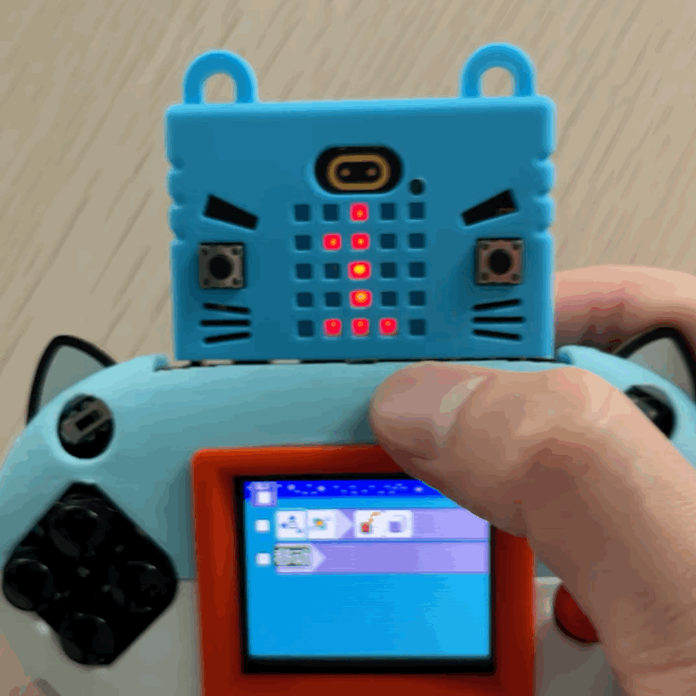
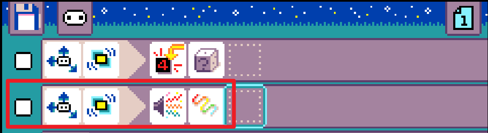
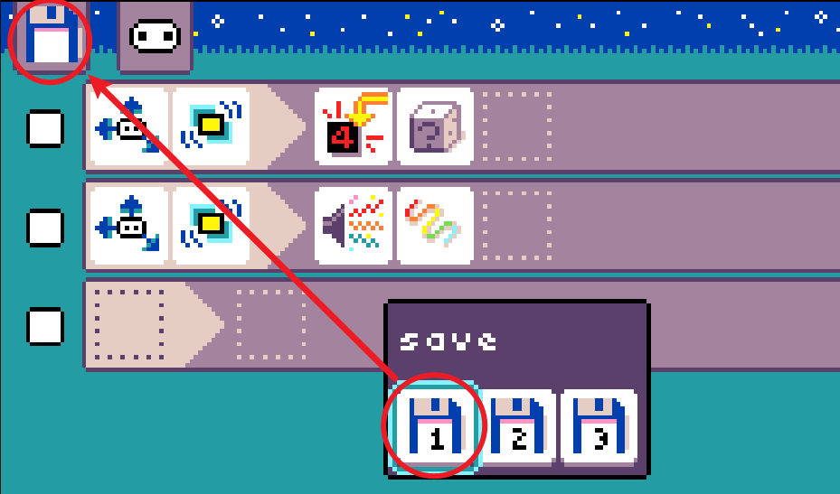

## Project Introduction

Using the Microbit's gyroscope for motion detection and LED matrix for number display, this project creates a dice that shows different numbers when shaken.

## Programming Logic

When the gyroscope detects shaking, it triggers the LED matrix to display a number.

## Experiment Phenomenon

Shake the Microbit and observe the changes on the LED matrix.

## Program Enhancement

You can enhance the program by adding a buzzer sound alert. When the gyroscope detects shaking, in addition to displaying a number on the LED matrix, it will also produce a sound.

## Saving the Program

## Loading the Program

Even after turning off the device, you can reload the previously saved program when you turn it back on.

