## Introduction to Jacdac

Microsoft's Jacdac (Joint Asynchronous Communications, Device Access and Control) ecosystem is an open-source hardware and software platform designed for developers and educators, aiming to simplify connectivity and communication among IoT devices. Jacdac adopts a modular design, facilitating seamless interconnection and collaboration among various sensors, actuators, and microcontrollers through standardized interfaces and protocols. The system supports plug-and-play functionality, eliminating the need for complex configurations, enabling users to rapidly build and test their IoT projects.

For users:

1. Its unique interface (similar to Apple's Lightning connector experience) facilitates easy plugging, especially for young children.
   
2. Modules use a bus protocol, allowing them to be connected on a single bus without the need to distinguish interfaces as traditionally required. This significantly reduces wiring complexity.
   
3. The system supports plug-and-play functionality. In MicroCode, once modules are plugged in, corresponding icons appear, enhancing user experience.

## Teaching Recommendations

Based on MicroCode's teaching and workshop experiences:

MicroCode and Jacdac module programming should be scheduled for the second phase. The first phase primarily focuses on becoming familiar with MicroCode and graphical programming for MicrobitV2. In the second phase, integrating Jacdac modules with simple materials can create projects suitable for young children.

To help everyone quickly get started with Jacdac modules, here are simple programs for all 7 types of modules to help understand their functions.

## Jacdac Keycap Button 

Type: Input Module

Function: Detects whether buttons are pressed or released

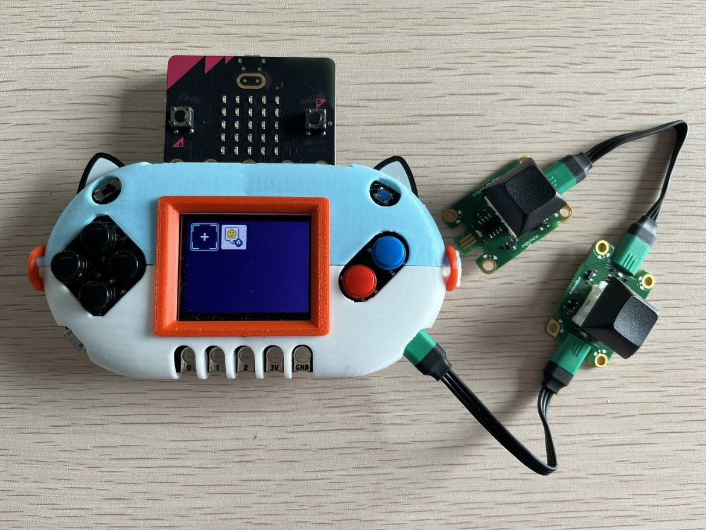

Programming Example:

When two mechanical buttons are connected, pressing mechanical button 1 and mechanical button 2 produce different sounds.

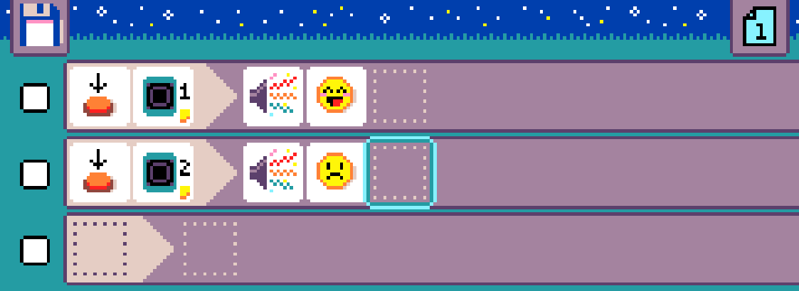

## Jacdac Rotary Button

Type: Input Module

Function: Detects button press, left rotation, and right rotation feedback

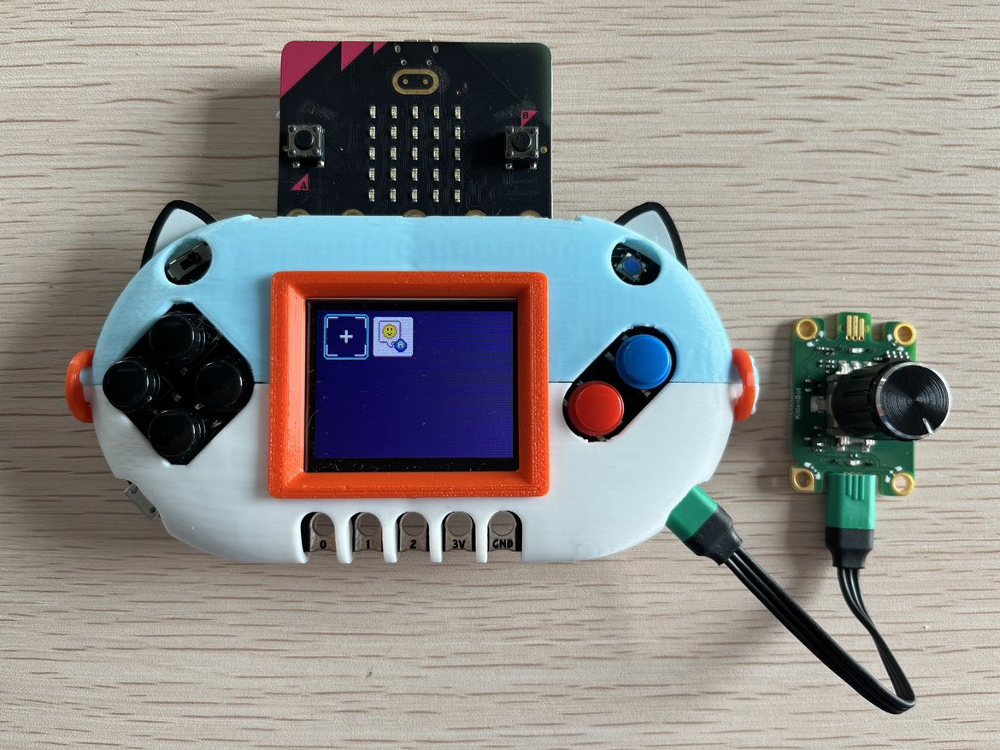

Programming Example:

When rotated left or right, display different directional arrows on the LED matrix; when pressed, display a smiling face.

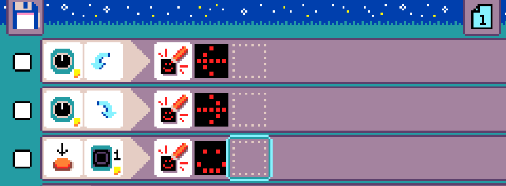

## Jacdac Slider

Type: Input Module

Function: Detects slider position (5 positions, 1~5)

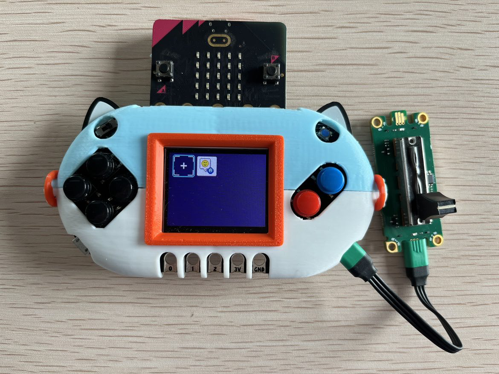

Programming Example:

When the slider is moved to different positions, display different numerical values on the LED matrix.

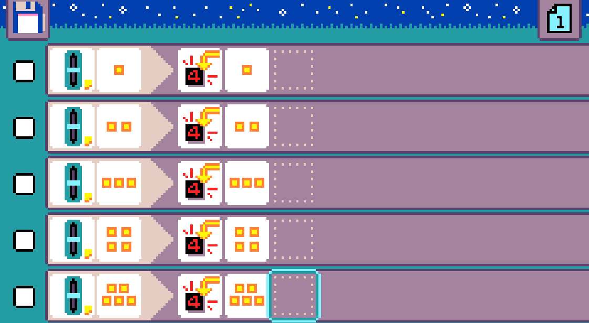

## Jacdac Light Sensor

Type: Input Module

Function: Detects brightness levels (5 levels, 1~5)

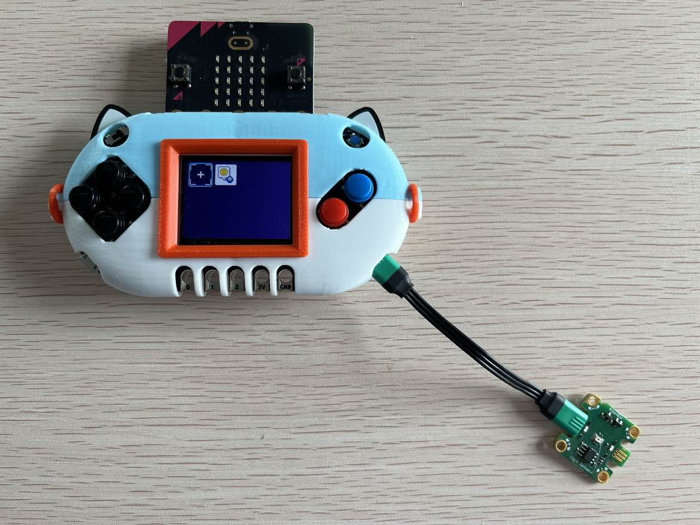

Programming Example:

When the magnet detects weak light intensity, display a crying face on the LED matrix; when the light sensor detects strong light intensity, display a smiling face.

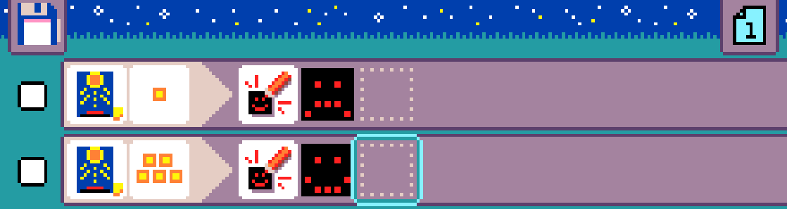

## Jacdac Magnet Sensor

Type: Input Module

Function: Detects magnetic field strength (5 levels, 1~5)

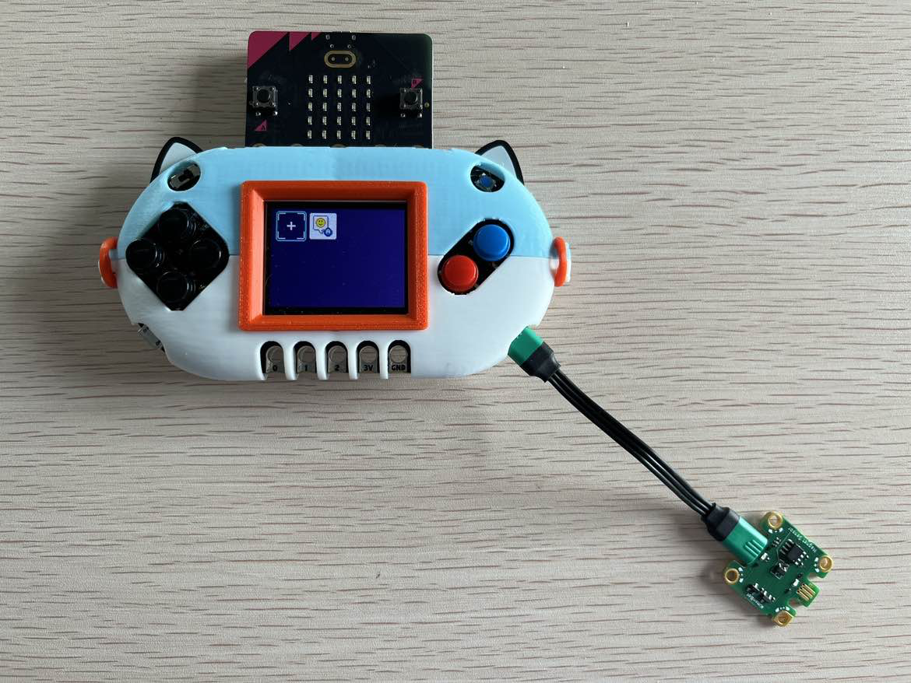

Programming Example:

When the magnet sensor detects a weak magnetic field, display a crying face on the LED matrix; when it detects a strong magnetic field, display a smiling face.

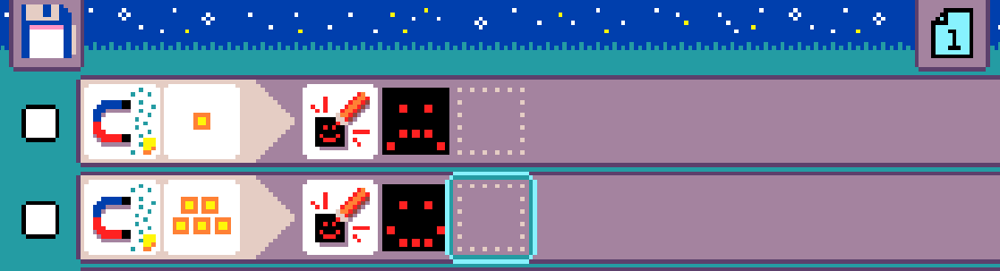

## Jacdac RGB Ring

Type: Output Module

Function: Displays various colors or effects with RGB LEDs

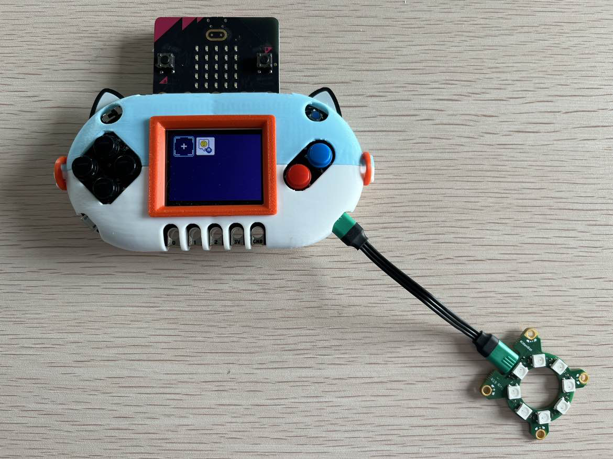

Programming Example:

When pressing buttons A and B, display a rainbow effect and then turn off.

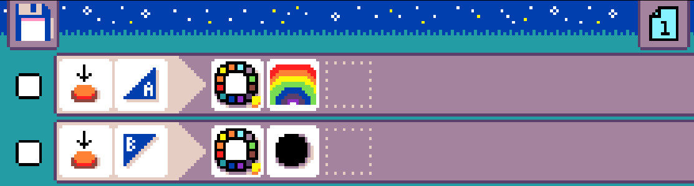

## Jacdac Hub

Type: Connector Module

Function: Extends and splits connections

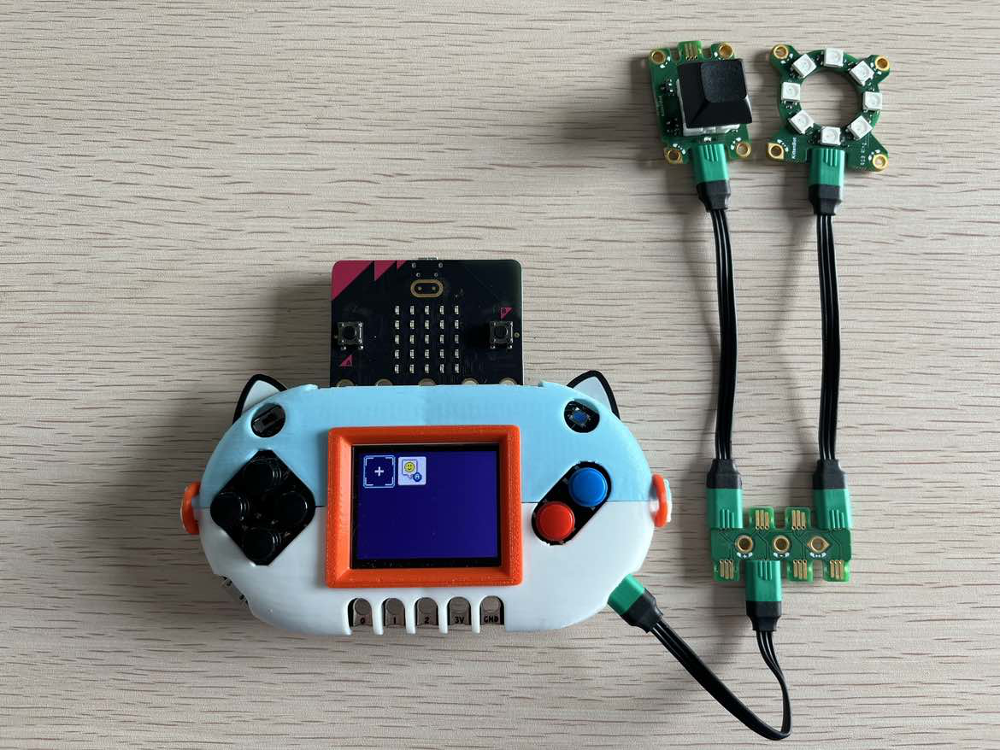