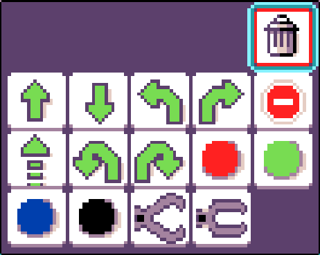
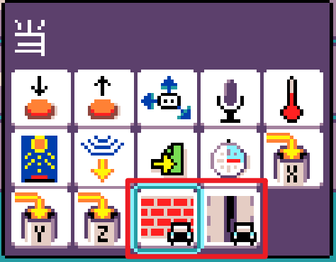
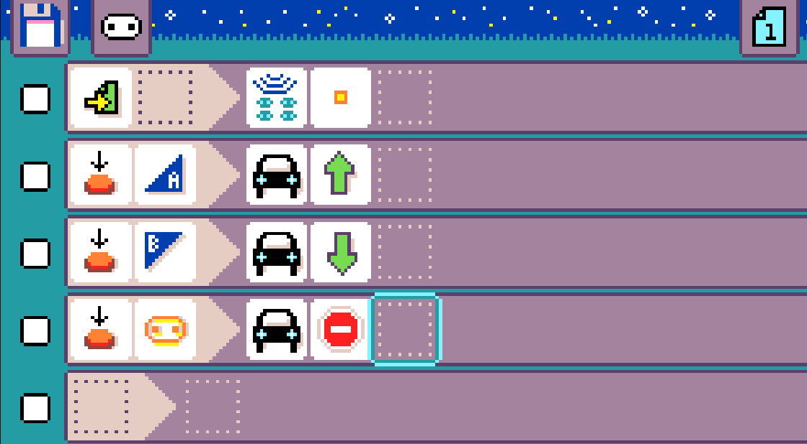
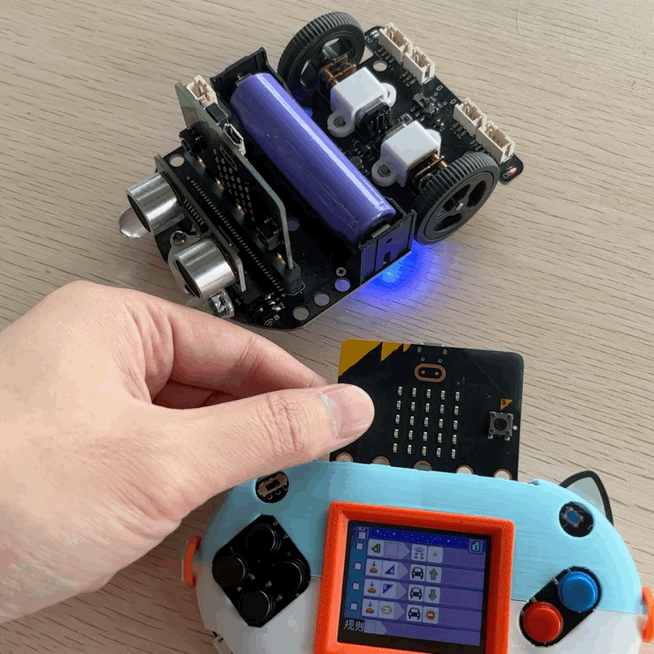
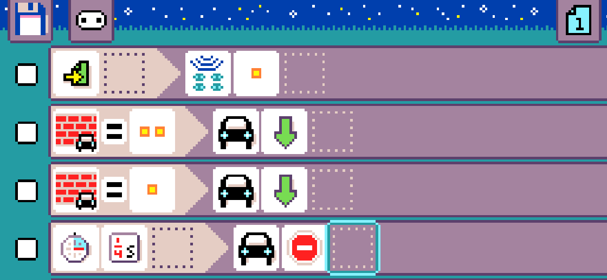
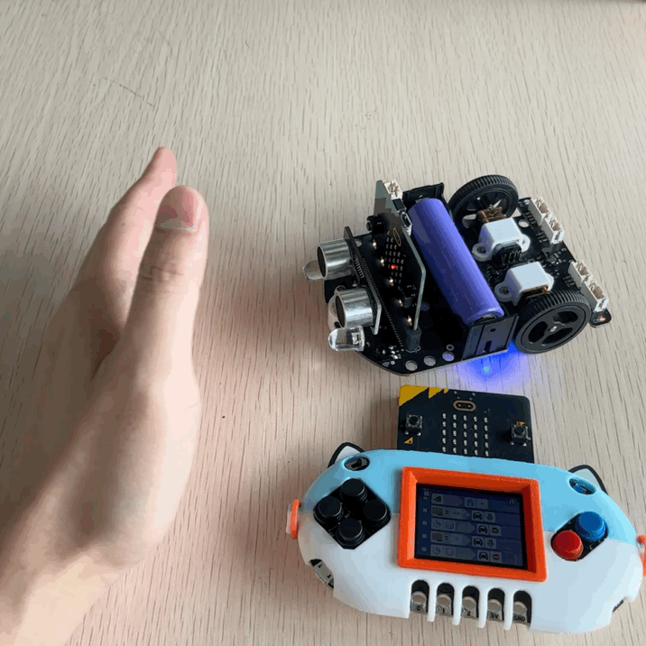
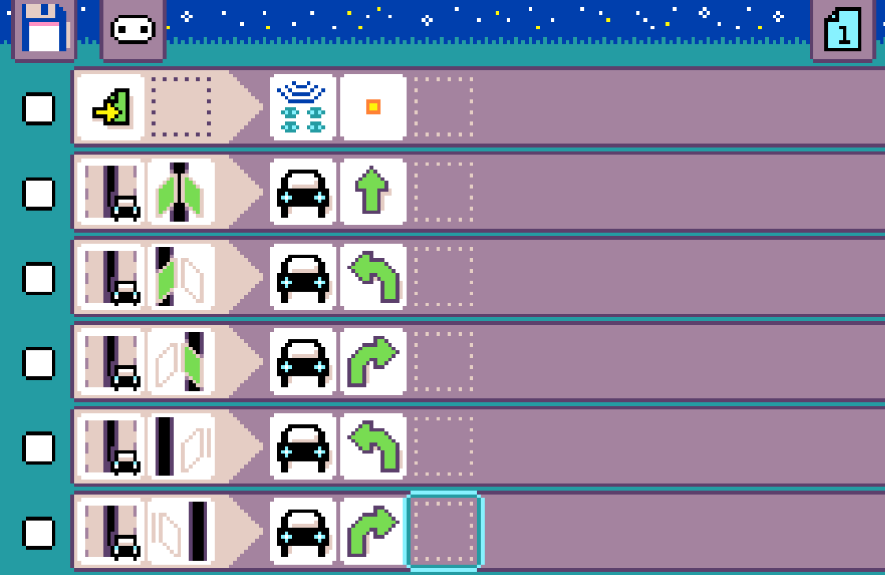
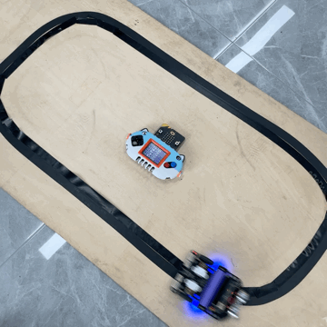

## Introduction

MicroCode not only supports programming for Microbit and Jacdac modules but also extends to programming for robots like the TabbyBot. TabbyBot is an integrated educational programming robot designed by Smallcat specifically for learning with Microbit.

## Materials Preparation

NewbitArcadeShield + MicrobitV2

TabbyBot robot

TabbyBot ultrasonic module

Line-following black tape / or white paper + black marker

## TabbyBot Firmware

To enable communication between the robot and MicroCode, a dedicated firmware needs to be downloaded onto the Microbit mainboard of the TabbyBot.

After downloading the hex file, drag and drop it onto the Microbit's USB drive.

[V2](https://github.com/KittenBot/microbit-robot/blob/main/assets/kittenbot-tabbyrobot-for-microbit-v2.hex)

[V1.5](https://github.com/KittenBot/microbit-robot/blob/main/assets/kittenbot-tabbyrobot-for-microbit-v1.hex)

## Robot Initialization Settings

When the Microbit mainboard is plugged into the TabbyBot and powered on:

Simultaneously press the A and B buttons on the Microbit (to switch to setting mode).

The LED matrix will display a scrolling string "radio+number".

Press either the A or B button to set this number, which is the wireless group parameter. The robot can only be controlled when its wireless group matches the one programmed in MicroCode.

The wireless group of the robot needs to be set only once. If the program is not changed subsequently, the robot will default to the last set wireless group upon startup.

## Robot Programmable Resources

1. Bottom RGB lights: Set colors to red, green, blue, or turn off.
   
2. Robot movements: Forward, backward, left turn, right turn, fast forward, large left turn, large right turn, stop.
   
3. Mechanical claw open (an advanced accessory requiring additional purchase).

   

4. Ultrasonic distance detection (included in TabbyBot kit).

5. Line-following detection (TabbyBot comes with two line-following sensors).

   

## Quick Start

Assuming the current wireless group of TabbyBot is set to 1:

Program the Microbit on the MicroCode controller so that the A and B buttons control the robot's movements.

Effect:

## Ultrasonic Avoidance with the Robot

When the program starts, besides setting the wireless group to 1:

When a distance is detected and it's relatively short (since there's no '<' symbol, assume distance = 1 or 2), the robot moves backward and stops a quarter second later.

Effect:

## Line-Tracking Robot

When the program starts and the wireless group is set to 1:

The robot begins line-tracking based on the following logic:

- Moves forward when both sensors detect the black line.
- Turns left when the left sensor detects the black line (indicating the robot is veering right).
- Turns right when the right sensor detects the black line (indicating the robot is veering left).
- Continues turning left when the left sensor completely loses the black line (indicating a significant right veer).
- Continues turning right when the right sensor completely loses the black line (indicating a significant left veer).

Effect:

