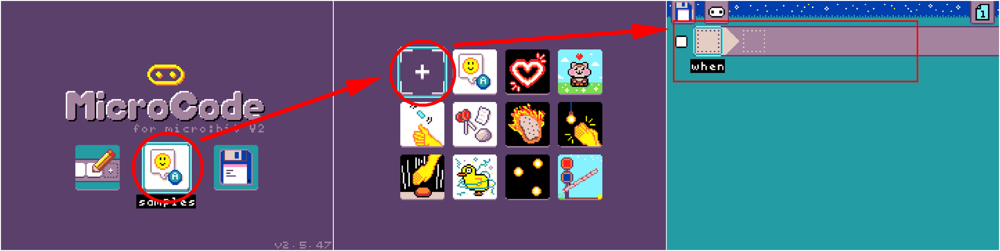
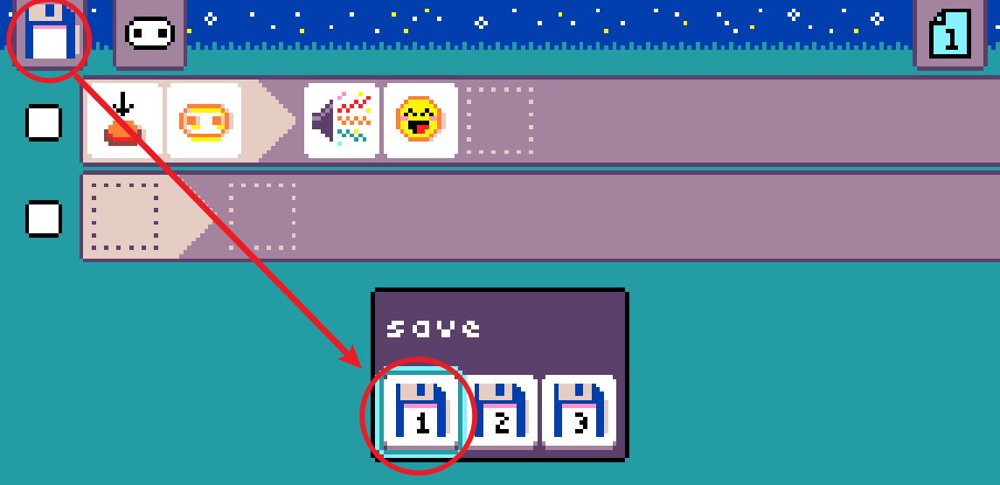
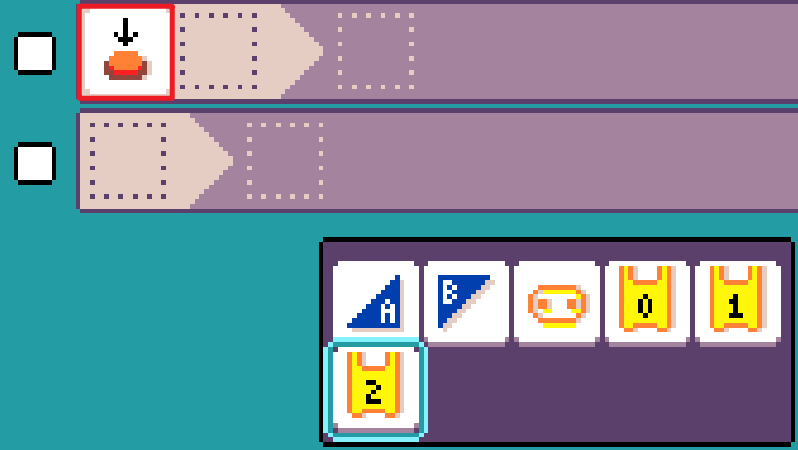

# Introduction to MicroCode

## What is MicroCode?

MicroCode is a graphical programming platform created by Microsoft specifically for young children. It enables programming on the Microbit V2 without the need for a computer or tablet. By inserting the Microbit into a dedicated expansion board with a color screen, children can complete programming creations by writing icon-based logic directly on the board. MicroCode offers a visual programming model based on Kodu, suitable for children aged 6-9. This document will introduce the features, basic usage, precautions, and a quick start guide for MicroCode.

## Features

MicroCode is a visual programming tool for Microbit V2, designed to provide a simple programming experience for children. Its main features include:

- **Anywhere, Anytime**: Enables programming anytime and anywhere, accompanied by a familiar game controller to attract children.
- **Child-Friendly**: Icon-based, structured code editor and programming language, easy for children to use.
- **Sample Programs**: Provides numerous sample programs to help users get started quickly.
- **Extended Functions**: Use Jacdac accessories (such as LEDs, servo motors, etc.) for expansion and programming.
- **Robot Control**: Use MicroCode to program and control small robots for line following and other functions.
- **Multilingual Support**: An international programming platform supporting over 20 languages.

## Required Hardware

The hardware needed for using MicroCode graphical programming:

### Basic Essentials:

1. [Microbit V2 (V1.5 is not supported)](https://item.taobao.com/item.htm?id=629040300061&skuId=4858762989208&spm=a1z10.3-c-s.w4002-25280158849.9.3f555d5fT0wMNd)

2. [Newbit Arcade Shield](https://item.taobao.com/item.htm?id=647757869106&skuId=5609200898405&spm=a1z10.3-c-s.w4002-25280158849.11.3f555d5fT0wMNd)

### Optional Extensions:

1. Jacdac KitA Electronic Kit
2. MicroCode Programming Car

## Quick Start

For the first use, you need to download the MicroCode firmware for Microbit V2. Subsequent uses do not require a download.

1. Open the website [microcode (microsoft.github.io)](https://microsoft.github.io/microcode/)

2. Follow the instructions in the image to download the MicroCode firmware and save it to your computer.

3. Connect the Microbit V2 to your computer using a MicroUSB cable, and drag (or copy) the downloaded firmware to the Microbit V2's USB drive.

4. After the download is complete, insert the Microbit V2 into the Newbit Arcade Shield and disconnect the USB data cable. The Newbit Arcade Shield offers a lithium battery accessory, and it is recommended to purchase the package with the lithium battery accessory.

5. Turn on the power switch, and you will see MicroCode appear on the screen (for subsequent uses, simply turn on the power).

## Basic Operations

Use the Newbit Arcade Shield’s four directional buttons to move the cursor.
- **A Button (Blue Button)**: Confirm
- **B Button (Red Button)**: Return

### Opening Examples

For the first use, select "Examples" (as shown in the image below) to quickly experience the charm of MicroCode.

In the programming icons, Button A and Button B refer to the Microbit's Button A and Button B. Our expansion board acts like a "mini-computer," programming the Microbit through the "mini-computer." When we press Microbit's Button A and Button B, the matrix and buzzer will respond accordingly.

### Creating a Program

Create a blank program.

### Editing the Last Program

Selecting edit will open the last program by default. Even if the device is turned off, it will open the program from before it was turned off.

### Saving a Program

MicroCode supports storing up to three programs. Each time you save, you will choose a storage location; there are three locations in total. If there is an existing program, it will be overwritten.

### Loading a Saved Program

## Programming Syntax

MicroCode's programming syntax is straightforward, with only one rule: "When... Do...". For example, when Microbit Button A is pressed, the matrix lights up with a smiley face. Other icons can be gradually understood through practice.

## "When" (As Input Conditions)

There are 14 icons available (the first 12 are related to Microbit programming), and the last 2 are related to the Microbit programming car.

1. Button Pressed (Button A, Button B, Microbit Logo, Pin 0-2)

2. Button Released (similarly)

3. Movement (Microbit gyroscope attitude detection: shake, tilt up, tilt down, tilt left, tilt right, face up, face down)

4. Sound (triggered when the sound reaches a threshold, divided into 5 threshold levels. The more dots, the louder the sound. The last speaker icon indicates triggering when the current sound increases.)

5. Temperature (triggered when the temperature changes: temperature rises, temperature falls)

6. Light Intensity (Microbit detects the level of ambient light and triggers at a certain threshold)

7. Receive Wireless Signal Content (1-5, or variables x, y, z)

8. When Page Starts (0.25 seconds, 1 second, 5 seconds, any seconds)

9. Timer (0.25 seconds, 1 second, 5 seconds, any seconds)

10. Variable Condition (when variable x, y, z equals 1-5 or equals another variable)

11. When the car's ultrasonic sensor detects an obstacle at a certain distance (the fewer the dots, the closer the obstacle)

12. When the car's line-following sensor detects a line (both on the line, left sensor on the line, right sensor on the line, neither on the line, line fully off the left sensor, line fully off the right sensor)

## "Do" (As Output Results)

There are 11 execution icons available (the first 10 are related to Microbit programming), and the last one is related to the Microbit programming car.

1. Matrix Expression Display (can be edited freely)

2. Matrix Number Display (1-5, display variable, random number, display temperature)

3. Buzzer Plays Sound Effect (the icon represents the sound effect content, such as laughter)

4. Buzzer Plays Short Tune, which can be DIY

5. Wireless Send (values 1-5, variables x, y, z, random number, temperature)

6. Set Wireless Group (1-5, total 5 groups)

7. Page Switch (can switch to pages 1-5); page switching can generally be understood as calling subroutines

8. Variable Assignment (for variables x, y, z alike), the value can be 1-5, another variable, a random number, or temperature

9. Car Robot Execution, Motion Control (forward, backward, left, right, U-turn), Car RGB Control, Mechanical Arm Open/Close

## Hardware Expansion

In addition to programming for Microbit V2, MicroCode also supports sensor programming for external sensors, suitable for second-stage advanced learning with MicroCode.

Currently, it supports the Jacdac KitA electronic kit, which is suitable for small projects for young children. KitA includes button modules, rotary encoders, light-sensitive modules, magnetic sensors, light ring modules, and sliding potentiometers.

### Connecting and Using Jacdac Modules

Use the dedicated Jacdac connection cables for wiring, which can be inserted either way, offering a great experience. For example, using the connection cable to connect the RGB light ring, you will see an LED icon in the programming interface indicating that this sensor is available.

Programming

Effect

## Common Questions and Answers

1. **Question**: Can Microbit V1.5 use MicroCode?
   **Answer**: No.

2. **Question**: What is the relationship between MicroCode and Makecode?
   **Answer**: Both platforms are developed by Microsoft and are international programming platforms. MicroCode is aimed at young children and scenarios without computers.

3. **Question**: There is no response when inserting Microbit V2 into the Newbit Arcade Shield.
   **Answer**: Please check:
   - If you have downloaded the MicroCode firmware
   - If the power of the Newbit Arcade Shield is turned on

4. **Question**: Can programs written in MicroCode be shared?
   **Answer**: Programs edited on the hardware can only be saved, not shared.

