## Hardware Connection

---

Use with MicrobitV2, connect the microUSB to MicrobitV2.

:::info
- The power supply of the expansion board is divided into two parts, one is the power supply from the MicrobitV2 end, and the other is the power supply from the expansion board end.
- When the power supply is from the MicrobitV2 end, the power switch of the expansion board will be disconnected no matter whether the switch is on or off.
:::

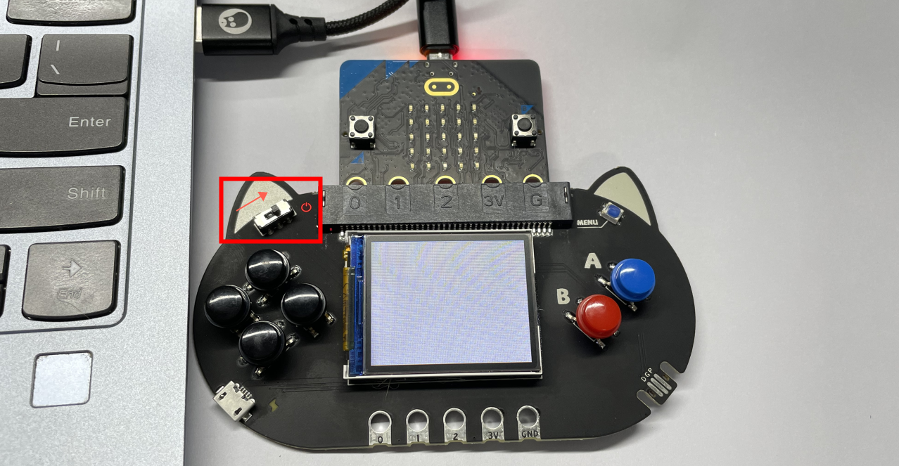

## Makecode Arcade Quick Start

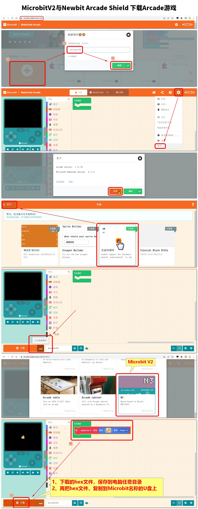

## Coding

---

:::info
Arcade Coding Platform: [https://arcade.makecode.com](https://arcade.makecode.com/#)
:::

**Front page of the programming platform**

1. Press the part numbered 1 to enter the project name and create a project to start programming
2. The part below number 2 is some simple tutorials provided by the platform and game works shared by the community. Novices can learn a little

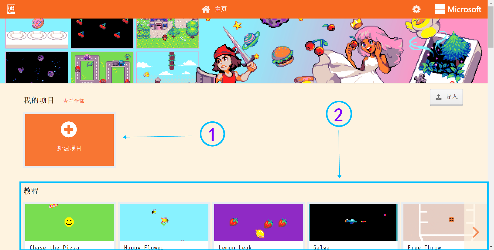

**Introduction to the programming interface, for basic entry, it is roughly divided into 3 parts that need to be understood first**

1. Online simulator: The hardware interaction content that needs to be realized by the remote control does not need to use the simulator
2. Programming block: We drag the programming code from here to program
3. Code editing area: We drag the code from the block area and splice it here to complete the program

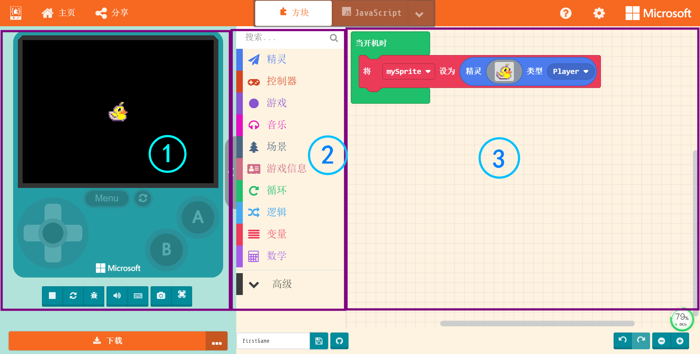

## Demostration
---

In this project we can complete the following effects, **the left and right movement and jumping of the yellow duck, as well as the physical relationship with the environment map**

[](https://www.yuque.com/kittenbot/hardwares/newbit-arcade-shield-game?_lake_card=%7B%22status%22%3A%22done%22%2C%22name%22%3A%22normal%20video.mp4%22%2C%22size%22%3A%22665839%22%2C%22taskId%22%3A%22ue9bf9343-e96f-4777-8f2d-99999b49d54%22%2C%22taskType%22%3A%22upload%22%2C%22url%22%3Anull%2C%22cover%22%3Anull%2C%22videoId%22%3A%22inputs%2Fprod%2Fyuque%2F2021%2F1432972%2Fmp4%2F1623759234246-ccb91e6a-5e00-47e0-93be-3c4d4d3b7b79.mp4%22%2C%22download%22%3Afalse%2C%22__spacing%22%3A%22both%22%2C%22id%22%3A%22ErfEw%22%2C%22margin%22%3A%7B%22top%22%3Atrue%2C%22bottom%22%3Atrue%7D%2C%22card%22%3A%22video%22%7D#ErfEw)

### Create a new project

1. Select or design a character image, use this block to create a character, and put it into the block of when the power is on, we can choose a built-in character in the gallery

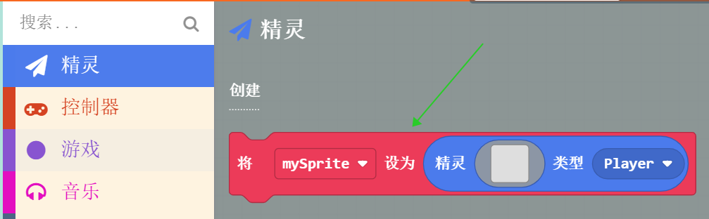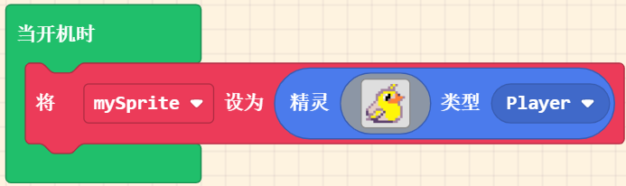

2. Associate the character with the keyboard (Handheld button), at this time you can already control the sprite to move in the simulator

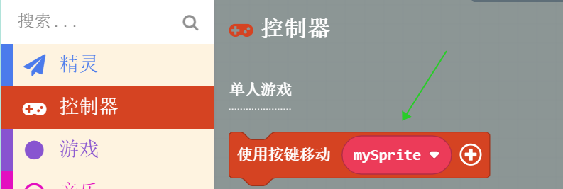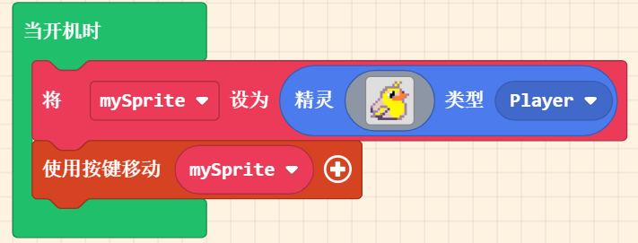

3. Add a background to the game, temporarily only change one color to make the scene bright

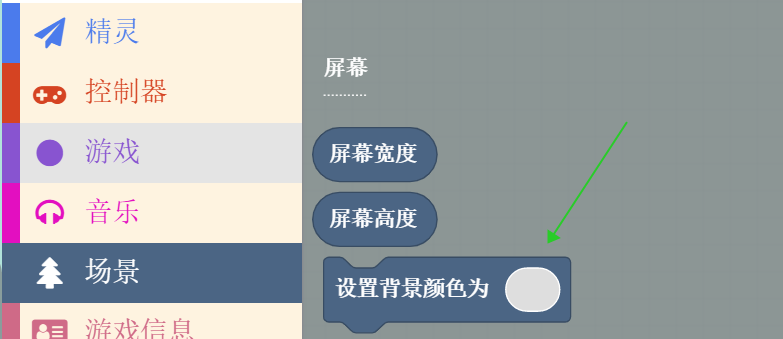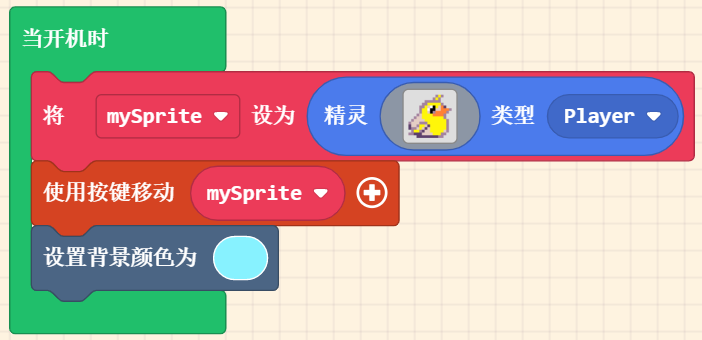

4. Add a map to the game. With the restrictions of the map, there will be some game scenes. Click into the map setting interface and change the parameters first, change the original 16:16 to 10:8.

:::info
Here, 10:8 means that the screen is placed with 10 and 8 bricks respectively. Since the default 1 brick is 16 pixels, the current area just fills the (simulator) Meowbit screen, and if it is larger than this number, it will overflow to the right and bottom with the upper left corner as the origin, which will be discussed later (large scene)
:::

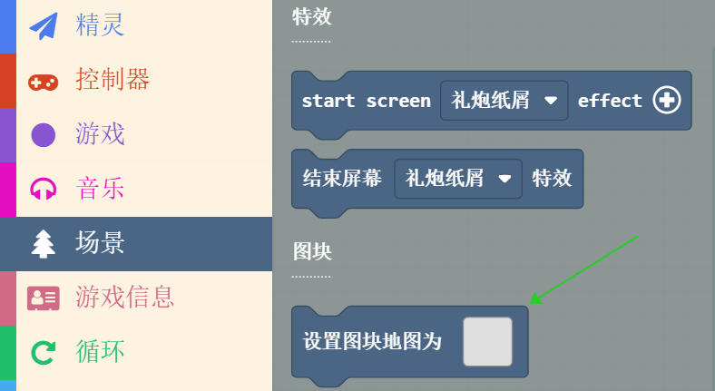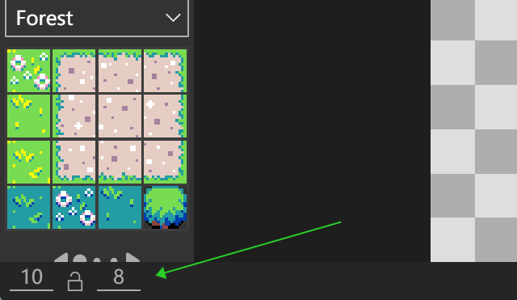

5. We have completed the drawing of the map and the character. Let's take a look at the current effect: according to the current program, we actually run on the simulator, and we can use the direction keys of the keyboard to control the 'bird' to move freely.

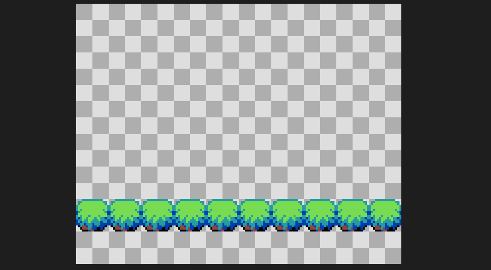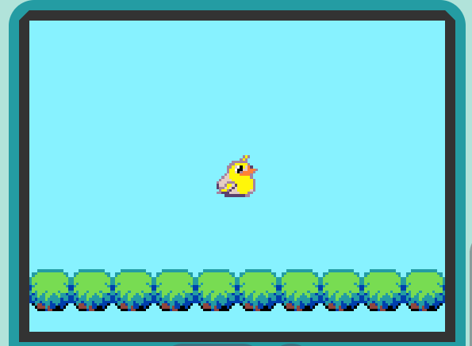

### Add game interaction

We have completed the simplest game prototype, including characters, scenes, and background colors. Next, we will continue to give it the life of the game. The so-called life of the game is the feeling of experiencing interaction in the game. Let's take the bird hitting the tree and 'call' as a simple interaction.

1. Interaction is going on all the time, whether in games or in life. We use the block when the game is updated to represent this continuous process. As long as the game is running, the contents of this block will be refreshed and executed at the microsecond level

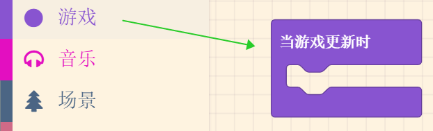

2. The basis of interaction is judgment and execution. For the logic that the bird hits the tree and will call, whether it hits the tree is a judgment, and hitting the tree will call is an execution, so we drag out the basic judgment block in the logic block

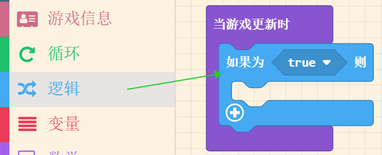

3. Build the following program with existing blocks that meet the requirements. After running in the simulator, you can see that when the bird hits the tree, it will display :)

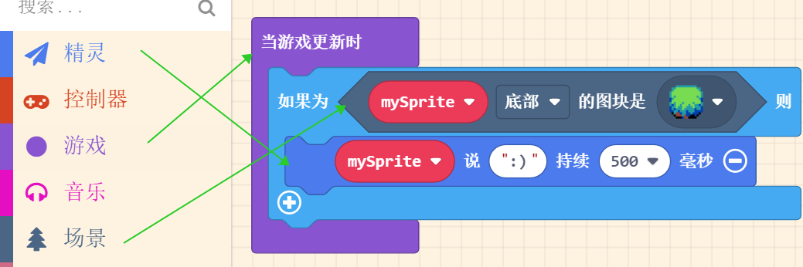

4. In order to increase the sense of reality, when objects collide with objects, they should not be able to pass through. At this time, we add the attribute of the wall to the map scene. First return to the **map** block, enter the edit interface and select the draw wall option

 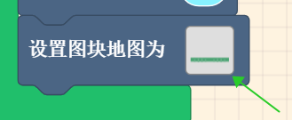  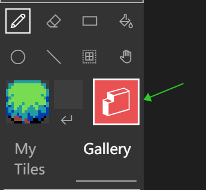

5. Then smear on the tiles that need to be turned into walls (cannot be crossed), and the tiles that turn red will be upgraded to the role cannot be crossed

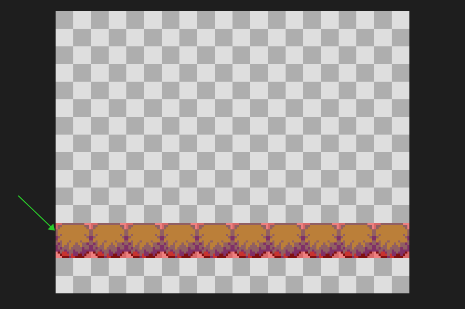

### Add gravity

Realistic, often can give people a stronger sense of empathy. Gravity exists in the environment we live in is the most real, let's not talk about complex knowledge points, just focus on implementing it and take a look

1. The simulated scene is the sky, and the bird is added to the gravity environment. The free acceleration of the bird under gravity is normally 9.8m/s², but because this is mapped to 1 meter in the screen in pixels, it looks too slow. I tried to expand it by about 30 times and take an integer

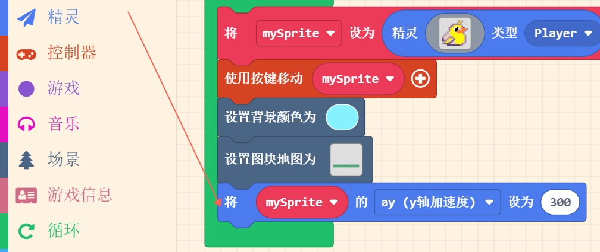
:::info
Now you can see that the bird is falling from the beginning, which already has the feeling of free fall under gravity
:::

2. The bird flaps its wings to fly up to avoid hitting the tree
:::warning
We haven't tested the instantaneous vertical velocity of the bird flapping its wings, so we use the vertical velocity of human jumping for simulation.

- According to the law of conservation of mechanical energy: 1/2*m(weight)*v²(take-off speed square)=m(mass)*g(gravity acceleration=9.8)*h(height)

- The person can jump about 0.5m in a normal vertical jump

- The weight of the bird is about 30g, so the take-off speed is about 3m/s
:::

Base on the 30 times expansion, the instantaneous vertical upward velocity y is 90, press the A key to let the bird flap its wings once
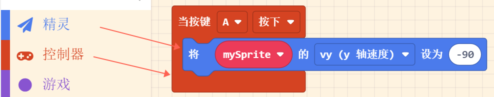

3. Since the bird has been affected by the vertical gravity, we should not interfere with the vertical coordinate of the bird with the key at this time, so now we change the y-axis speed in the previous key association to 0

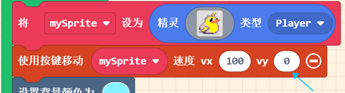

## Download

---

### 

Since MicrobitV2 (nRF52833) is still in the testing stage for the official Arcade platform, we need to go to the settings page of the platform to open the hardware options that are still in the experimental version.

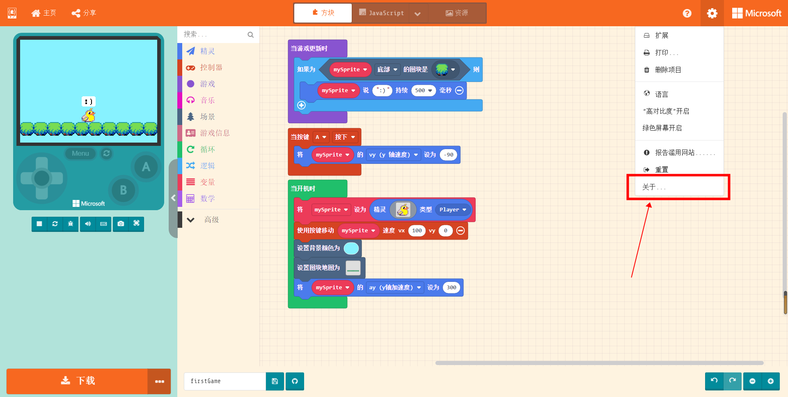 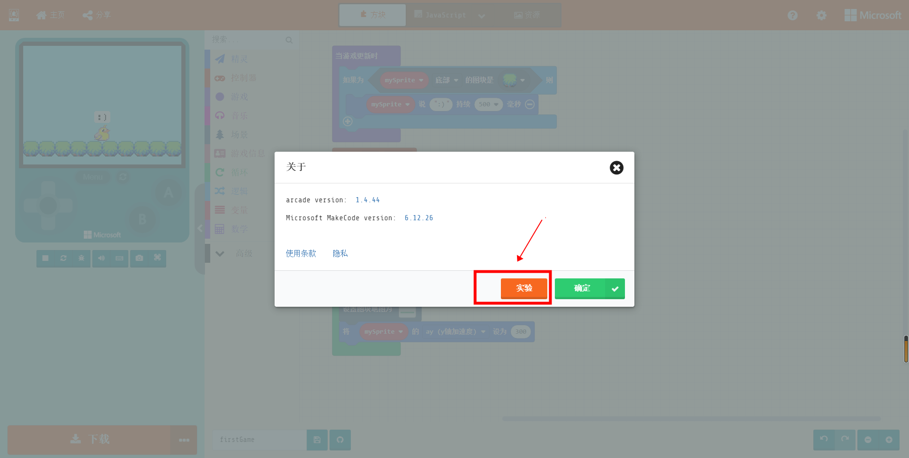

Make sure that Expermental Hardware is **enabled** (only need to set once)
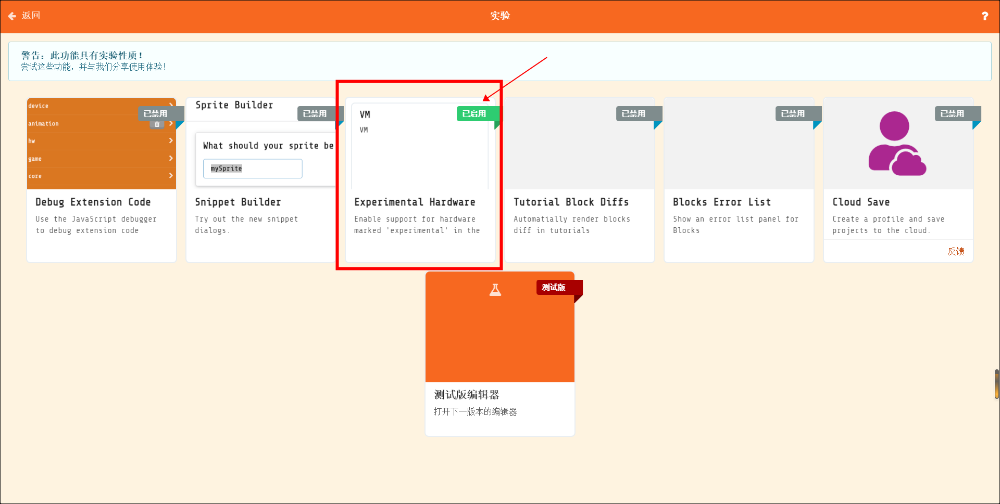

Return to the programming homepage, click the **Download** button in the lower left corner, and select **N3** at the bottom of the pop-up window
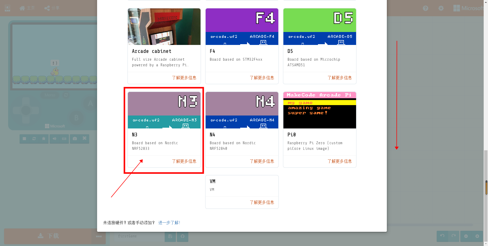

You will get a .hex file, drag it into the MICROBIT drive to run on MicrobitV2 + Newbit Arcade Shield.
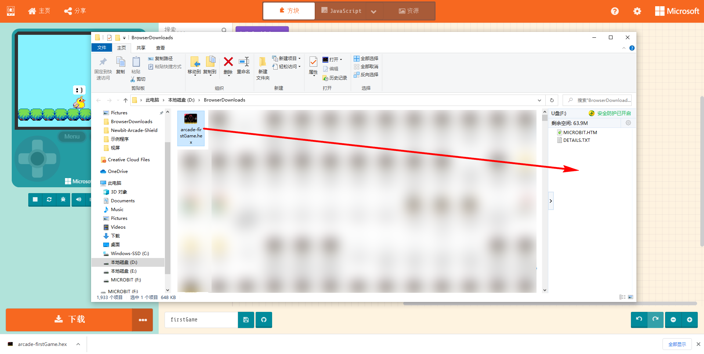

### Source Code

🏳‍🌈 Goto [https://makecode.com/_LdFRbMU08Jgt](https://makecode.com/_LdFRbMU08Jgt)

