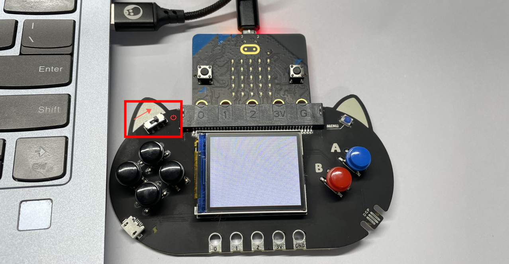
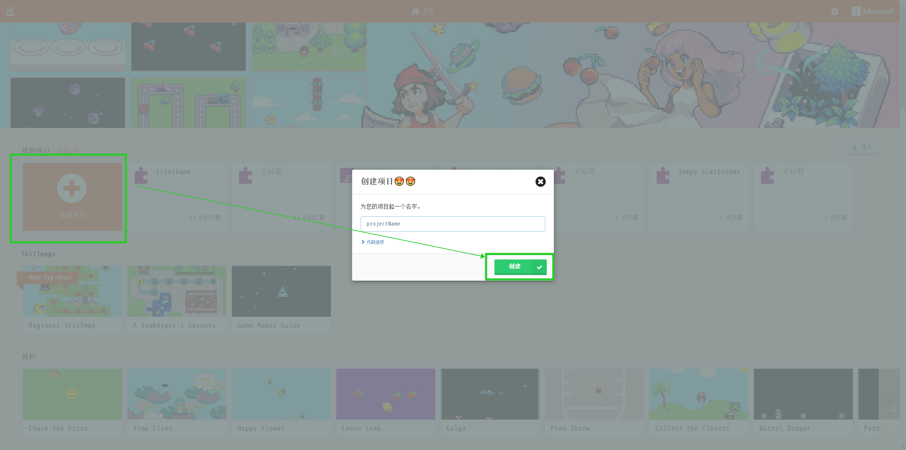
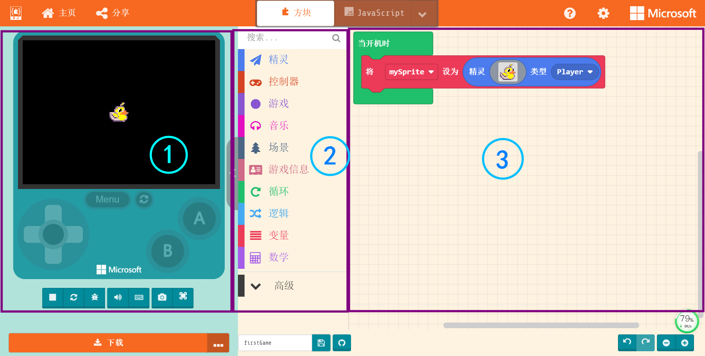
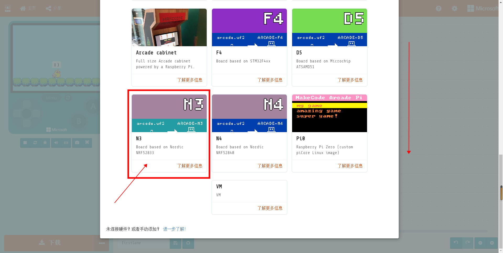

## Hardware Connection

---
Use with MicrobitV2, connect the microUSB to MicrobitV2.

:::info
- The power supply of the expansion board is divided into two parts, one is the power supply from the MicrobitV2 end, and the other is the power supply from the expansion board end.
- When the power supply is from the MicrobitV2 end, the power switch of the expansion board will be disconnected no matter whether the switch is on or off.

:::

## Coding Platform

---

:::info
Newbit Arcade Shield as a Microbit remote control handle is still programmed in Arcade, programming platform address:
[https://arcade.makecode.com](https://arcade.makecode.com/#)
:::

**Coding homepage**

Create a new project and enter the programming page

**Introduction to the programming interface, for basic entry, it is roughly divided into 3 parts that need to be understood first**

1. Online simulator: The hardware interaction content that needs to be realized by the remote control does not need to use the simulator
2. Programming block: We drag the programming code from here to program
3. Code editing area: We drag the code from the block area and splice it here to complete the program

## Remote Control Car

---

### Demo Video

We will use a single-motor car as the remote control object, and the effect of this remote control is to control the car to move forward and backward. **The handle end is programmed in Arcade; the car end is programmed in Makecode**

[](https://www.yuque.com/kittenbot/hardwares/newbit-arcade-shield-controller?_lake_card=%7B%22status%22%3A%22done%22%2C%22name%22%3A%22control-car.mp4%22%2C%22size%22%3A%22880544%22%2C%22taskId%22%3A%22u10735a25-5775-4834-8312-cc4d29128cf%22%2C%22taskType%22%3A%22upload%22%2C%22url%22%3Anull%2C%22cover%22%3Anull%2C%22videoId%22%3A%22inputs%2Fprod%2Fyuque%2F2021%2F1432972%2Fmp4%2F1623847784101-355c8aed-2835-4909-93d8-ffd118d449e0.mp4%22%2C%22download%22%3Afalse%2C%22__spacing%22%3A%22both%22%2C%22id%22%3A%22lytCd%22%2C%22margin%22%3A%7B%22top%22%3Atrue%2C%22bottom%22%3Atrue%7D%2C%22card%22%3A%22video%22%7D#lytCd)

###  Materials

In this case, the following materials are required:

- MicrobitV2 *1
- Newbit Arcade Shield *1
- Nanobit *1 (equivalent to MicrobitV1 without screen)
- Nanobit Shield *1（equivalent to Robotbit）
- GeekServo 2KG Motor *1
- Some lego bricks

### Car End Programming
:::info
if you are using Microbit+Robotbit to make a car, you can load the Robotbit plug-in (search for Robotbit in the plug-in bar)
:::

#### Coding Platform

- Goto [https://makecode.microbit.org/](https://makecode.microbit.org/)
- Create a new project and enter the programming page

#### Load Plug-in
We use Nanobit as the main control of the car, so the expansion board needs to be equipped with Nanobit Shield, so I will use the corresponding makecode plug-in.

#### Coding

First analyze the remote control car, what the car end needs to do is as follows

- Receive remote control signal (in the same wireless group as the handle)
- Drive the motor to travel (judge the model key value sent by the handle, corresponding to the front and back of the motor)

#### Download Program

Make sure to use the MicroUSB data cable to connect the main control board, and drag the downloaded .hex program file into the disk named Nanobit (MICROBIT).

### Remote Control End Programming
:::info
Since the buttons on the Newbit Arcade Shield are not directly driven by the IO port of MicrobitV2, they cannot be used in Makecode for the time being.
You need to go to the Arcade programming platform to use it.
:::

#### Coding Platform

- Goto [https://arcade.makecode.com/](https://arcade.makecode.com/)
- Create a new project

#### Load Plug-in
We need the wireless plug-in to realize the communication between the handle and the car. Since the wireless function used in this project is an additional plug-in in Arcade, it needs to be loaded separately.
**Search for radio and select the first one.**

#### Coding

The main function of the handle end is communication and sending control signals. To complete the car moving forward when the up key is pressed; the car reverses when the down key is pressed; the car stops when nothing is pressed, we can write it like this. (For fixed-speed forward and backward, key-value pairs are not required, and you can expand them according to the case)

#### Download Program

Press the **Download** button in the lower left corner, and select **N3** at the bottom of the pop-up hardware selection window

Make sure to use the MicroUSB data cable to connect the main control board, and drag the downloaded .hex program file into the disk named MICROBIT.

###  Attachment
[遥控案例.zip](./remote.zip)
