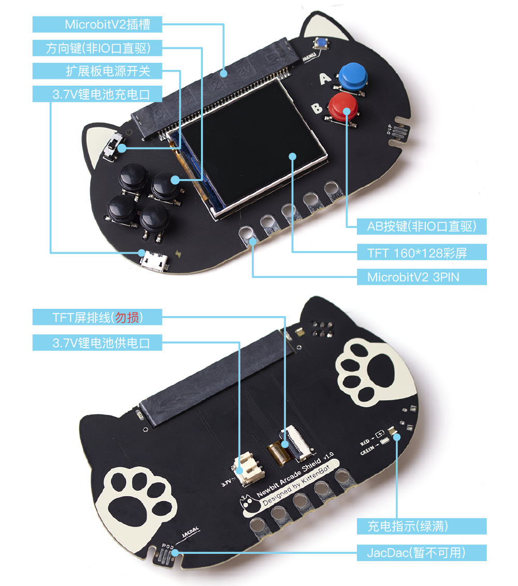

## Shop Link

---

** 🛒  **[**Kittenbot—Newbit Arcade Shield**](https://www.kittenbot.cc/products/newbit-arcade-shield)

## Product Description

---

Newbit Arcade Shield is a color screen handle expansion board specially designed for MicrobitV2, which gives MicrobitV2 the ability to **program games** in addition to being used as a remote control handle. MicrobitV2 can realize online programming and offline play of games on the Microsoft Arcade programming platform by carrying Newbit Arcade Shield, which is very suitable as a programming experience extension link for MicrobitV2.

### Ideal Use-Cases for Newbit Arcade Shield

- Users with MicrobitV2
- Teenagers with a certain programming foundation
- Users who want to learn game programming

### Key Features

- **Color screen display**: 1.8-inch color screen, 160x128 resolution, 65K color display, support for displaying pictures and text
- **Programmable buttons**: 6 programmable buttons, 2 programmable RGB lights, 1 programmable buzzer
- **Jacdac interface**: Support Jacdac interface, can be connected to Jacdac module
- **Battery power supply**: Support 3.7V lithium battery power supply and charging

### Technical Specifications
| **Dimensions** | 115 x 65 x 17.5 mm |
| --- | --- |
| **Weight** | 35 g |
| **Power Supply** | micro USB(5V) / Lithium Battery(3.7v) |

### Hardware Details

:::info
🤵if you can't find what you want here, please comment to tell us, we will evaluate the needs as soon as we receive them!
:::
