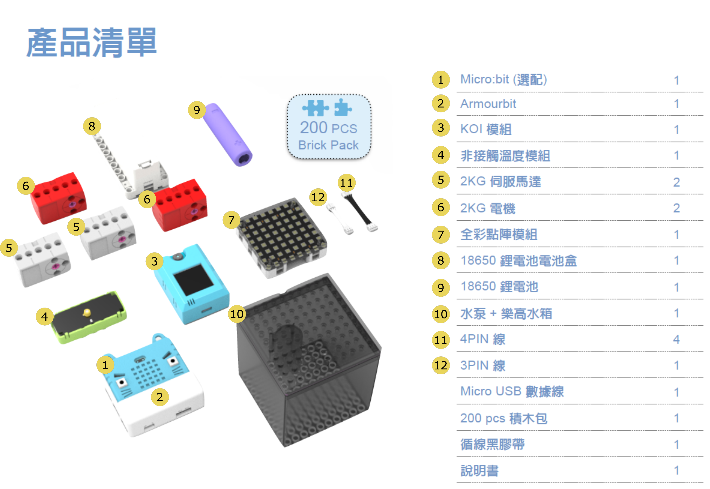

Here is the parts list of Health Care Educational AI Kit, please check and make sure there are no missing components.

## List of electronic components

- Armourbit Expansion Board x1
- Armourbit Battery Box x1
- 2KG GeekServo Servos x2
- 2KG GeekServo Motors x2
- KOI AI Camera x1
- Infra-Red Temperature Sensor x1
- 18650 Rechargeable Battery x1
- RGB LED Matrix Module x1
- Water Pump+Water Tank x1
- 4pin Cables x4
- 3pin Cable x1
- 1m USB Cable x1
- Building Bricks(200 Pieces) x1
- Black Tape x1
- Instructions x1
- Micro:bit Silicon Jacket x1
- Decoration Cards x1
- MicroSD Card x1

## List of building blocks

## Parts List Download 

[Download As PDF](https://bit.ly/AIHealthCareSetBuildingGuide)