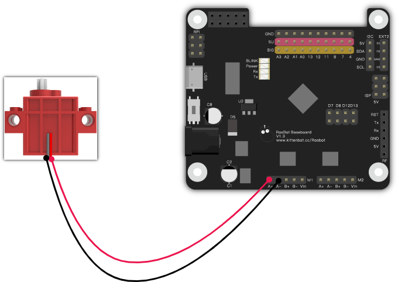
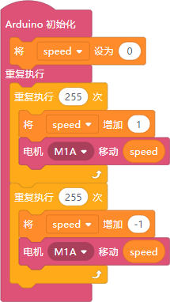
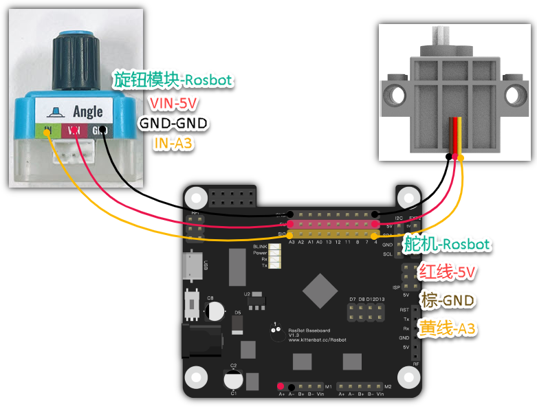
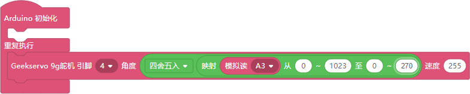

Certainly! Below is an optimized version of the Markdown content:

---

### Overview
Control of Servo and Motor-based Components

### Module Introduction

| **Actuator Drives** | Description |
| --- | --- |
|  | Control a motor at a specified speed. |
|  | Control two motors simultaneously. |
|  | Run two motors and stop them after a specified time period. |
|  | Control four motors simultaneously. |
|  | Stop all running motors. |
|  | Move a stepper motor a specified distance. |
|  | Rotate to a specified angle. |
|  | Advanced dual-motor operation for initialization. Refer to the stepper motor datasheet for parameter details. |
|  | Set the wheel spacing for two stepper motors. |
|  | Make the car turn at a specified degree. |
|  | Set the angle for standard servos (e.g., blue 9g servos). The speed refers to the rotation speed; higher values mean faster rotation. |
|  | Set the angle for Geekserver 9g servos. |

### Example Programs

#### Variable Speed Motor

- Wiring  
  
  
- Code  
  

#### Knob-Controlled Servo

- Wiring  
  

- Code  
  
