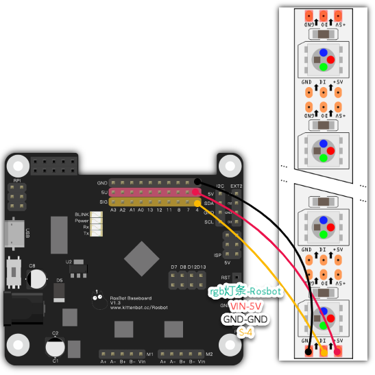
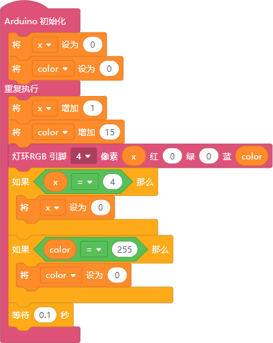
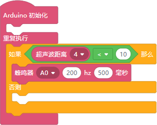

### Overview
This section features common examples of peripheral modules. Unlike simple pin control blocks, these modules require specialized software libraries for operation. Hence, they are separated into a distinct category.

### Module Introduction

| **Peripheral Modules** | Description |
| --- | --- |
|  | Make a buzzer sound at a specified frequency. |
|  | Change the color of a single LED. |
|  | Change the color of a specified LED. This block allows color settings via code. |
|  | Turn off the specified LED. |
|  | Single-pin ultrasonic sensor. |
|  | Return the power supply voltage. |

### Example Programs

#### Flowing Lights
A visual effect where the color gradually deepens, mimicking flowing lights.

- Wiring  
  

- Code  
  

#### Collision Warning
Simulates real-world scenarios where vehicles emit a warning sound when close to colliding with an object.

- Wiring  
  

- Code  
  

