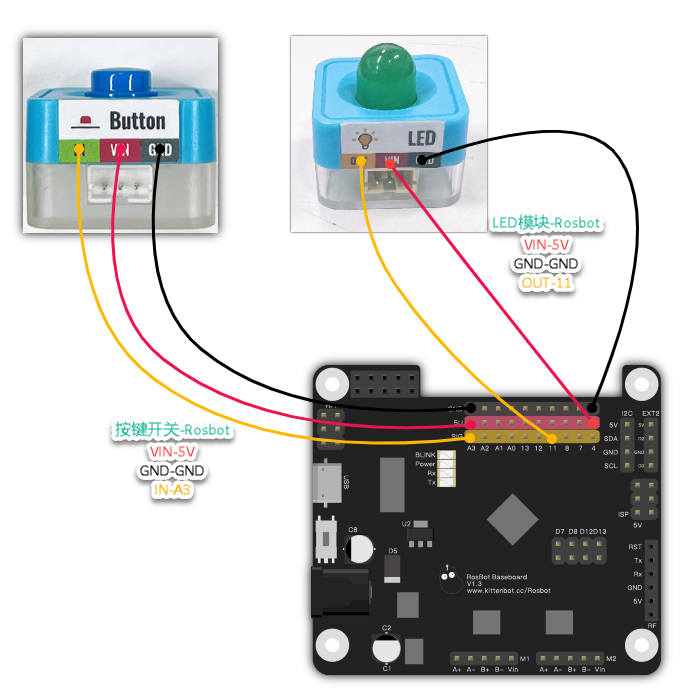

### Introduction

Use pins to control common motor modules

### Blocks

---
| Icon | Description |
| ---- | ----------- |
|  | |
|      | Set the pin mode as either Input or Output. |
|      | Activate only after setting the pin to **Output** mode; allows you to set the pin to High or Low voltage levels. |
|      | Output analog values, commonly used for controlling the brightness of LEDs. |
|      | Activate only after setting the pin to **Input** mode; enables you to read the current state of the pin. |
|      | Read analog values from the pin, useful for modules like potentiometers. |
|      | Functions similarly to "Digital Write." Pin 13 is connected to the onboard LED, allowing for direct control without the need for external modules. |

---

### Examples

#### Blinking LED

- Wiring 

- Code

#### Rotary knob brightness switch

Use the rotary knob module to adjust the brightness of the LED

- Wiring 

- Code

#### Button switch

Control the LED with the button

- Wiring 

- Code

