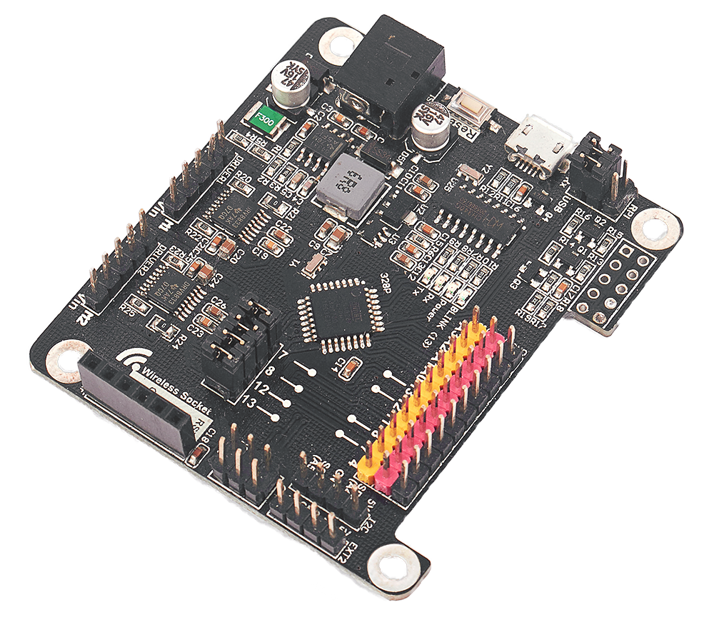
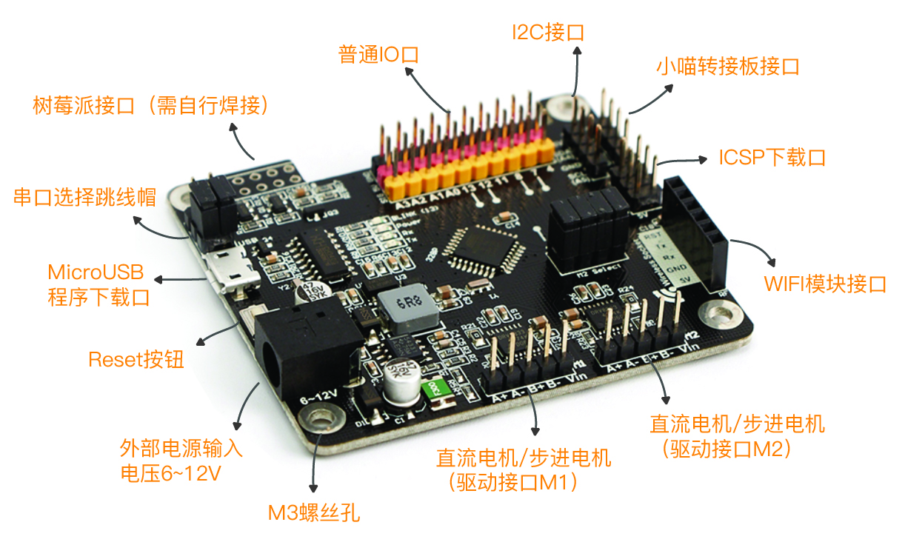

## Shop Link

---

**🛒**[** Kittenbot-Rosbot **](https://www.kittenbot.cc/products/rosbot-arduino-uno-for-advanced-robotics)

## Product Description

---

Rosbot is a robot controller board based on Arduino UNO, it has the same main control chip as UNO, but it has built-in motor drive, optimized serial communication interface, and structure compatibility and Raspberry Pi compatibility are the advantages of Rosbot.

## Features

- On board multifunctional motor drive, meet the requirements of robot car making
- MicroUSB is used for download port
- Onboard standard M3 copper column fixing hole for easy installation and fixing
- WIFI interface is led out, no need to directly insert WIFI module with DuPont line
- Raspberry Pi serial port wire sequence solder pad, if necessary, can be soldered with 10P socket directly inserted and fixed on Raspberry Pi

## Ideal Use-Cases for Rosbot

- Arduino training institutions
- Personal users who want to use Arduino programming to do robot projects

## Specifications
| **Dimensions** | 65 x 60 x 10 mm |
| --- | --- |
| **Weight** | 23.1g |
| **Main Controller** | MEGA328P(arduinoUNO) |
| **USB Serial** | CH340 |
| **Working Voltage** | 5V (With Overcurrent / Self recovery fuse) |
| **Input Voltage** | 5V（USB）、6～12V (External DC connector) |
| **Digital In/Out** | 8 |
| **Analog Pins** | 6 |
| **Motor Driver** | DRV8833 |

 

## Hardware Details

- Digital I/O: 2, 3, 4, 7, 8, 11, 12, 13
- Analog I/O: A0-A5
- DC motor interface: 4
- Stepper motor interface: 2
- PWM servo interface: 10
- Expansion interface:
   - I2C interface
   - Raspberry Pi interface
   - WIFI/Bluetooth interface
- Serial port function: support external output

# FAQ

---

[**FAQ**](./FAQ)
