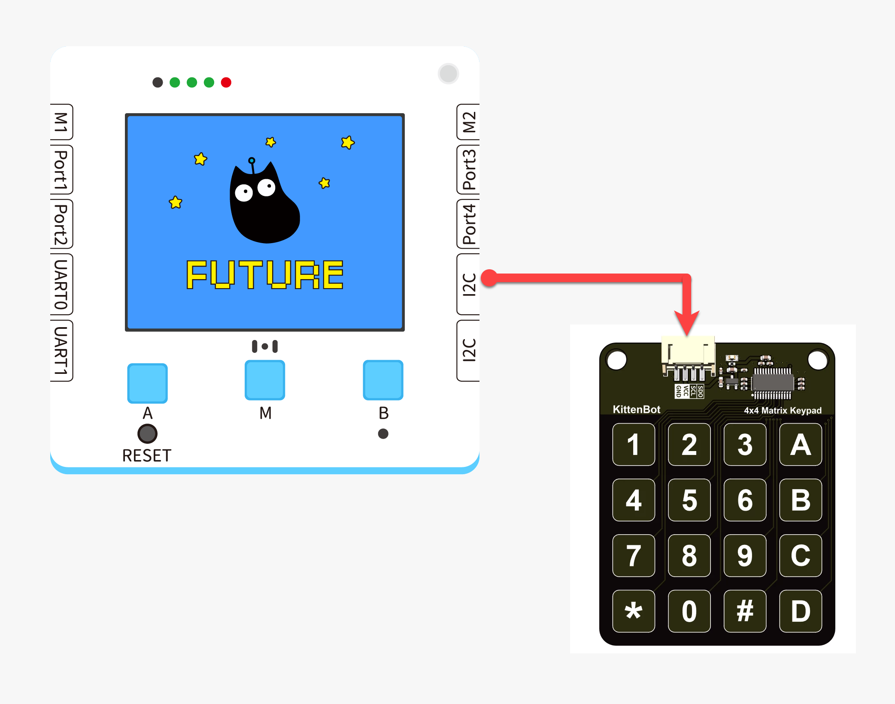
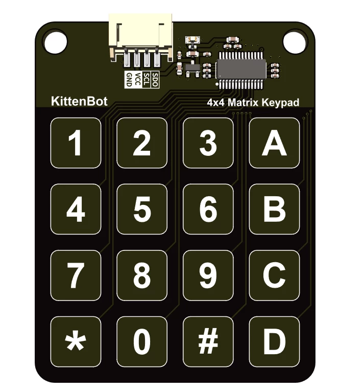
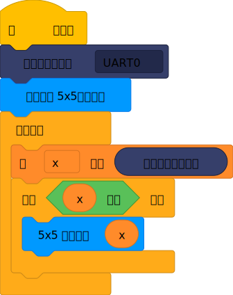
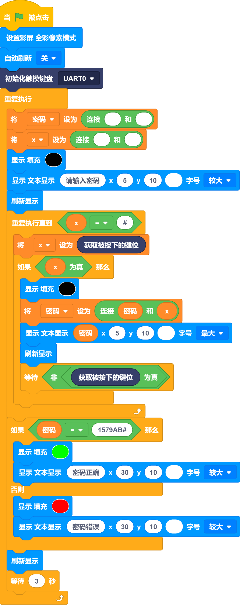
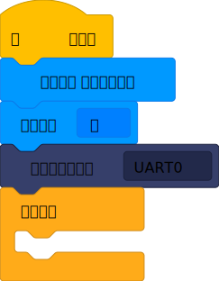
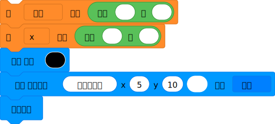
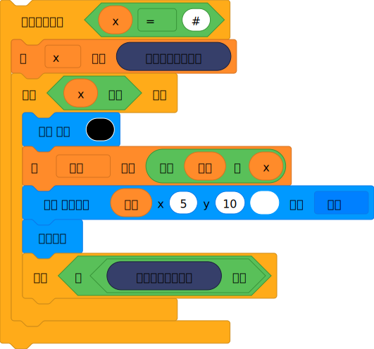
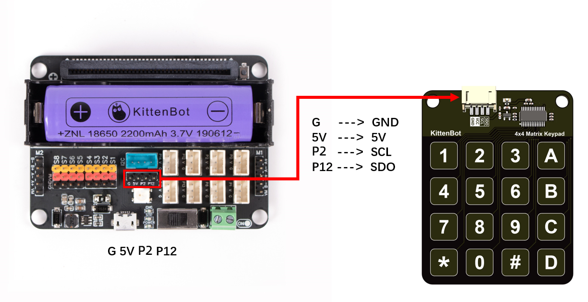
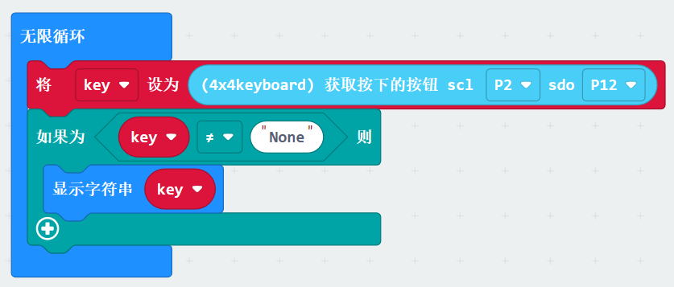
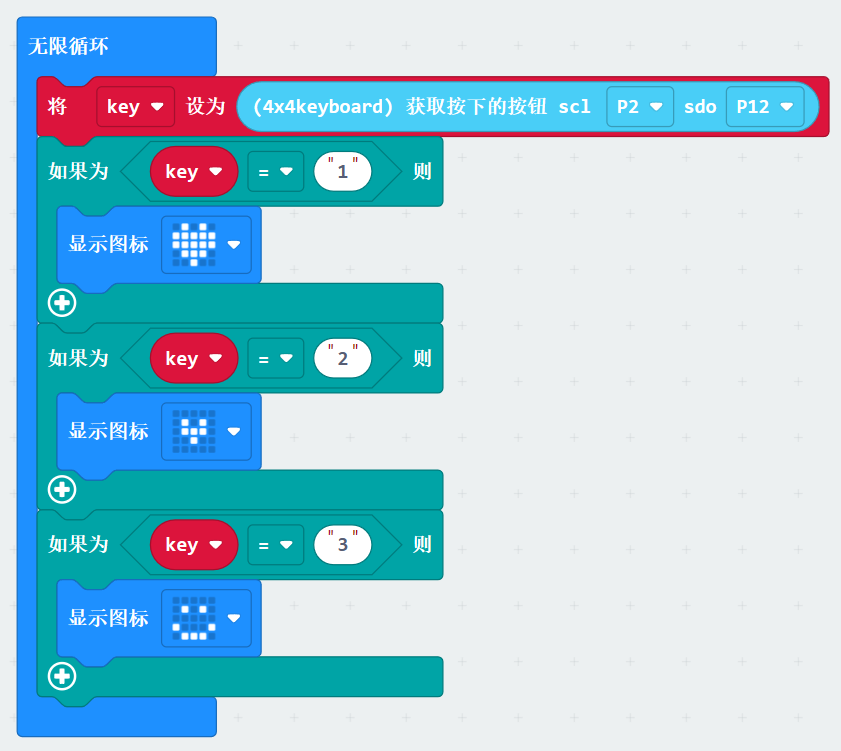


## Features
---
| **Signal** | Time domain signal - analog serial port protocol |
| --- | --- |
|  |


## Module Principle
There is capacitance between any two conductive objects. The size of the capacitance is related to the conductive properties of the dielectric, the size and conductive properties of the plates, and the presence of conductive materials around the plates. The two exposed copper areas between PCB boards (or FPC) are the two plates of the capacitor, which is equivalent to a capacitor. When a human finger approaches the PCB, the capacitance changes due to the conductivity of the human body. When the touch key chip detects a significant increase in capacitance, it outputs a switch signal.


## Wiring

|  |  | Future Board Lite Interface | Cable |   |
| --- | --- | --- | --- | --- |
|  | Sugar Cube LED Module | UART0 | Black PH2.0-4Pin Interface Cable |  |
:::warning
Supports connecting to UART0, UART1 Pay attention to keeping the interface consistent with the actual interface when programming
:::


## Blocks-Function Description
| Serial Number | Block Image | Block Function |
| --- | --- | --- |
| 1 |  | Initialize touch keyboard |
| 2 |  | Read pressed key value |
| Serial Number | Block Image | Block Function |
| --- | --- | --- |
| 1 |  | Read the key value read by the touch keyboard module |


## Program 1-Complete program
:::success
Cyclically read the keys pressed by the touch, and display the key values on the dot matrix of the color screen. Note: The type of the value of the key position read by the program is a string, which cannot be compared with a number
:::



## Program 2-Complete Program

:::success
Implement complete password lock function, enter password in order, finally press # to end, compare with set password, if successful, display screen as green
:::



## Program 2 - Function Description
:::success
Program initialization: Set the color screen mode, the initial touch keyboard port 
:::
> Before entering the password, the password and x variables need to be cleared to ensure that there is no data
> 
:::success
- Read the keys in real time. When a key is pressed, add the current password bit to the main password string
- And display the currently entered password
- Wait for the key to be released, then enter the next password bit
- All password bits will be output until the # key is pressed. There is no limit on the number of password bits here

:::
> Compare the entered password with the set password, and display green if the input is correct
> Note: The set password needs to be added with #
> 


##  Demo
:::warning
:::


## Using Kittenblock
How to run your program using offline download to check the effect


## Using on Microbit



##   Programming platform
[Microsoft MakeCode for micro:bit](https://makecode.microbit.org/#editor) Use Makecode programming platform


##   Add the Sugar Cube Plugin

 Search for "Sugar" in the extensions, click "Add"


##  Circuit Connection

|  |  | Future Board Lite interface | Use cable |   |
| --- | --- | --- | --- | --- |
|  | Sugar cube LED module | UART | Black PH2.0-4Pin interface cable |  |
:::warning
Support connecting to P2 and P12 Pay attention to interface consistency with the actual interface during programming
:::


##   Example 1: Read the button and display



##   Case 2: Processing judgment based on key values


