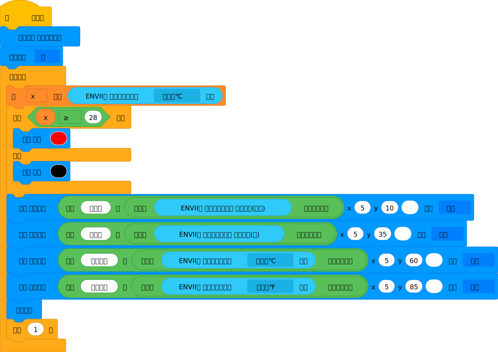
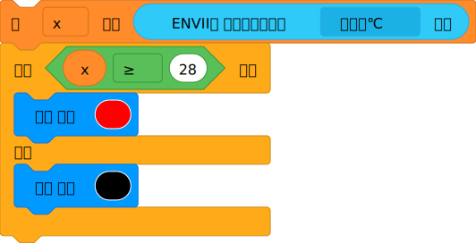
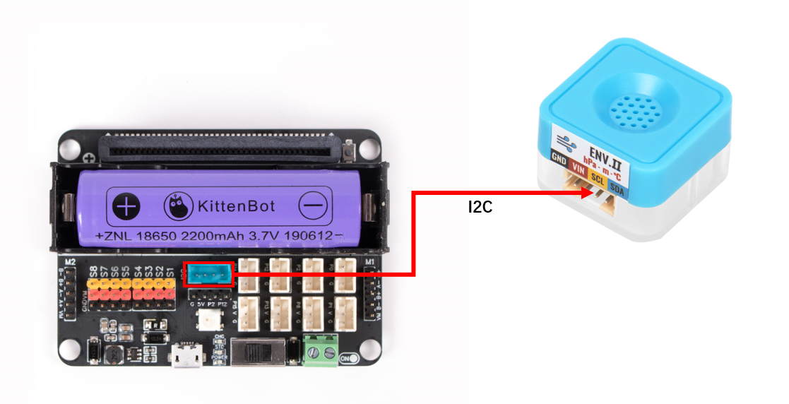
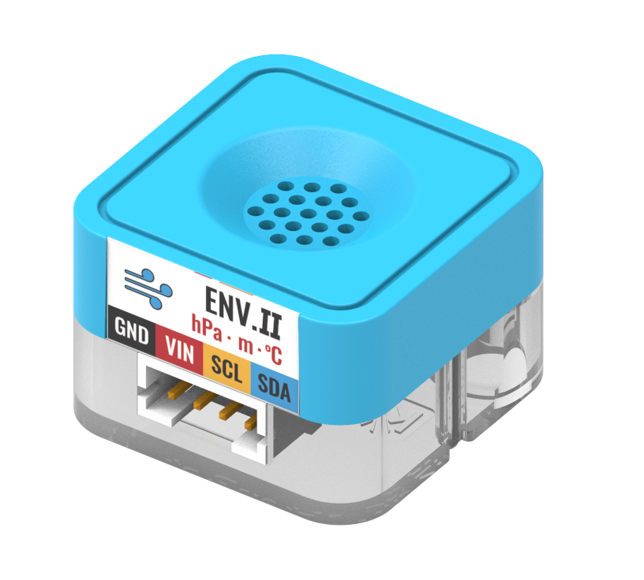
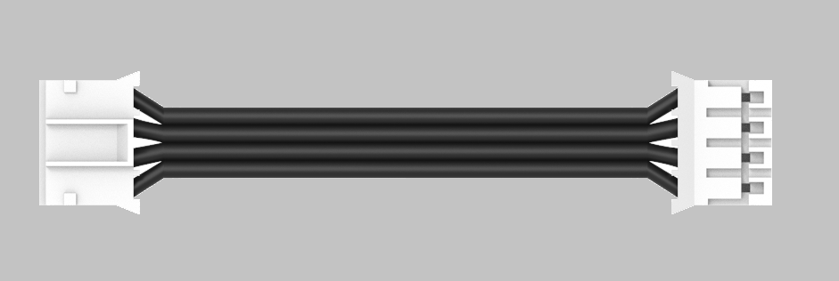
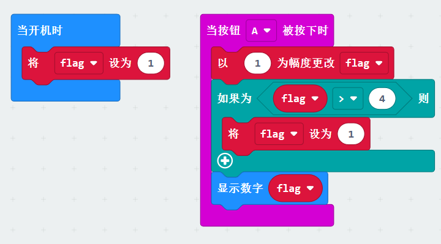
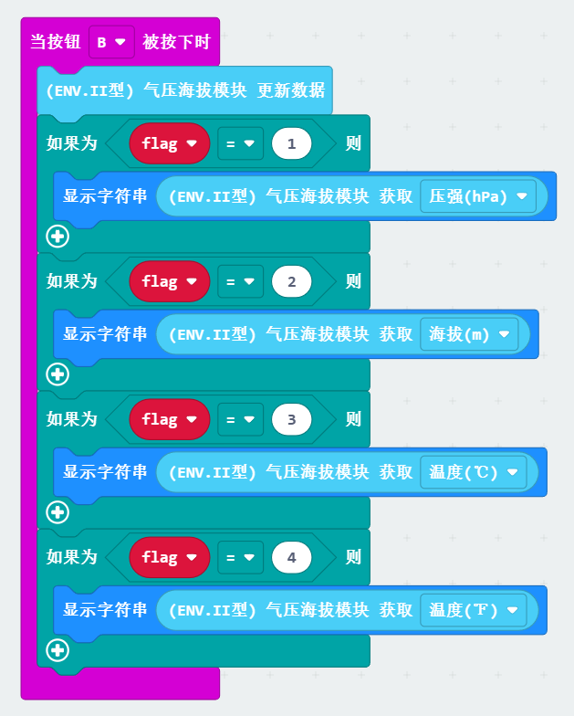
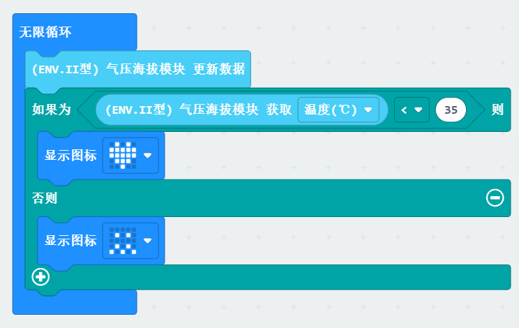

## Functions
---
| **Signal** | Timing signal - I2C protocol |
| --- | --- |
|  |

## Module principle
The Earth has gravity, and the closer an object is to the center of the earth, the stronger the gravitational force it receives. Therefore, there is a certain linear relationship between the gravitational force an object receives and its height relative to the earth. The barometric altimeter makes use of this principle by measuring atmospheric pressure with a pressure sensor and indirectly calculating the altitude based on the relationship between pressure and altitude.

## Wiring diagram

|  |  | Future Board Lite interface | Wire used |   |
| --- | --- | --- | --- | --- |
|  | Sugar cube pressure altitude module | I2C | Black PH2.0-4Pin interface wire |  |
:::warning
Connection supported on I2C Both I2C interfaces are the same     Note: Do not connect to the UART port
:::

## Blocks-Function Description
| Serial Number | Block Image | Block Function |
| --- | --- | --- |
| 1 |  | Get the altitude data of the module |
| 2 |  | Get the air pressure data of the module |
| 3 |  | Get the temperature data of the module (in Celsius) |
| 4 |  | Get the temperature data of the module (in Fahrenheit) |
| Serial Number | Block Image | Block Function |
| --- | --- | --- |
| 1 |  | Get the latest data |
| 2 |  | Get information about pressure, altitude, temperature, etc. |

## Program - Full Program

## Program-Function Description
:::success
Set the color screen to full-color pixel mode and turn off the automatic refresh mode 
:::
:::success
Read the temperature value for judgment, and set this threshold according to actual needs Here, 28 is used as an example for judgment 
:::
:::warning
Display the various data of the module on the color screen. Since the data read is decimal, it needs to be converted to a string before it can be displayed on the screen 
:::

## Using Kittenblock
Run the program offline to view the effect

## Using on Microbit

## Programming Platform
[Microsoft MakeCode for micro:bit](https://makecode.microbit.org/#editor) Use the Makecode programming platform

## Add FangTang extension

 Search Sugar in extensions, click add

## Circuit Connection

|  |  | Microbit Interface | Wire |   |
| --- | --- | --- | --- | --- |
|  | Sugar cube barometer altitude module | I2C | Black PH2.0-4Pin interface wire |  |

##   Example Display data
Press the A key to switch display different data 
Press the B key, display corresponding data according to the mode 
If the temperature exceeds the set value, a sad face is displayed 

