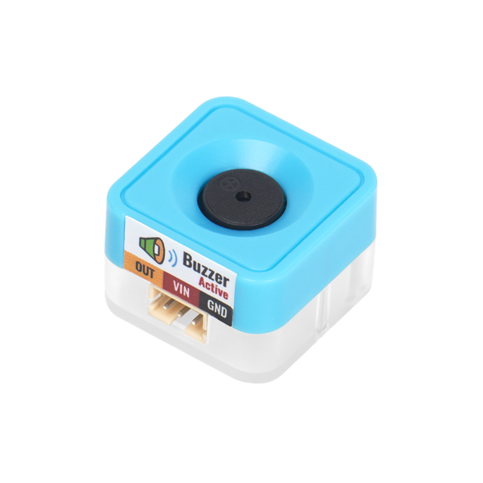
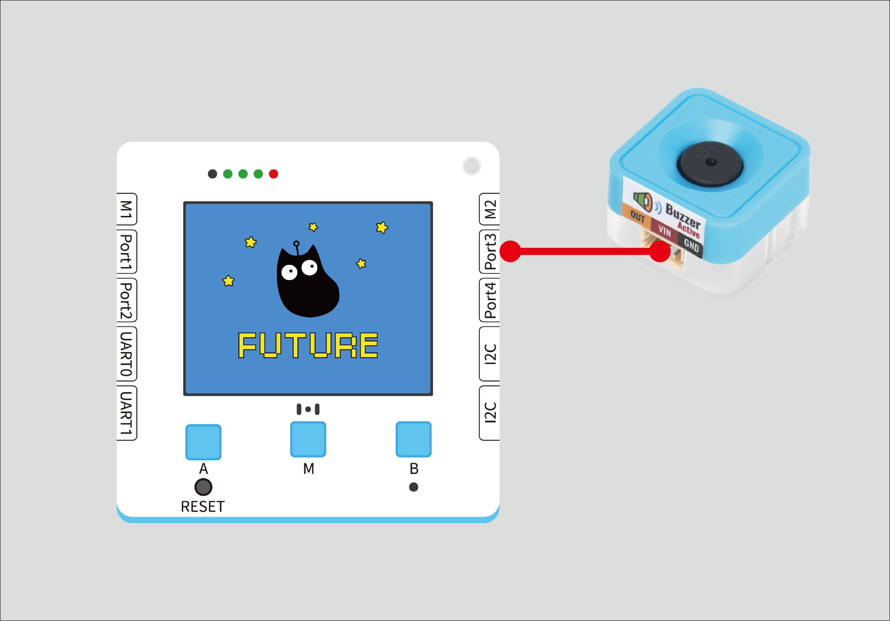
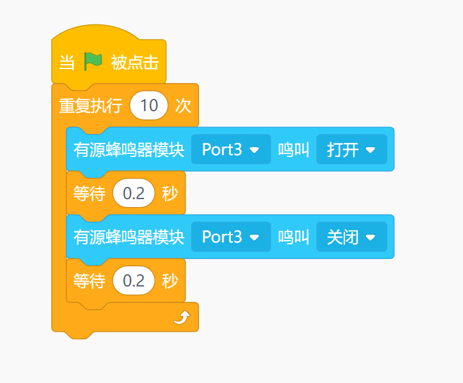
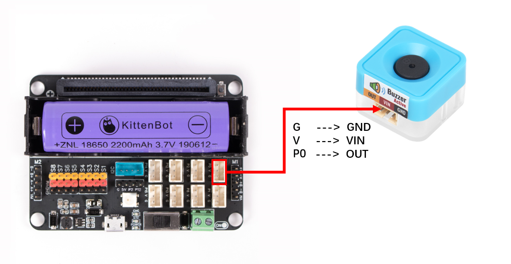


## Introduction



##   Function
---
Play sound, ticking sound
| **Signal** | Timing Signal |
| --- | --- |
|  |


## How the Module Works
An active buzzer is an acoustic module that combines a vibrating diaphragm, driver circuits, and sound source components. It can produce clear, stable sound signals. Compared with passive buzzers, active buzzers feature a small size, high volume, and good sound quality. They are widely used in alarms, prompts, and reminders.
- Oscillator: An active buzzer has a built-in oscillator that can generate high-frequency electrical signals. This oscillator usually consists of a transistor, a capacitor, and a resistor and can oscillate at a specific frequency.
- Driver circuit: When an external input signal reaches the active buzzer, it is transmitted to the built-in driver circuit. The driver circuit controls the frequency and amplitude of the oscillator according to the input signal and converts it into an acoustic signal.
- Sound output: When the oscillator starts to oscillate and the driver circuit starts to work, the active buzzer emits sound. The loudness and frequency of the sound depend on the characteristics of the input signal and the parameters of the built-in oscillator and driver circuit.


## Wiring

|  |  | Future Board Lite Interface | Wire |   |
| --- | --- | --- | --- | --- |
|  | Sugar Cube - Buzzer Module | Port3 | White PH2.0-3Pin Interface Cable |  |
:::warning
Supports being connected to Port1, Port2, Port3, Port4 Make sure the interface and the actual one are consistent when programming
:::


## Block - Function Description
| Number | Block Diagram | Block Function |
| --- | --- | --- |
| 1 |  | Control the buzzer switch |
| Number | Block Diagram | Block Function |
| --- | --- | --- |
| 1 |  | Control the buzzer switch |


## Program 1 - The complete program



## Program 1 - Feature Description
:::tips
By controlling the opening and closing, the frequency of the sound can be controlled to achieve different sound effects.
:::


## Using Kittenblock
Run the program offline to see the result


## Using Microbit



##   Programming Platform
[Microsoft MakeCode for micro:bit](https://makecode.microbit.org/#editor) Using Makecode programming platform


## Add Sugar plug-in

 Search for Sugar in the extension, click Add


## Circuit Connection

|  |  | Microbit interface | wire |   |
| --- | --- | --- | --- | --- |
|  | Square Buzzer | P0 | White PH2.0-3Pin Female to Female Jumper Wire |  |


## Case: Button Control


