
##   Function
---
Display conventional numbers, the two dots in the middle can serve as symbols of the clock: light up
| **Signal** | Timing signal |
| --- | --- |
|  |


## Module Principle
A digital tube is a common display device often used for digital display in devices such as digital clocks, counters, and information prompts. The working principle of the digital tube is to convert the digital signal into a current signal, and control the direction and magnitude of the current flow to make the LED (light-emitting diode) emit light, thereby realizing the function of digital display.


## Wiring
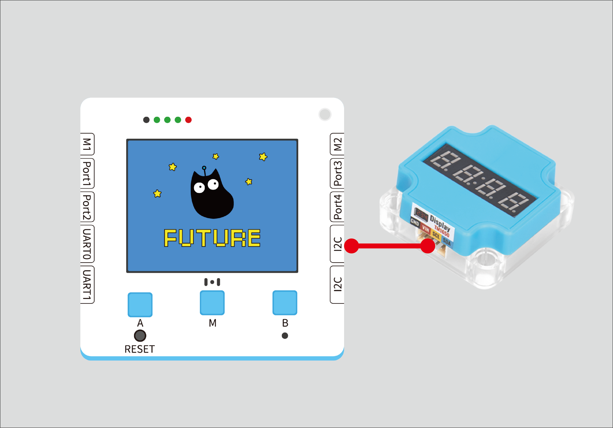
|  |  | Future board Lite interface | Cable |   |
| --- | --- | --- | --- | --- |
| 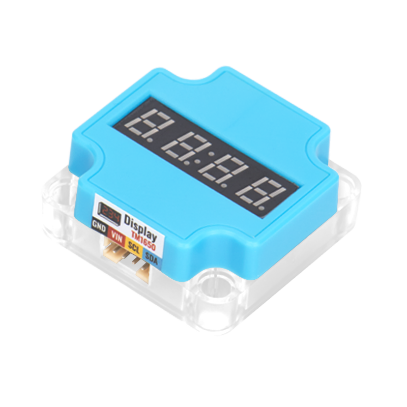 | Sugar cube digital tube module | I2C | Black PH2.0-4Pin interface cable |  |
:::warning
Either I2C terminal can be connected to
:::


## Building Block - Function Description
| Serial Number | Building Block Image | Building Block Function |
| --- | --- | --- |
| 1 | 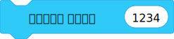 | Displays digital number (integer 0-9999) |
| 2 | 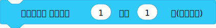 | Unit displays the content of the digital tube, digits 0-15, and digits greater than 10 will be converted to letters A-F |
| 3 | 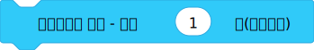 | Displays "-" at the specified position |
| 4 | 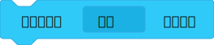 | Controls the on/off of ":" for the digital tube module |
| 5 |  | |
| 6 |  | Controls the brightness of the digital tube |
| 7 |  | Clears display, turns on display, turns off display for the digital tube |
| Serial Number | Building Block Image | Building Block Function |
| --- | --- | --- |
| 1 | 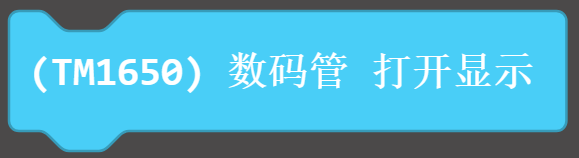 | Controls the opening of the digital tube |
| 2 | 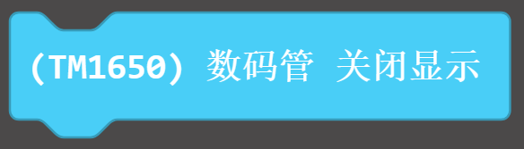 | Controls the closing of the digital tube |
| 3 | 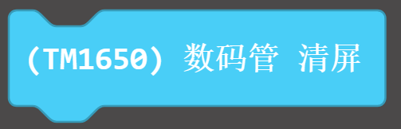 | Displays clear |
| 4 | 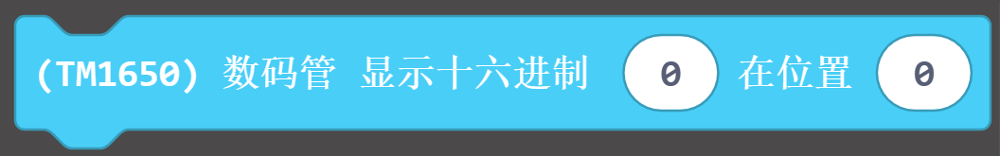 | From left to right, the position is 0-3, and the hexadecimal data displayed is 0-9 and a-f |
| 5 | 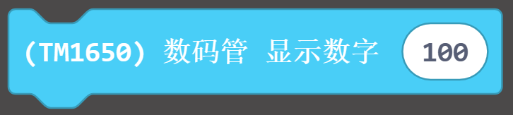 | Displays a decimal data |
| 6 | 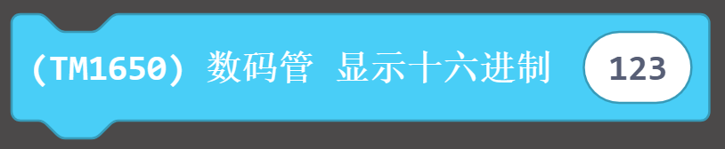 | Displays a hexadecimal data |
| 7 | 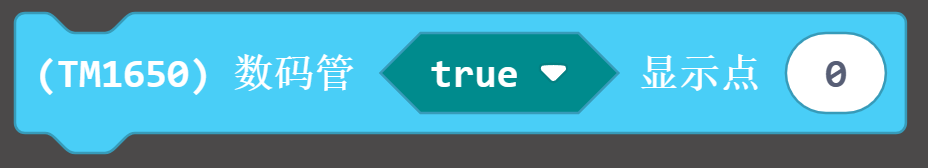 | Turns on the decimal point position of the module |


## Program 1 - Full Program
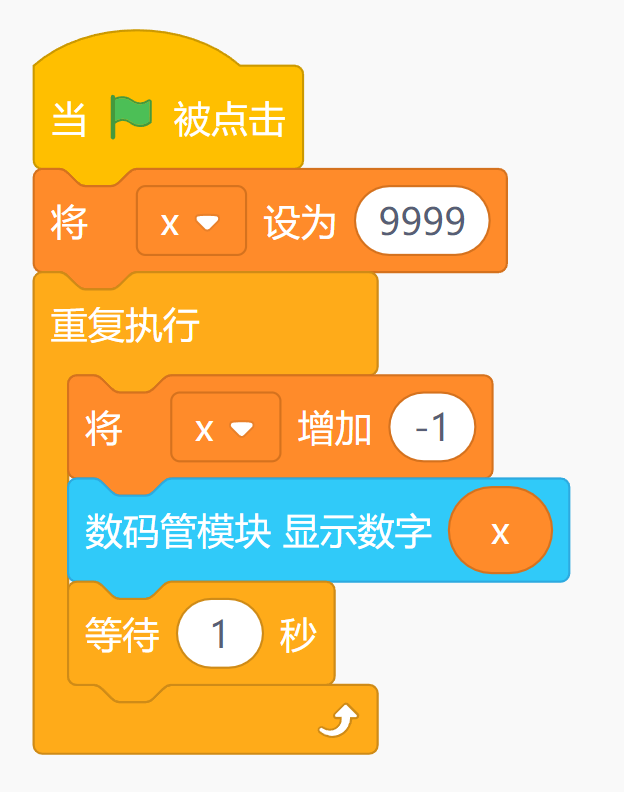


## Program 1 - Functional Description
:::danger
Initialize a whole number, reduce it by 1 every second, and display it.
:::


## Program 2 - Complete Program
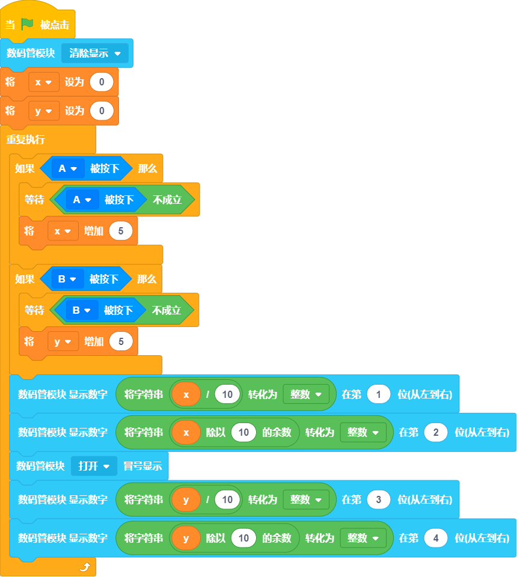


## Procedure 2- Functional Description
:::info
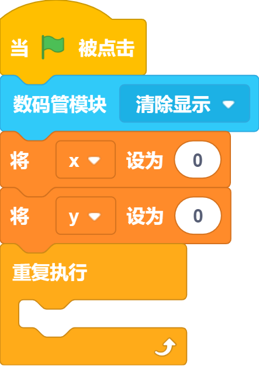 Clear the previous display when booting up and set two variables for the scores
:::
:::info
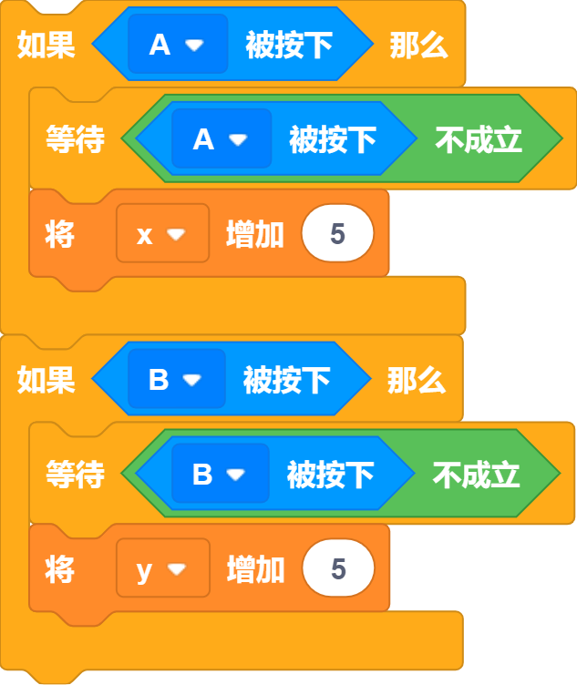 Control the scores of different teams by pressing buttons; each press adds 5
:::
:::info
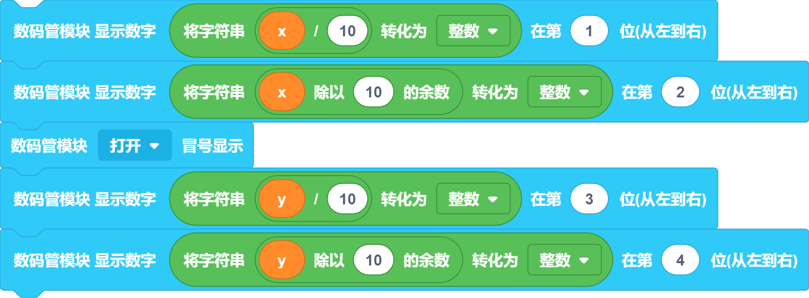Display the scores; the digit in the unit's place is the remainder of the current value divided by 10, and the digit in the ten's place is the current value divided by 10
:::


## Using Kittenblock
Run the program offline to view the effect


## Using on Microbit



##   Programming Platform
[Microsoft MakeCode for micro:bit](https://makecode.microbit.org/#editor) Use Makecode Programming Platform


##   Add Sugar Cube Plugin

 In the extensions, search for Sugar, click Add


## Circuit Connection
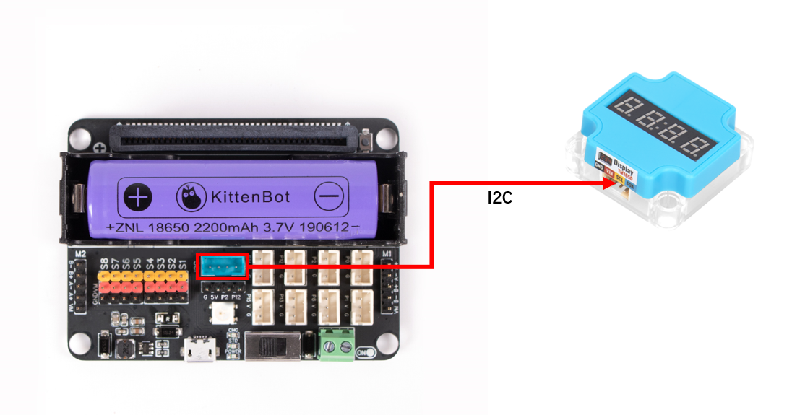
|  |  | Microbit Port | Wiring |   |
| --- | --- | --- | --- | --- |
|  | Sugar Cube Digital Tube Module | I2C | Black PH2.0-4Pin Interface Cable |  |


##   Case 1: Key Count - Decimal
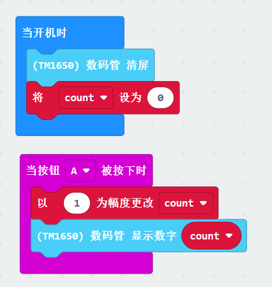


##   Case 2: Key Count - Hexadecimal
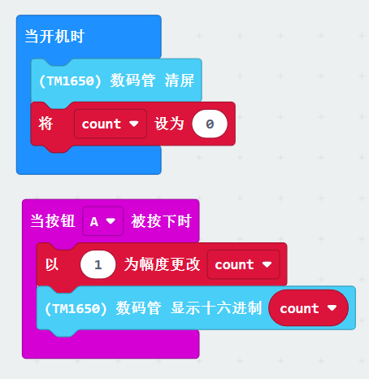


## Case 3: Scoreboard

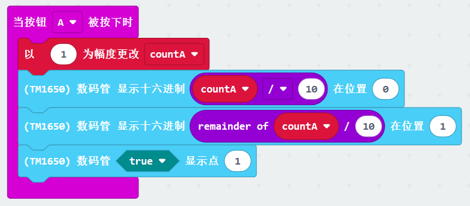
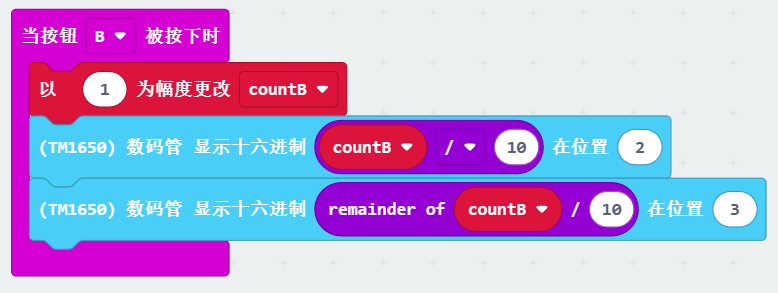

