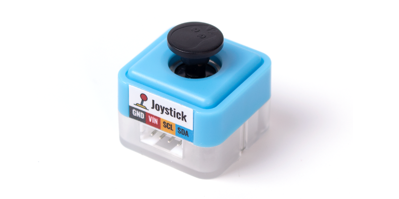
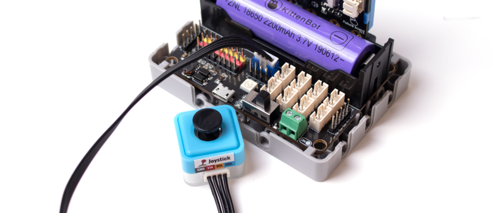
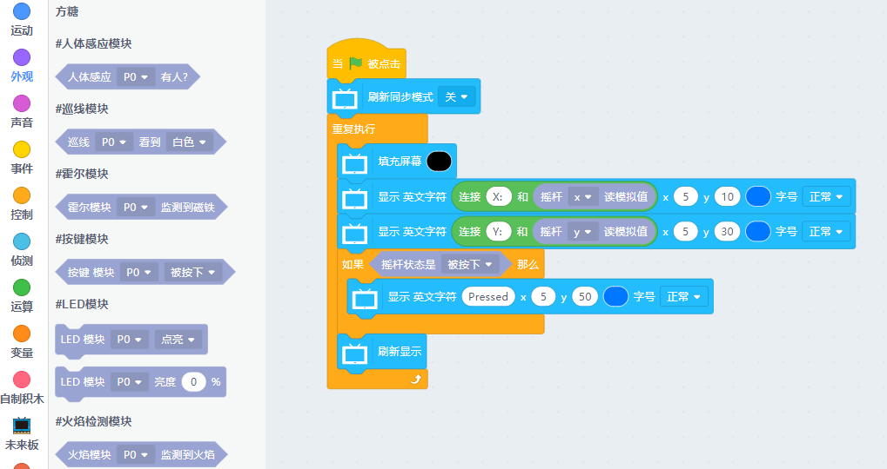
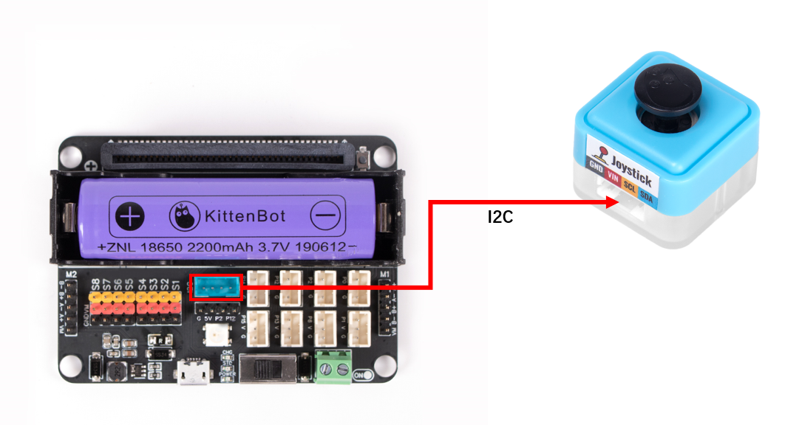
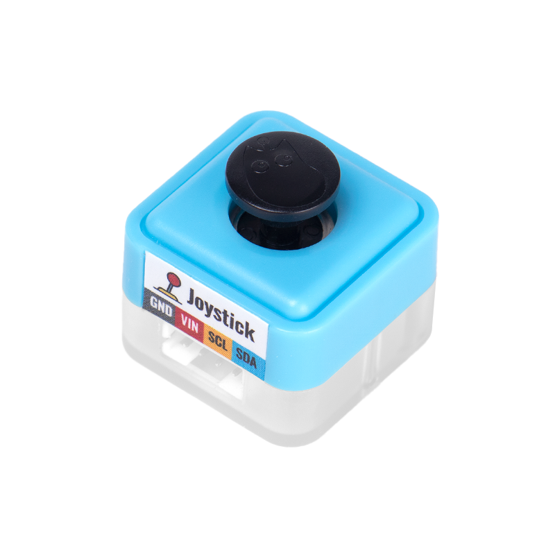
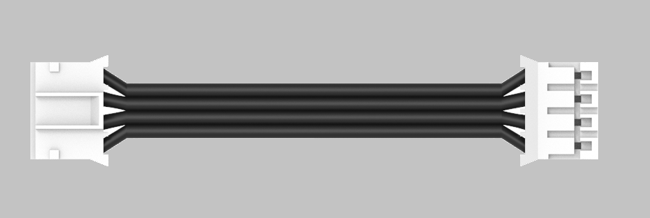
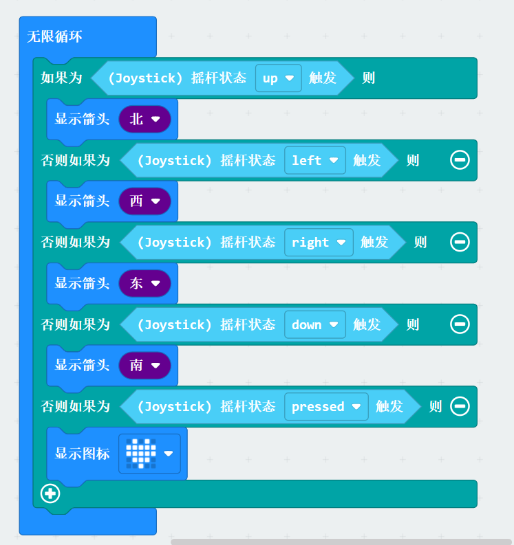


## Introduction
This is a five-way joystick, which can detect the values of the four directions of the X and Y horizontal axes and the vertical axis press. It is a relatively special I2C module.<br />


## Parameters
---
| **Dimension** | 24 x 24 x 23 mm |
| --- | --- |
| **Weight** | 7 g |
| **Type** | I2C |
| **Range** | X: -255~255<br />Y: -255~255<br />Z: Pressed or not |


##  Circuit Connection
---
Connect the joystick module to the Robotbit Edu's blue I2C interface using a 4PIN terminal wire. <br />Turn on the Robotbit power supply to see the red light at the bottom of the photosensitive module light up (the module is normally powered) <br />


##   Coding
---


## Using Kittenblock
You can concatenate strings (numbers will be converted to strings) using the Join block under the Operation block category.
:::info
Due to poor online interaction real-time performance, it is recommended to upload the program and run it on the Future board. <br />If you are not sure how to upload offline, please refer to [**Quick Start**](https://www.yuque.com/kittenbot/hardwares/eytesg#Ue4Lw)
:::

:::warning
Note that the colon in the English character string block should be an **English colon** (please do not enter the Chinese input method)
:::


## Joystick Direction Value
`value(dir)`
- dir: Select direction
   - 'x': X axis, return value range -255~255
   - 'y': Y axis, return value range -255~255
`state()`
- Return value:
   - Default state: 'none'
   - Other states: Detect 5-way state, according to the trigger state can return "pressed", "left", "right", "up" or "down".
```python
from future import *
from sugar import *
joystick = Joystick()
screen.sync = 0
while True:
    screen.fill((0, 0, 0))
    screen.text(str("X: ")+str(joystick.value('x')), x = 5, y = 10)
    screen.text(str("Y: ")+str(joystick.value('y')), x = 5, y = 30)
    if joystick.state() == 'pressed':
        screen.text("Pressed", x = 5, y = 50)
    screen.refresh()
```


## Effect Display
Print the data of the X and Y axes on the Future Board screen. When the joystick is pressed, the third line of the screen will display **Pressed**
[](https://www.yuque.com/kittenbot/hardwares/sugar-joystick?_lake_card=%7B%22status%22%3A%22done%22%2C%22name%22%3A%22joystick.mp4%22%2C%22size%22%3A%22973943%22%2C%22taskId%22%3A%22uc2f56989-1e40-418a-ad26-e80d161a555%22%2C%22taskType%22%3A%22upload%22%2C%22url%22%3Anull%2C%22cover%22%3Anull%2C%22videoId%22%3A%22inputs%2Fprod%2Fyuque%2F2021%2F1432972%2Fmp4%2F1623416053480-5580a33e-2f91-4a70-8571-7132980540ca.mp4%22%2C%22download%22%3Afalse%2C%22__spacing%22%3A%22both%22%2C%22id%22%3A%22WIgCC%22%2C%22margin%22%3A%7B%22top%22%3Atrue%2C%22bottom%22%3Atrue%7D%2C%22card%22%3A%22video%22%7D#WIgCC)


## Using on Microbit



##   Programming platform
[Microsoft MakeCode for micro:bit](https://makecode.microbit.org/#editor)<br />Use Makecode programming platform


## Add Sugar Plugin

<br />
Search for Sugar in the extensions, click Add


## Building Blocks-Function Description
| Sr. No. | Building Block Image | Building Block Function |
| --- | --- | --- |
| 1 |  | Read Joystick Status |
| 2 |  | Read Joystick Raw Value |


##  Circuit Connection

|  |  | Microbit Interface | Cable | <br /> |
| --- | --- | --- | --- | --- |
|  | Sugar cube joystick module | I2C | Black PH2.0-4Pin interface cable |  |


## Case: Control display


