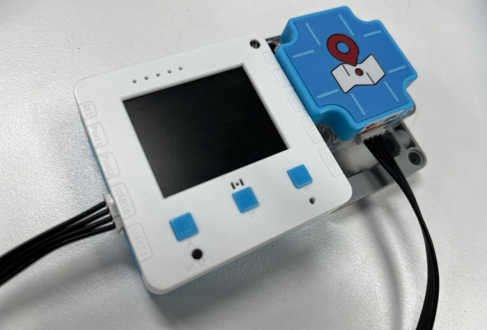
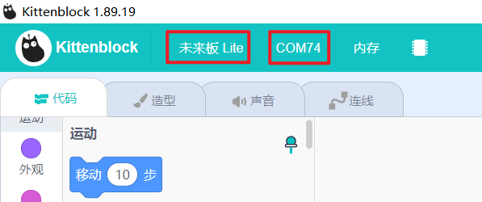
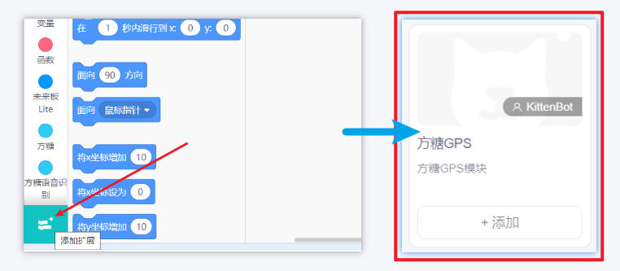
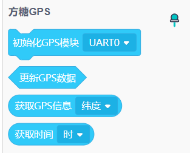
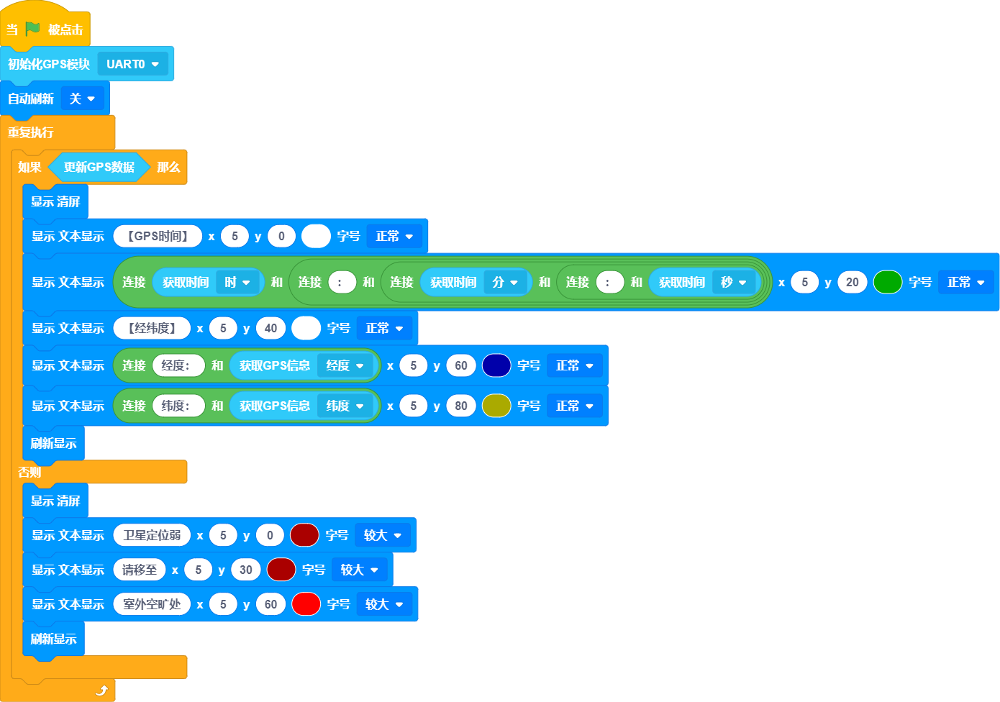
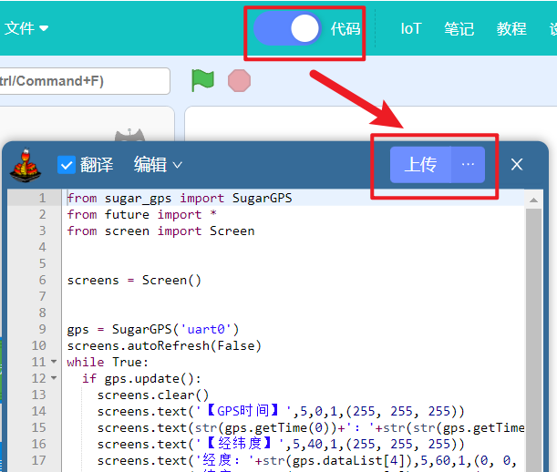
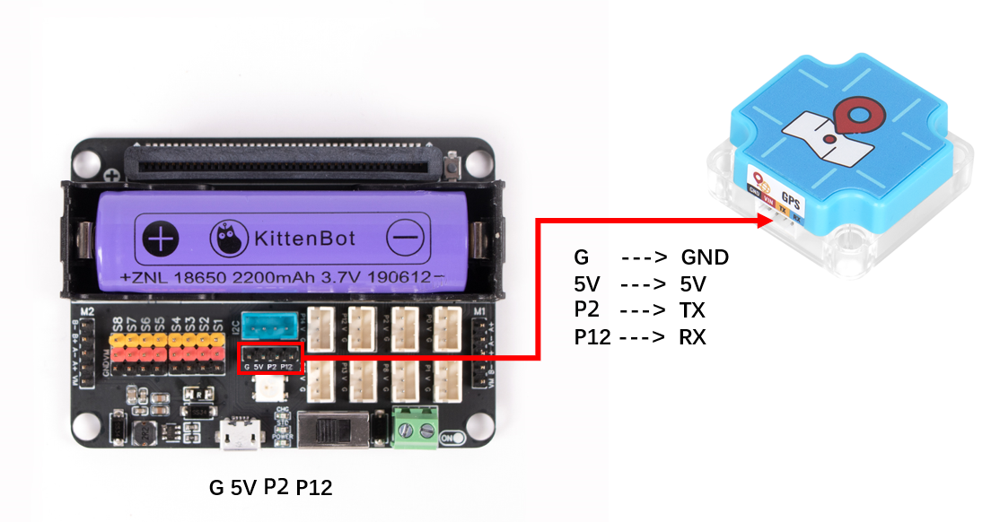


## Introduction



## Product Details
---
Fangtang GPS is a multi-mode satellite navigation and positioning module that supports satellite positioning systems such as BeiDou 3rd generation/GPS/GLONASS, and supports multi-system joint positioning and single-system independent positioning modules. It is based on a highly sensitive positioning chip, which can provide accurate positioning information and is suitable for various positioning applications, such as in-vehicle navigation, IoT device tracking, etc. 
The module adopts an integrated RF baseband design, integrating DC/DC, LDO, RF front end, low-power application processor, RAM, Flash storage, RTC and power management, which can be powered by button battery or farad capacitor to RTC, backup RAM to reduce the first positioning time, can be widely used in vehicle positioning and navigation equipment, high-precision timing, safety monitoring, surveying and mapping, precision agriculture and other fields that require navigation/positioning/timing.


## Hardware Features
1. **Dual-mode positioning**: Supports simultaneous use of GPS and Beidou satellite systems for positioning, providing stronger positioning coverage and accuracy.
2. **High sensitivity**: Has a high-sensitivity positioning chip, which can quickly obtain positioning signals in complex environments.


## Applicable fields
In-vehicle navigation, tracking of IoT devices, location-based services, etc.


## Product Parameters
| **Voltage** | 5V |
| --- | --- |
| **Current** | 200mA |
| **Product Size** | 40 x 40 x 17 mm, 4 Lego pin holes |
| **Communication Protocol** | Serial communication, baud rate 115200 |
| **Supported Motherboards** | Future Board Lite, Future Board, Micro:bit |
| **Positioning Mode** | GPS+BDS or GPS+GLONASS multi-system joint positioning, supports A-GNSS assisted positioning |
| **High Sensitivity** | Capture Cold start -148dBm, hot start -156dBm, tracking -162dBm |
| **Positioning Time** | ** **Pure hardware cold start (<32S)  Pure hardware hot start (<1S)  Pure hardware recapture (<1S)  Software-assisted A-GNSS (<5S)  |
|  Horizontal Positioning Accuracy   |  2m |
|  Speed Accuracy  | 0.1m/s |
|  Timing Accuracy   |  30ns |
| **Antenna** | Internal 3.3V active antenna power supply circuit and detection circuit |
| **Output Format** | NMEA0183 V4.1 and previous versions |
| **Application Scenarios** |  Vehicle navigation, IoT device tracking, positioning services, etc. |


## Usage on Futureboard Lite
---
Using Futureboard Lite as an example, obtain longitude and latitude information via GPS module 
Hardware Wiring: 
The communication interface of the GPS module is a serial port, thus it is connected to the UART0 interface of Futureboard Lite 

Software Programming:
- Open Kittenblock, select Futureboard Lite as the hardware, and connect the serial port

- Load the GPS module plugin
 

- Write the program
Program logic: 
Detect whether GPS information has been received. When GPS information is received, display it on the screen. Otherwise, display a prompt on the screen to move to an open area. 

- Download the program



## Usage on Microbit



##   Coding Platforms
[Microsoft MakeCode for micro:bit](https://makecode.microbit.org/#editor) Use Makecode Coding Platform


## Adding Sugar plugin

 Search Sugar in Extensions, click add


## Building Blocks Function Description



## Frequently Asked Questions
---
**Q: Why can the GPS module not be used indoors?** A: The GPS module needs to receive satellite signals, and can only receive signals in open outdoor spaces.
**Q: Where else can the GPS module be used besides for positioning?** A: The GPS module can provide latitude and longitude information, as well as UTC time and altitude information.
**Q: What is the positioning accuracy of the GPS module?** A: 2 meters
**Q: Can the GPS module display a positioning map on the screen of the motherboard?** A: No, the performance is insufficient. Special hardware and software are required to achieve this positioning effect.

