
##  Function
---
To accept and process signals from infrared remote controllers
| **Signal** | Timing Signal |
| --- | --- |
|  |


## Module Principle
 Key value data corresponding to infrared remote control emission
| ff005da2 | ff009d62 | ff001de2 |
| --- | --- | --- |
| ff00dd22 | ff00fd02 | ff003dc2 |
| ff001fe0 | ff0057a8 | ff003dc2 |
| ff009768 | ff006798 | ff006f90 |
| ff00cf30 | ff00e718 | ff00857a |
| ff00ef10 | ff00c738 | ff00a55a |
| ff00bd42 | ff00b54a | ff00ad52 |


## Wiring

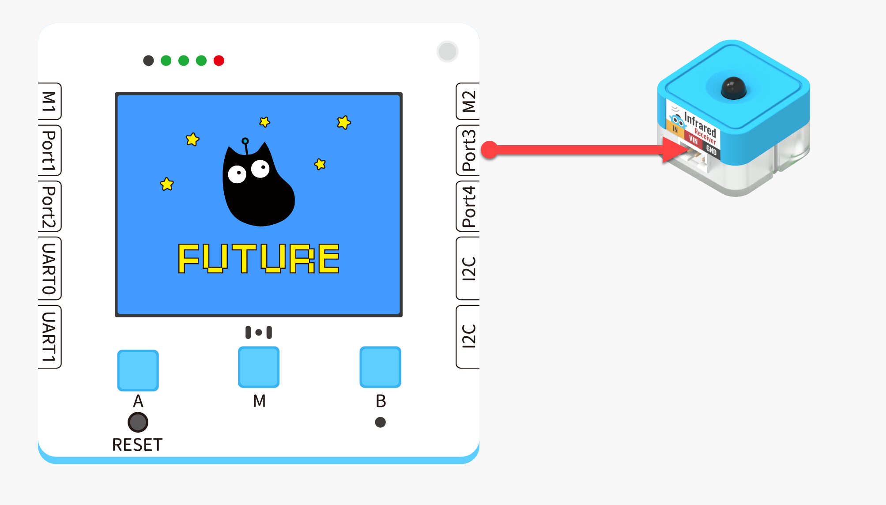
|  |  | Futureboard Lite interface | Use wire |   |
| --- | --- | --- | --- | --- |
| 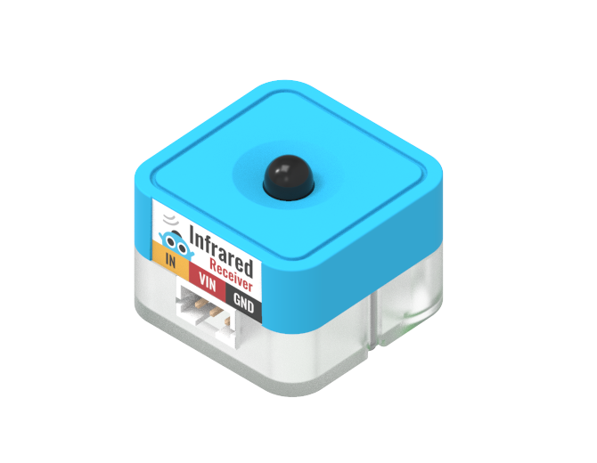 | Infrared remote control | Port3 | White PH2.0-3Pin interface cable |  |
:::warning
Supported connection to Port1、Port2、Port3、Port4 Be sure the interface is consistent with the actual situation while programming.
:::


## Blocks - Function Description
| Number | Block Image | Block Function |
|---|---|---|
| 1 |  | Read key values from the remote controller |


## Program 1 - Full Program
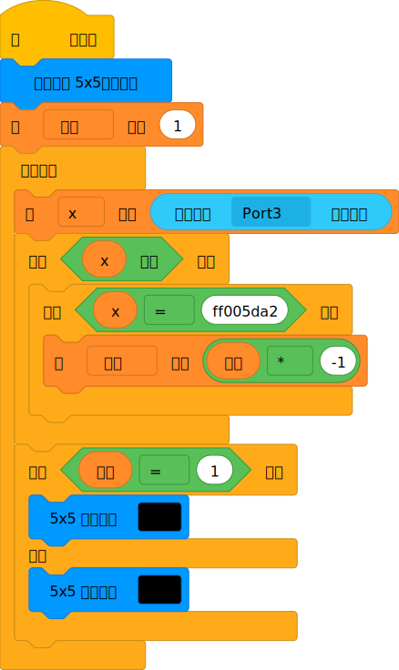


## Program 1 - Function Description
:::danger
Set the color screen to dot matrix mode, initialize the variable to 1 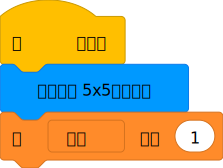
:::
:::danger
Read the infrared remote control emission data 
:::
:::tips
When there is data, x is true, otherwise it is false When the data is true, then make a judgment, if it is ff005da2, it corresponds to the infrared remote control Multiply the variable of the flag by negative one, the flag variable after this operation, there are always only two possible values, -1 or 1 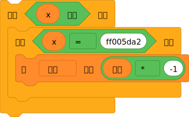
:::
:::info
By judging whether the flag variable is 1, it can be processed in two cases, if it is 1, the big heart will be displayed, if it is -1, the small heart will be displayed This usage can be extended to other scenarios, such as turning on lights, turning on motors 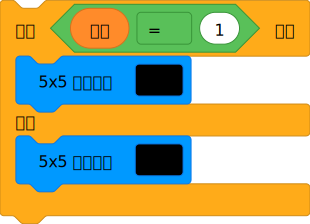
:::


## Program 2 - a complete program



## Program 2- Functional Description
:::warning
Initializes RGB settings and related color screen configurations 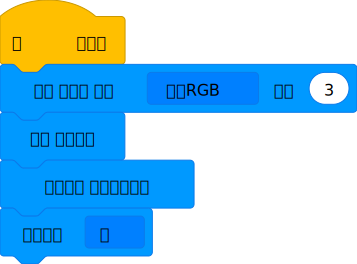
:::
:::warning
Reads data from the infrared remote control; if there is data, proceed to the next step 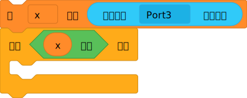
:::
:::info
Judges the read data; if it is ff00fd02, increases the brightness variable by 10; if the value exceeds 100, resets it 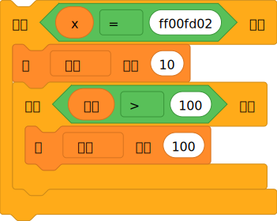
:::
:::danger
Judges the read data; if it is ff006798, decreases the brightness variable by 10; if the value is less than 0, resets it 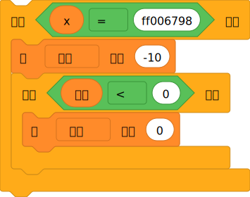
:::
:::info
Controls the brightness of the colored light and displays the brightness value on the color screen 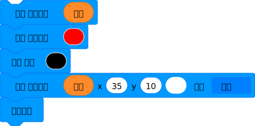
:::


## Using KittenBlock
Run the program offline to view the effect


## Using on Microbit



##   Programming Platform
[Microsoft MakeCode for micro:bit](https://makecode.microbit.org/#editor) Use Makecode programming platform


##   Add the Sugar Plug-in

 Search for Sugar in the extensions, click Add


##   Circuit connection
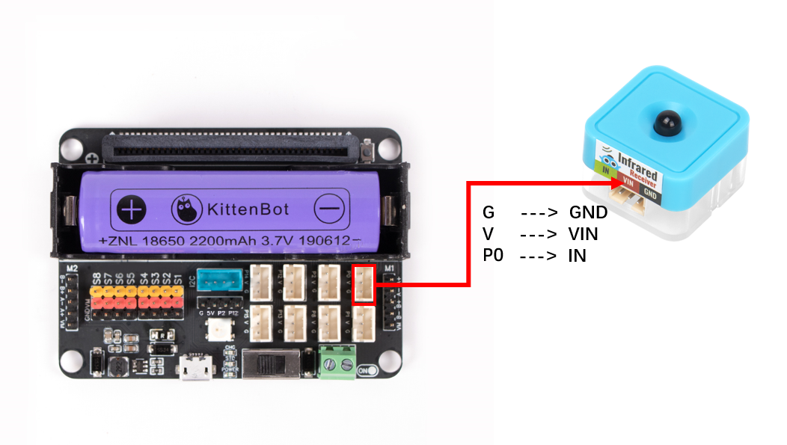

