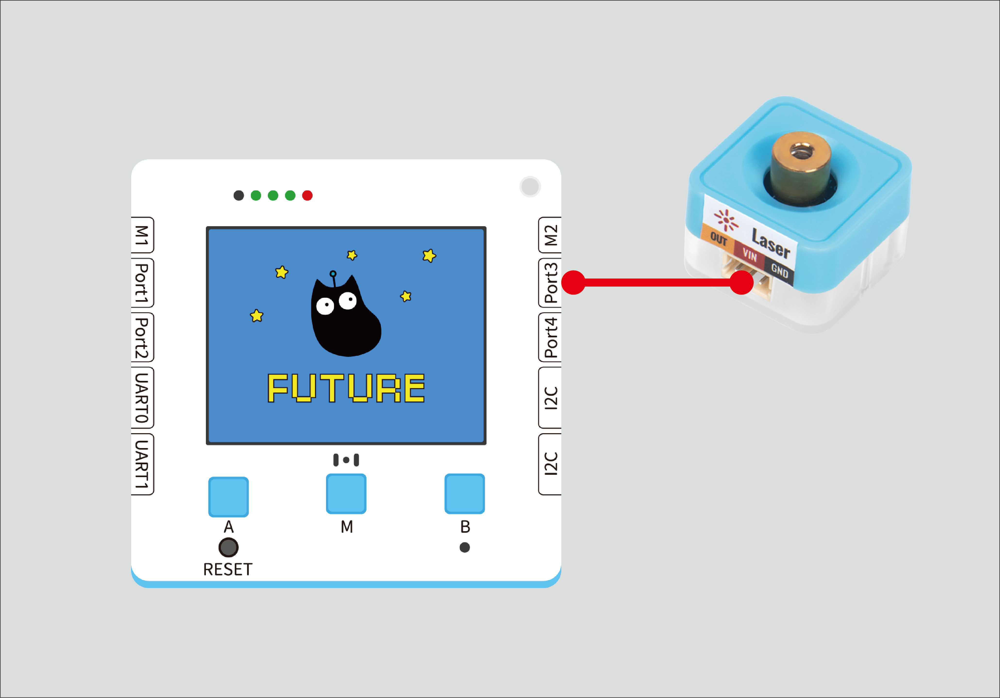
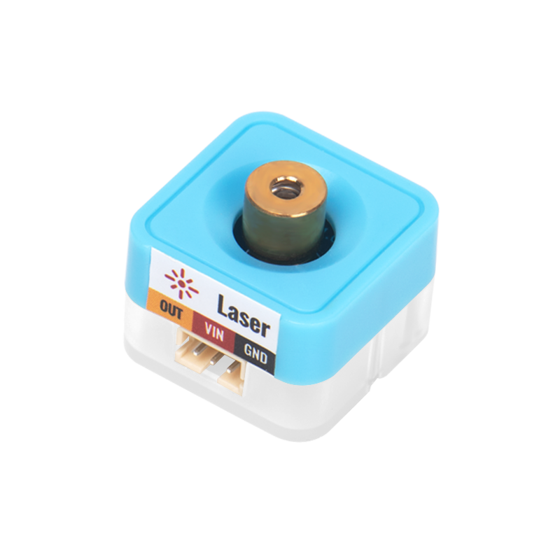
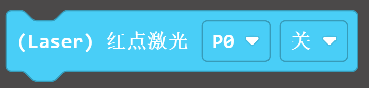
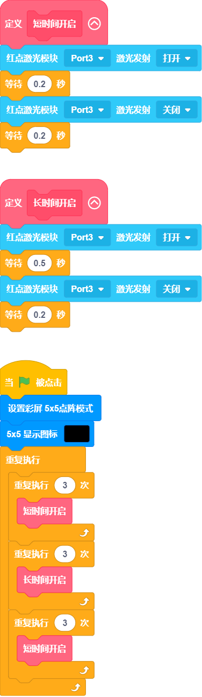
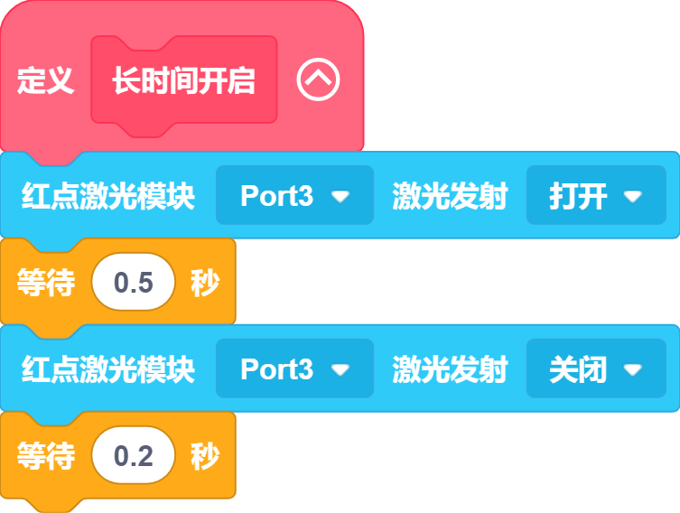
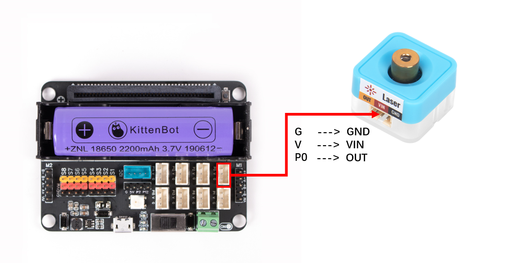
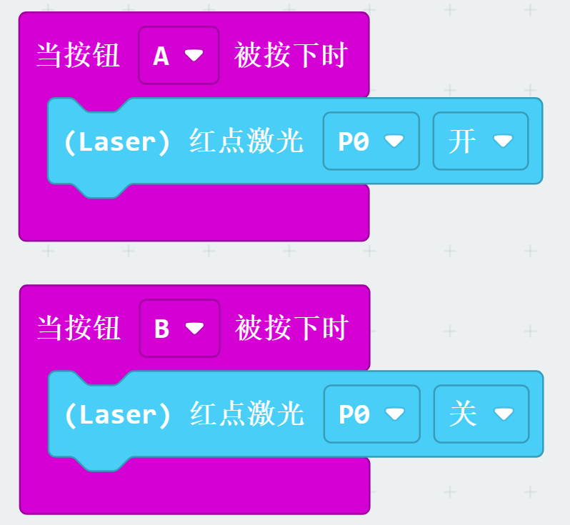


##  Function
---
Open laser emission after receiving control signal
| **Signal** | timing signal |
| --- | --- |
|  |


## Principle of the Module
The laser emitter produces laser through the effect of stimulated emission of radiation. When the laser medium is activated by external energy, its atoms or molecules are in an excited state. When they collide with photons corresponding to the excited state, the excited atoms or molecules will jump to a lower energy level while releasing a beam of photons coherent with the stimulated radiation, which is the laser.


## Wiring

|  |  | Future Board Lite Interface | Cable |  |
|---|---|---|---|---|
|  | Sugar Cube Red Dot Laser Module | Port3 | White PH2.0-3Pin Interface Cable |  |
:::warning
Supports connecting to Port1, Port2, Port3, and Port4. Pay attention to the consistency between the interface and the actual usage when programming.
:::


## Blocks - Function Description
| Number | Block Image | Block Function |
| --- | --- | --- |
| 1 |  | Controls the enabling or disabling of the red laser module on the control port |
| Number | Block Image | Block Function |
| --- | --- | --- |
| 1 |  |   |


## Program 1 - A Complete Program



## Program 1 - Function Description
:::danger
 Define a function to control the short-term on and off of the laser module.
:::
:::danger
 Define a function to control the long-term on and off of the laser module.
:::
:::tips
 By controlling the on and off of the laser through a loop, simulate the SOS signal, the law of three long, three short, and three long laser emissions.
:::


## Using Kittenblock
Use offline download to run the program to see the effect


## Using on Microbit



## Programming Environment
[Microsoft MakeCode for micro:bit](https://makecode.microbit.org/#editor) Use the Makecode programming environment


##   Add the Sugar plugin

 
Search for Sugar in extensions, click Add


##   Circuit Connection

|   |  | Microbit Interface | Cable |   |
| --- | --- | --- | --- | --- |
|  | Sugar Cube Red Dot Laser Module | P0 | White PH2.0-3Pin Interface Cable |  |
:::warning
Supports connection to P0, P1, P2, P8, etc.   Pay attention to the consistency of the interface and the actual interface during programming
:::


## Case: Control by button


