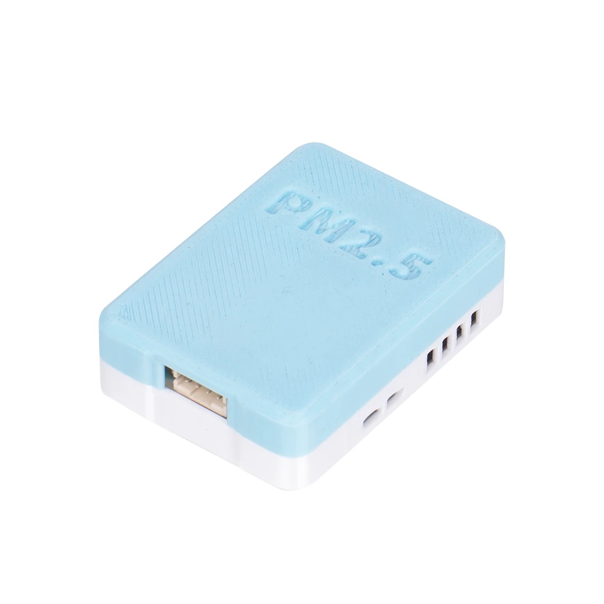
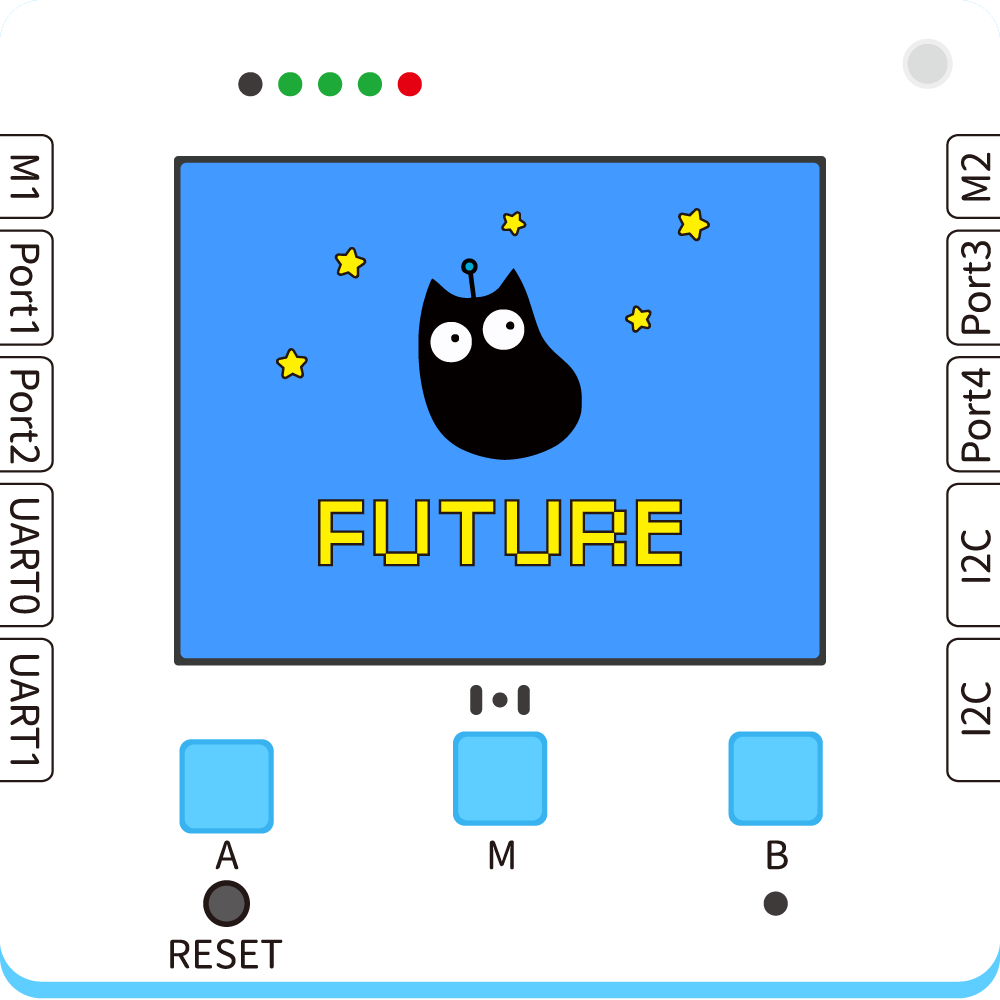
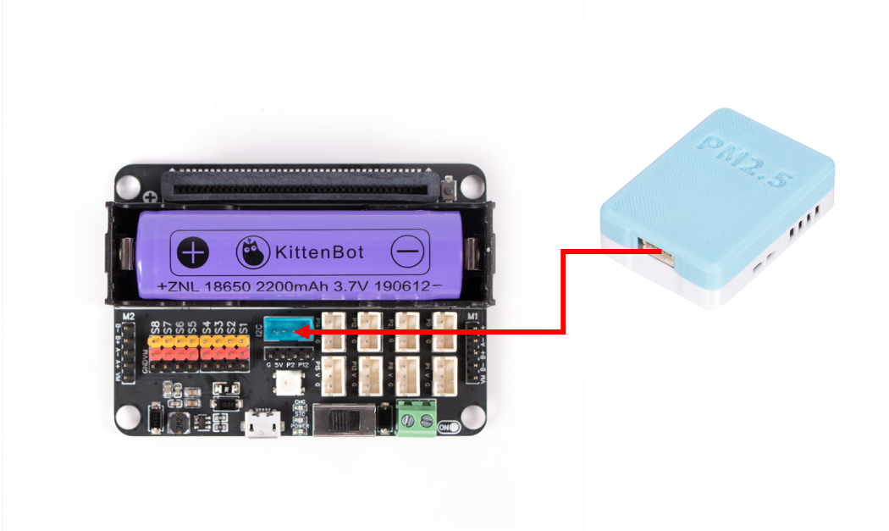
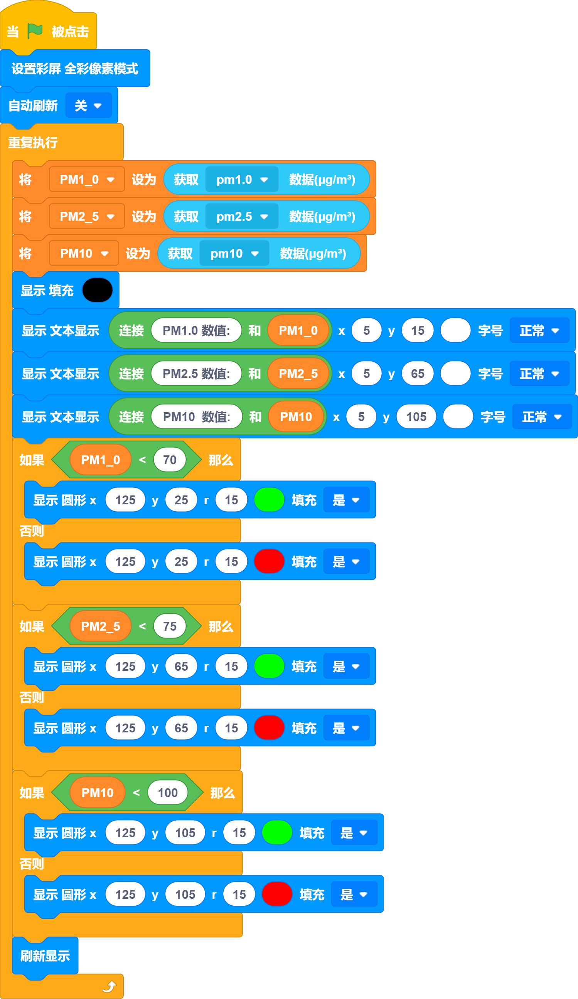
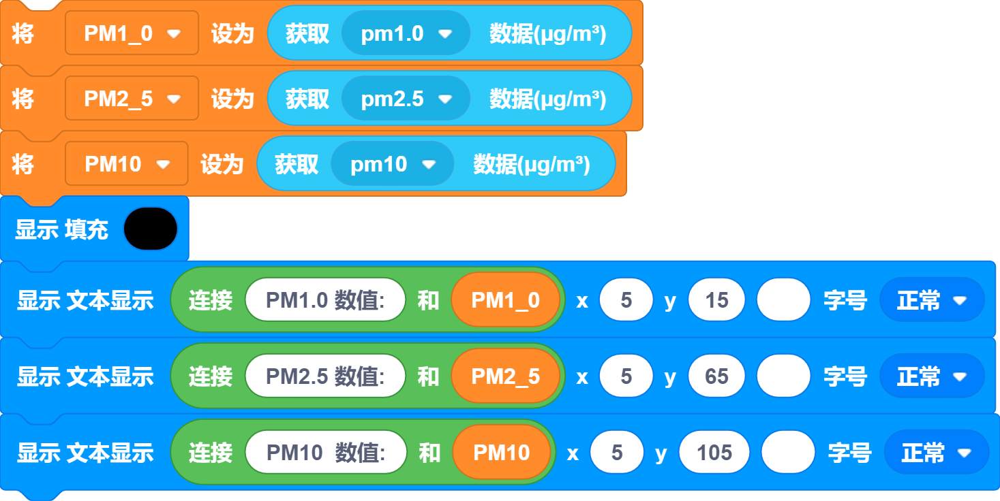
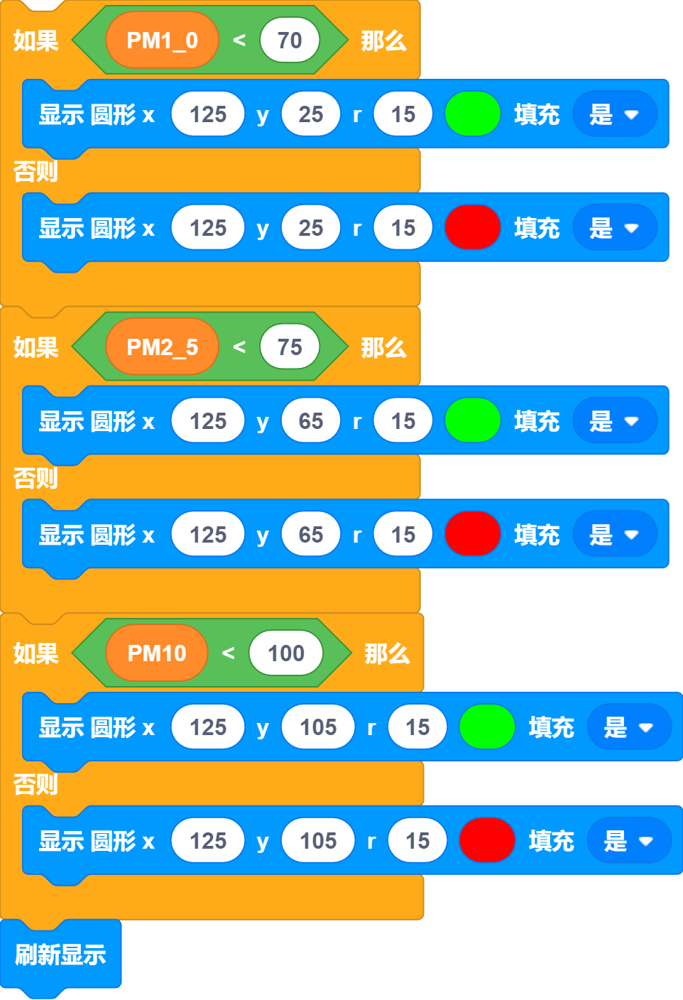
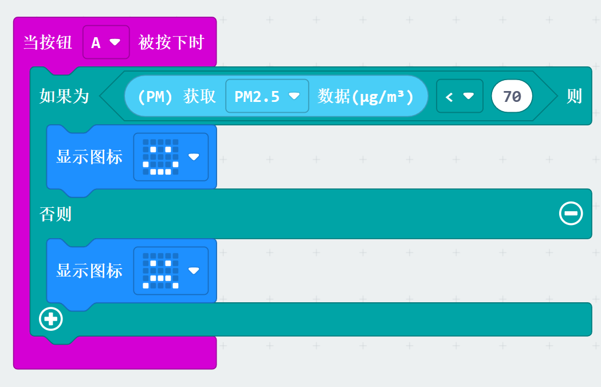
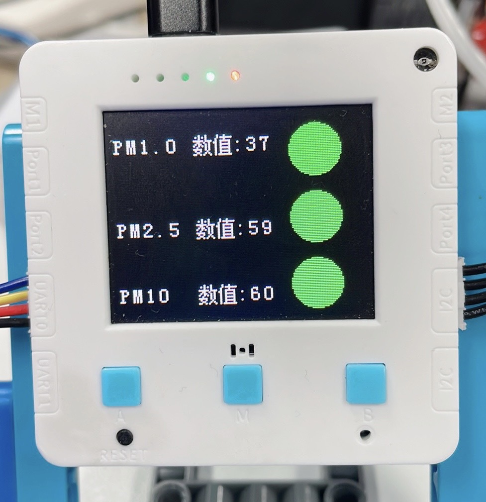


## Introduction



## Features
---
Read the density of three major diameter of particulate matter in the air
| **Signal** | I2C signal |
| --- | --- |
|  |


## Module Principle
When fine particulate matter in the air enters the area where the laser beam is located, the laser will be scattered; the scattered light has 360° radiation in space, and a photodetector is placed in an appropriate position to receive the scattered light, and then the photoelectric detector generates a current signal through the photoelectric effect, and after amplification and processing by the operational amplifier circuit, the fine particulate matter concentration value can be obtained.

PM2.5, PM1.0 and PM10 are three main types of atmospheric particulate matter, which represent particulate matter in the air with diameters less than or equal to 2.5 microns, 1.0 microns and 10 microns, respectively. These particulate matters come from industrial emissions, vehicle exhaust, combustion emissions and natural processes.

Normal standards refer to the concentration limits of these particulate matters in the air. According to the standards of the World Health Organization, the annual average concentration of PM2.5 should not exceed 10 micrograms / cubic meter, and the 24-hour average value should not exceed 25 micrograms / cubic meter; the annual average concentration of PM10 should not exceed 20 micrograms / cubic meter, and the 24-hour average value should not exceed 50 micrograms / cubic meter. For PM1.0, there is currently no unified international standard, and the standards in different regions may vary.

When the concentration of these particulate matters in the air exceeds the normal standard, it may affect human health, including respiratory diseases, cardiovascular diseases, etc. Therefore, monitoring and controlling the concentration of these particulate matters is very important for protecting public health.


## Using on Futureboard Lite



## Blocks-Function Description
| No. | Block Image | Block Function |
| --- | --- | --- |
| 1 |  | Read the concentration of PM1.0, PM2.5, and PM10 particles in the sensor, in units of ug/m³ |
| No. | Block Image | Block Function |
| --- | --- | --- |
| 1 |  | Read the concentration of PM1.0, PM2.5, and PM10 particles in the sensor, in units of ug/m³ |


## Case - Air Quality Monitoring
---


## Wiring Diagram

|  |  | Future Board Lite Interface | Wiring |   |
| --- | --- | --- | --- | --- |
|  | PM2.5 Module | I2C | Black PH2.0-4Pin Interface Cable |  |

|  |  | Microbit Robtobit Interface | Wiring |   |
| --- | --- | --- | --- | --- |
|  | PM2.5 Module | I2C | Black PH2.0-4Pin Interface Cable |  |


##   Program Writing

:::warning
Set three variables to store three data values of PM1.0, PM2.5, and PM10 After successfully obtaining them, display them on the screen 
:::
:::success
Set a normal standard for the value. The following values can be adjusted according to the actual situation. When the value of the sensor read is lower than the standard, draw a red circle on the right side of the screen; otherwise, display a green circle 
:::
Press the A key to determine whether the value is lower than the set standard. If it is lower than the standard, display a smiling face; otherwise, display a crying face 
Press the B key to display the current PM value 
The method for other PM values is the same 


##   Effect



## Using on Microbit



##   Programming Platform
[Microsoft MakeCode for micro:bit](https://makecode.microbit.org/#editor) Programming with Makecode platform


## Add the Sugar Plugin

 Search for Sugar under Extensions and click Add


## Case: Brightness Control - Breathing Light
---

